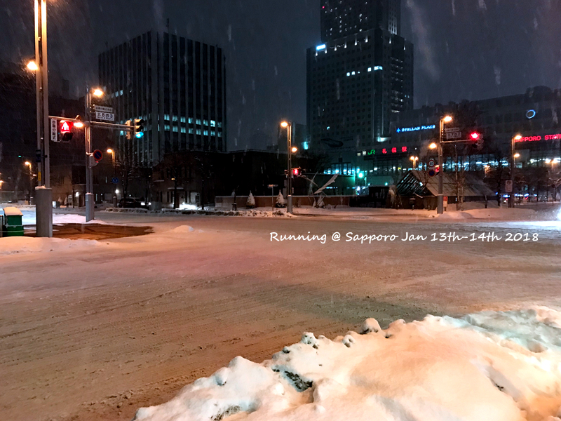
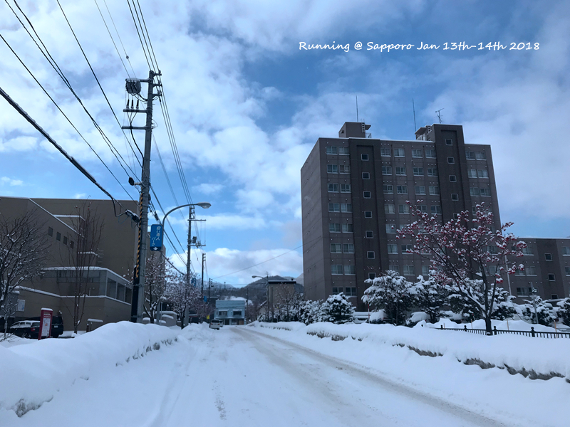
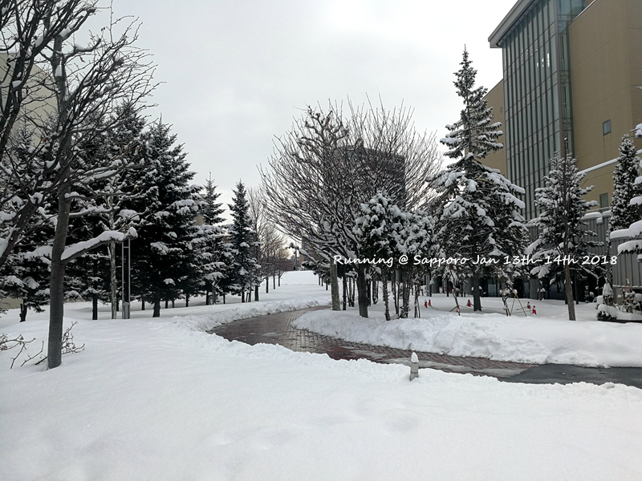
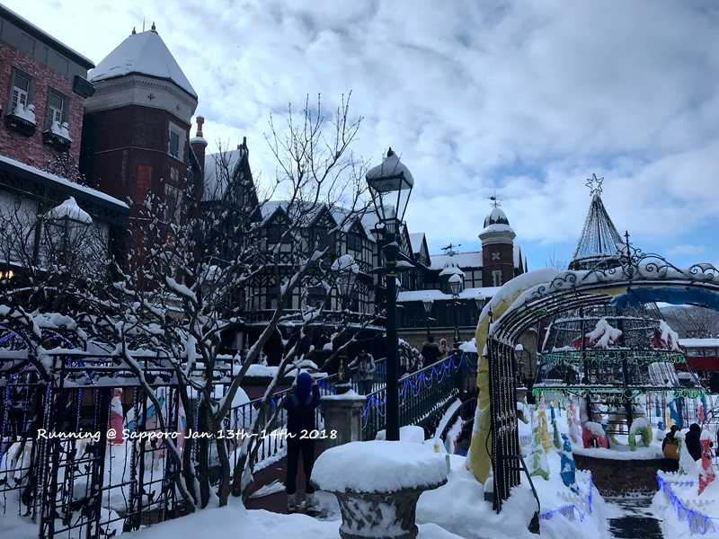
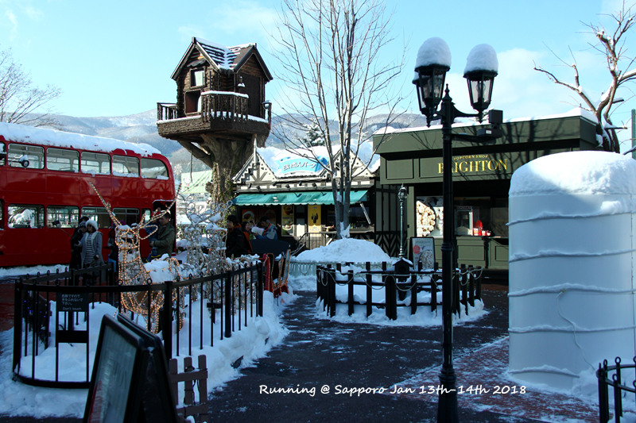
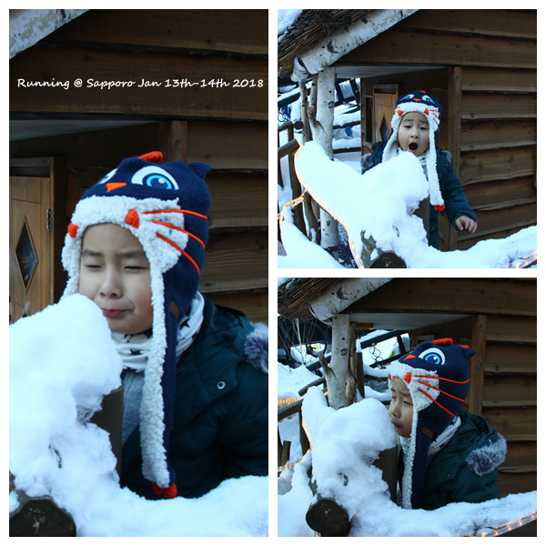
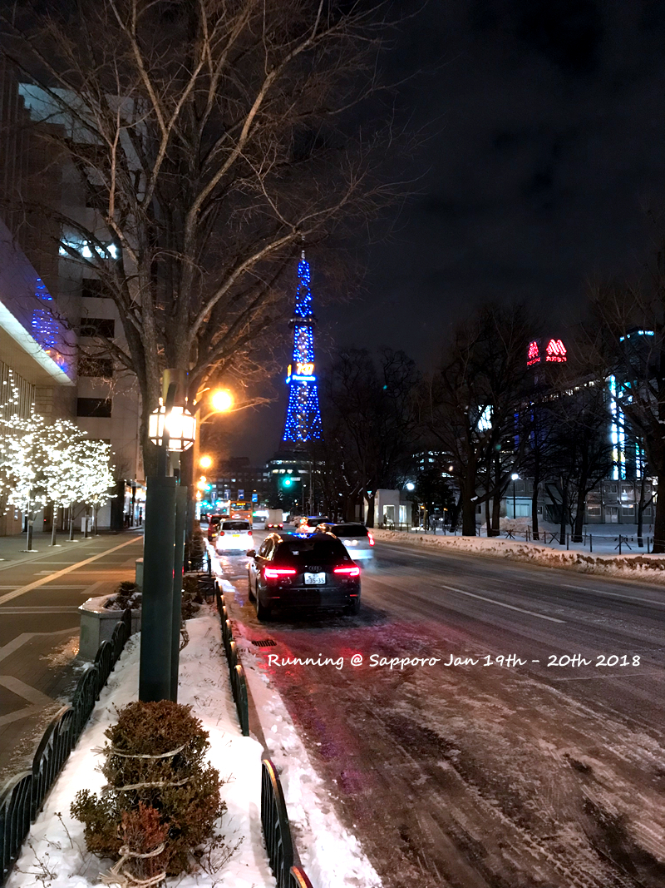

北海道进出的航班大多都在新千岁，函馆、旭川好像也有机场，但国内直达的航班在一月基本没找到，因此札幌是去北海道无法不路过的一个城市。此次去北海道，因为价格原因，选择的是转机的航班，并且转机时间相对都比较短（1.5H左右)。提前研究了一下如何转机，去新千岁，国际转国内，行李无法直达，需要在转机机场，过海关->拿行李->重新托运行李->过国内安检->候机。而回去的时候则是国内转国际，行李可以直达，在转机机场从到达站->国际出发楼层->过安检->过海关->候机。1.5H左右的转机时间并不富裕，并不建议更短了。虽然是同一个航空公司的联程，但错过了要改签也是麻烦的。
<!--more-->

去的航班居然是在虹桥T1，日航和ANA感觉有一个小小的专属区域，boarding gate附近还有娃可以玩的地方。缺点就是T1可以吃饭的点太少。不过虹桥真的近，跟去公司打车一个价。

上海到成田大概2个多小时，坐转机shuttle bus的时候儿子睡着了，正好在下一班飞机起飞前睡了一个小时。两班航班都很准时，差不多8点到达札幌。本身以为妥妥的飞机餐，结果没想到号称媲美ANA的Japan airlines 18：30-20：05的飞机上居然没有餐只有饮料，只得下来就地解决。这次发现北海道这块微信普及率很高，机场这边微信都有立减活动，上次东京那里感觉都是支付宝的天下。

出了札幌JR就是漫天的雪，其实记忆中也可能就是第二或者第三次看到这样的大雪。小时候有过两次，但记忆并不深刻。到大了之后，也就是本科有一年下的特别大，还滑过一跤。那次是看着别人在面前滑到内心还在想怎么这么搞笑会摔倒，然后自己也直接倒下了。。。虽然下雪，但北海道真的不冷，主要是没风。走到旅馆也就几条马路，本来以为最Low的房间居然还带个小榻榻米的休闲区，淋浴区也特别的大，瞬间好感度大大提高。大大的淋浴区居然配备的还是小椅子淋浴+浴缸，终于明白书上说的日本人坐着洗澡是真的。之前在泡汤的地方看到都是坐着洗以为只是避免溅到别人，没想到独立浴室也是如此。

JR站，反反复复进出的地方。下雪反而不用打伞，干干的雪拍一下就可以了。

札幌本身并没有什么景点，巧克力工厂，北海道神宫，大通公园，连狸小路、北海道大学这样的算上估计也就5、6个。我的Plan也就是第一天去了一下巧克力工厂，最后一天逛了一下狸小路收尾。每次去旅行之前总是把购物时间压缩再压缩，回来的时候总觉得因此亏了一个亿。。。

巧克力工厂其实真的很小，不知道为什么没有人提过如果不进去制作饼干啥的其实根本没有必要参观所谓的巧克力制作流程。。。基本上外面拍一圈照就可以了。点点很喜欢那里的小房子，基本每个都进去参观过了。

地铁东西站到底就到巧克力工厂，路上厚厚的雪

巧克力工厂到了10点多人还是蛮多的，估计旅行团带过来得不少，主要是外面转一圈根本不花钱啊。。。

最后一天匆匆赶回札幌，终于体会到薄野的商业和大都市的热闹。札幌，应该还会再来。

