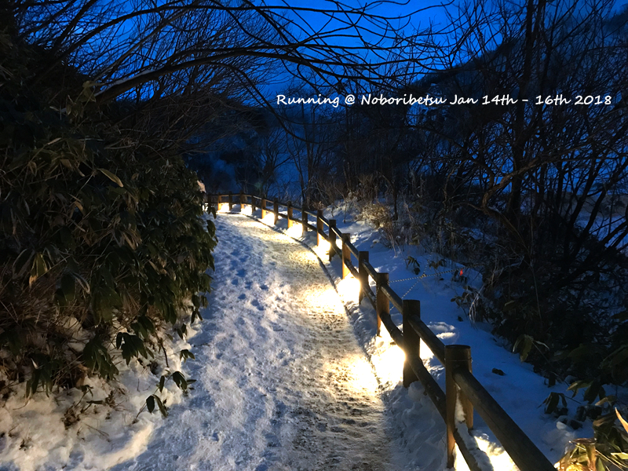
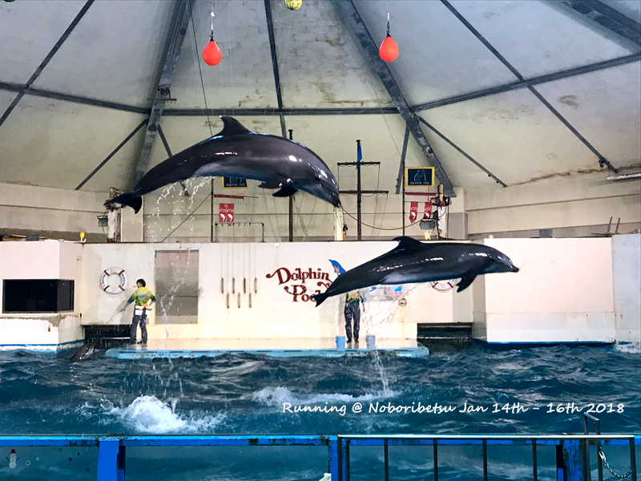
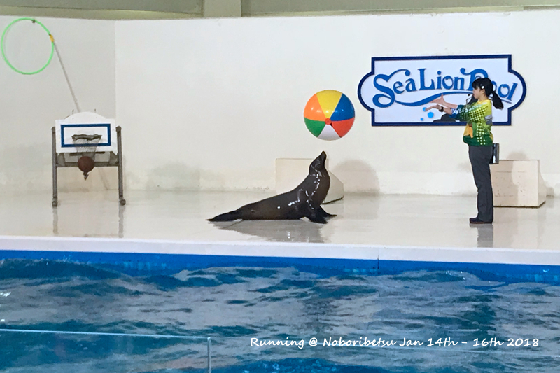
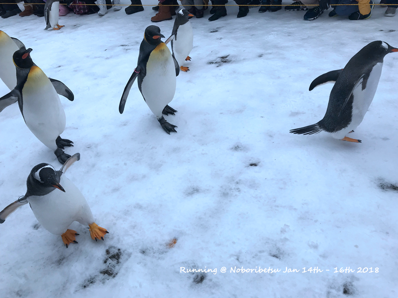
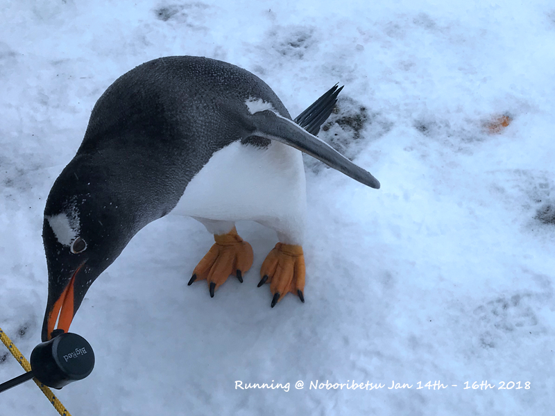
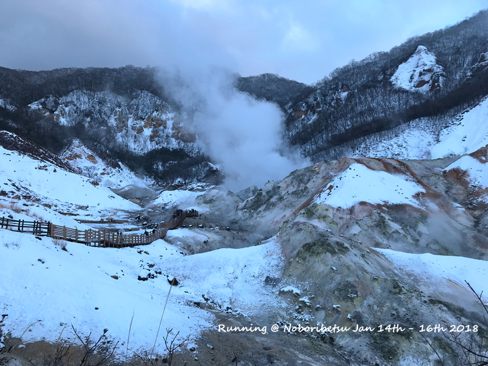
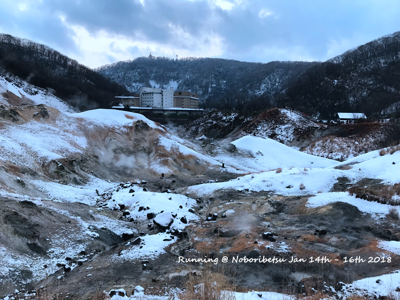
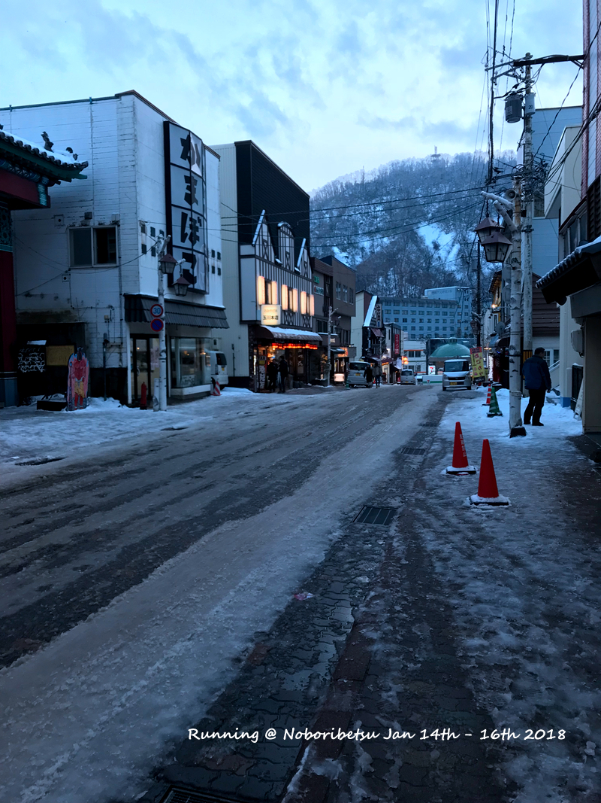

登别是北海道这块有名的温泉胜地，因为本身登别温泉街很小，所以就打算住一晚。但酒店那500JPY的往来班车实在留给登别的时间太少，而来往的JR又太贵，因此纠结再三，用路费贴了房费，在登别住了两晚。登别这里的景点除了地狱谷温泉本身，还有尼克斯海洋公园和熊牧场。原本有考虑在旭川去看企鹅，后来在网上发觉原来登别也有（其实小樽也有），所以如果只是为了看企鹅，真没必要坐几个小时JR去旭川了。
<!--more-->

登别这块有很多小而优的温泉酒店，由于上次吃怀石料理感觉也就这样，情调大于内容。因此还是选择了离地狱谷最近，号称有地狱谷9种温泉源的7种的第一龙本馆。住下来觉得还行，自助早晚饭吃饱没问题，但多住几天绝对会吃厌（每天品种几乎一样）；房间的话大小适中，只是厕所有点小，但鉴于基本不在房间洗澡，因此问题也不大。原本以为南馆80年代的房子会有点老，但日本人房子真的保持的不错，并没有那种上海80年代房子的破旧感。综上来说，更老的不带淋浴的西馆好像更实惠。
第一天下午2点札幌500JPY的酒店班车大约在4点可以到达酒店入住。其实札幌的汽车站可以直接从JR站地下室走出来，我跟着citymap2go在外围饶了一圈。到酒店checkin的时候就预订回程的车，居然全满无座！原本500JPY的车票瞬间涨到1900，心痛不已，后悔当初写邮件为什么不直接把来回都订了，又不需要付定金！冬天的北海道天黑得很早，到了酒店出门随便走一下天就黑了。地狱谷那边的路很滑，当天就摔了一大跤，手上破了一大块皮，之后在登别走路就相当的小心。还好酒店旁边就是药妆店，买了各种大小邦迪贴着。冬天去北海道，还是推荐购买一副冰爪，不然滑冰摔倒是妥妥的。

第二天的安排就是早上尼克斯海洋公园，下午熊牧场。其实这两个加在一起是有套票的，但是因为熊牧场关门非常早而点点下午需要睡觉，因此并没有为了便宜几百日元购买套票。事实证明，的确不能为了几百而损失几千，因为熊牧场果然没赶上。尼克斯海洋公园早上在温泉街是有免费班车的，差不多时间直接问酒店大堂人员他们会带你找尼克斯的司机，实惠便捷首选。
去尼克斯海洋公园主要是为了看企鹅散步，其实那边还有海豚海狮表演。大约9点30多入园，一系列表演到11点多的企鹅散步结束，参观一下城堡里面的鱼，总共2个多小时的行程还是挺充实的。那天是这次旅行少有的下雨天（登别太热了），还好大多数时间都在室内看表演，不然冬天下雨在外面旅游需要坚韧不拔的毅力。看企鹅的时候属于开始大家都很激动，列队欢迎，等企鹅散步回家的时候只有小猫两三只。因此推荐大家开始站在终点附近，因为企鹅在终点附近会停留很久，然后等企鹅走回去的时候再合影留念。城堡里面的鱼种类不如上海海洋馆，但特别之处在于海星之类的都可以直接用手触碰，只是要求不要拉着它出水面。不愧是在人少的日本，如果在中国，这海星绝对一天可以死一回。。。当天在海洋公园吃了午饭让前台帮忙打车回去。从海洋公园打车回酒店大约是2000JPY，下午其实也有免费回酒店的班车，不过个人觉得尼克斯海洋公园玩不了一天，因为特别小。

打车路上点点眯了一下，回去给他拖了衣服他反而睡不着了。在榻榻米上折腾了一个小时还是起床去地狱谷。由于前一天晚上摔过一次，当天极其小心，终于是无损伤来回。然后就是温泉街逛一圈，短短的温泉街，因为全部都是商店，也逛了一个多小时：）一直都说北海道奶质特别好，因此每天尽量给点点买鲜奶，虽然日本大多数东西都比中国贵，但牛奶价格基本持平。

在地狱谷就可以看到旅馆

最后一天由于没有预订上酒店的班车，因此问了车站在哪儿就提早出门去等。没想到酒店的map实在太有歧义，走错方向了。。。快到时间了，觉得很奇怪，为什么一个人都没。还好在最后几分钟，赶往另外一个方向看一下，发觉大队的人在排队。车站应该在第一龙本馆出门右转往地狱谷方向，其实就在道南巴士车站那里。车相当得满，加座也全部坐满发车。其实登别到札幌如果让中国司机来开，应该一个半小时就够了。不过日本司机相当耐心兼谦让，大转弯只要视线范围内看得到还有直行车辆，必定等着，因此一个绿灯基本只能过一个大转弯车辆。在这样的精神下，登别和札幌大约2小时会到。

因为每天札幌和富良野之间的车次很少，因此为了赶上当天12点50的车次，当天就在JR底下的麦当劳快速解决。日本的麦当劳基本就跟国内一个价，而泰国怎么比国内还贵（不解），而且配套的饮料还可以有冰红茶。发觉每次出国我都特别爱喝冰红茶，从罗马到日本一路，都留下我喝过的大大小小的冰红茶。。。
