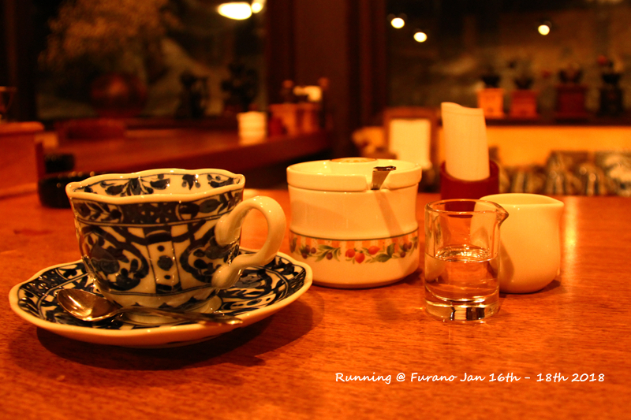

北海道最热门的度假村其实是星野，尤其是霍建华胡歌的美照一出，星野更是热得发烫。不过就各大网友拍出来的图片，无论是滑雪场还是森林餐厅，好像都感觉一般，估计还是人太多气氛不对。相较而言，富良野美英这些夏天热门的区域，到了冬季反而很冷清了。但精灵木屋+富良野那种森林雪地感实在太美，因此思前想后还是选择了富良野。
<!--more-->

去富良野最方便的还是大巴，JR的话不仅转线票价还贵。大巴如果有2人以上，可以直接买4次票，当时没搞懂，损失几十元。大巴唯一的缺点就是大约一小时一班，因此时间一定要提前确定好。

 
路上已经超有感觉了

冬天的北海道天暗的很晚，富良野车站下车打车到酒店差不多就4点多了。新王子酒店地理位置真心不错，至少在冬天，门口就是一圈景点，旁边是滑雪场，本身又带了温泉（携程订的居然包温泉票）。早饭的话和晚饭自助餐一样无功无过，但某人一个早上5瓶牛奶应该也喝回本了。出门晃一圈，攻略中号称很好玩的欢寒村实在是啥都没有啊，说好的冰雪滑滑梯呢,真是亏了300的门票。自己堆的雪人实在是惨不忍睹。。。

精灵木屋真的就是照片中看到的样子，尽管是圈养的一块地方，但是不管是白天还是晚上，都超美。晚上预订了酒店的自助餐，味道还行，就是没有刺身（只有寿司），蛋糕类不错。不过后来吃了酒店其他几个餐厅，应该说自助餐性价比还是略低。好处就是娃不要钱，然后菜选择范围大一些。

第二天的plan是滑雪，之前提前预约了滑雪教练，说3岁娃能参加的private lesson最多1小时，就订了1小时，而且还能有中文教练。滑雪还蛮好玩的，只是。。。没学会。滑了两个多小时好累，关键是滑下来只要几秒钟而转弯走上去太太太艰辛。看别人滑是各种轻松潇洒，自己滑下去时候想的就是要跌倒了。希望下次去可以更有感觉。有日本南部的学生冬令营过来滑雪的，导致王子酒店小卖部的牛奶一直断货。中午就吃了一楼的十胜，白咖喱味道不错。

滑雪那天天超好，也晒黑很多。冬天去北海道滑雪防晒霜不可少。

下午睡了会儿起来就想去森之计时喝咖啡，攻略没做好，以为那边只有一个咖啡店，结果。。。进了精灵木屋里面的coffee shop，想着说好的手磨咖啡呢。买了咖啡+仅有的一些泡芙当下午茶，总觉得这店上电视剧也太简陋了，似乎跟攻略看到的不一样。也怪自己太大意，总觉得这块地方很小，不至于走错。结果回去吃晚饭的时候一查，果然不对。晚餐是在一楼日式烧烤吃的，一顿各种点居然也就8K多，人多绝对比中午的食堂吃面/咖喱实惠。吃完晚饭赶紧再到森之计时，幸好赶上了，它白天要中午开而晚上8点半也就关门了。大多数蛋糕都卖完了，就装X的喝了杯咖啡。跟网上的图片一模一样，连那个磨咖啡的大叔都没变过。。

精灵木屋实在是太上照了

想着最后一天没啥好玩的了，所以还是打算坐10点的车从富良野车站走。早上吃了早饭想想还是再去拍一下森之计时的白天，晚上的灯光总觉得太晃眼。匆匆跑去拍了几张，完全是想象中的北海道。

新的屏保照

之前在酒店大堂看到出租车以为一直有出租车候着不需要预约，结果拍完照回来才发觉没了，赶紧让酒店帮忙打车，还好赶上了回去的车，最后一眼富良野车站。

