其实小樽和札幌也就30min车程，完全可以算得上是札幌的景点。去之前纠结到底要不要住一晚，最后被雪灯节的照片吸引，想着还是给点时间看看夜景吧。去了之后发现没有雪灯节的运河实在是丑，居然用了蓝色的灯光。不过并不后悔在小樽住一晚，小樽的确是个小资的小镇，类似于鼓浪屿、Oia。简单来说，就是无特别景点，但处处适合拍照+逛街。当年看情书的时候，其实并不知道是在小樽拍的，只觉得漫天雪色配上柏原崇干净的气质真的文艺范十足。去之前研究了几个情书出现过的景去到此一游。日本在这些年真的没有多大变化，像东爱里面丽香回完治的学校还可以找到当年刻名字的柱子，如果我现在想回学校找到当年的XXX，估计只剩下回忆。社会停滞不前，充满着旧日时光，幸与不幸？

<!--more-->

Dormy Inn虽然房间和床实在是小，但所有adds on service都很好：大堂咖啡，温泉，夜宵，早饭。点点大了之后，还能不能再住dormy inn是个很大问题。在小樽住Dormy inn在冬天绝对是最佳的选择，小樽站的对面，来去自如。号称北海道top 10的早饭，主打海鲜盖饭，只是中国人的胃早上吃这个还是比较challenge的。

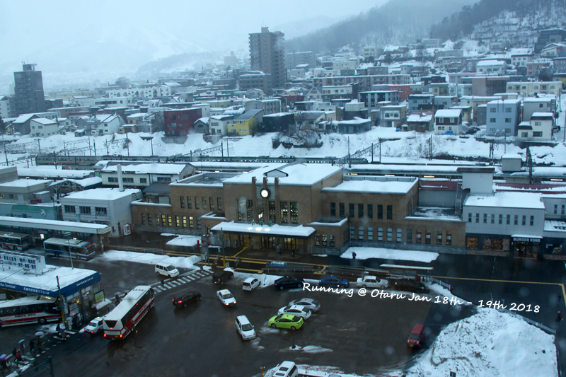
dormy inn望出去的札幌站

到达小樽那天雪还是很大，冒着雪去运河转悠了下。原本只是想着随便走走，第二天再从南小樽走回来，没想到一路居然也走到了letao门店。

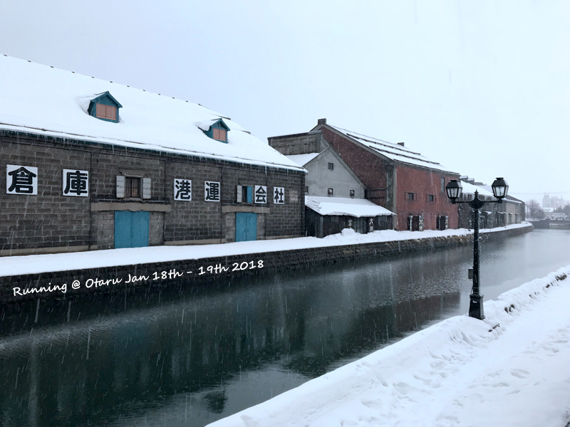
下着雪的运河，就这么短短的一丁点
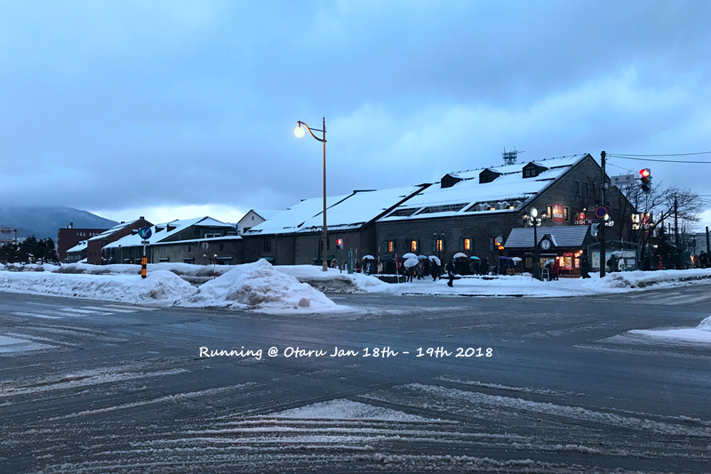
运河边矮矮的房子，在运河食堂对面
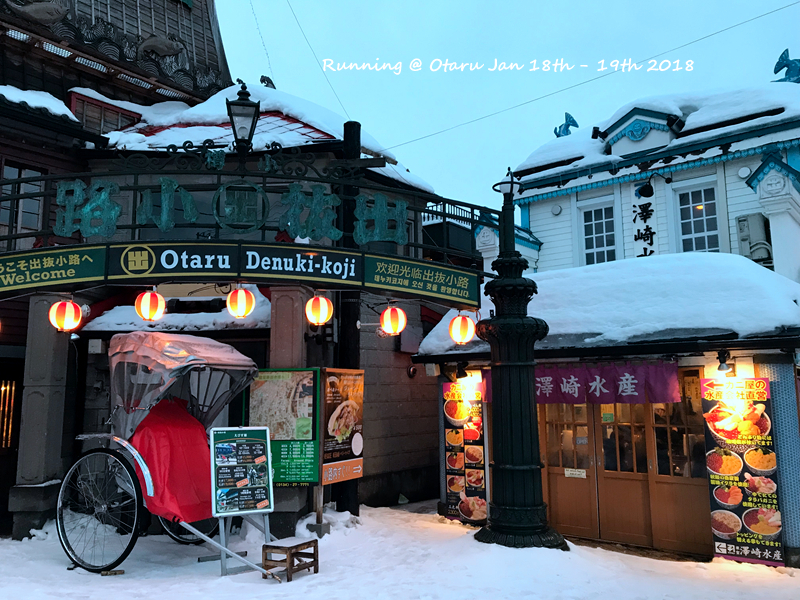
所谓的出拔小路居然就是这么一个角，恩，这就是文艺范的地方特点，永远都有一个特殊的角度
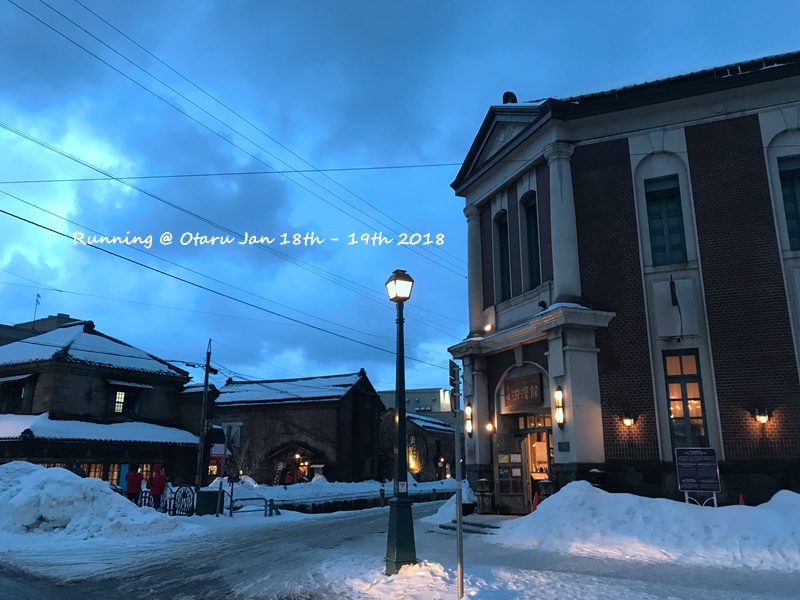

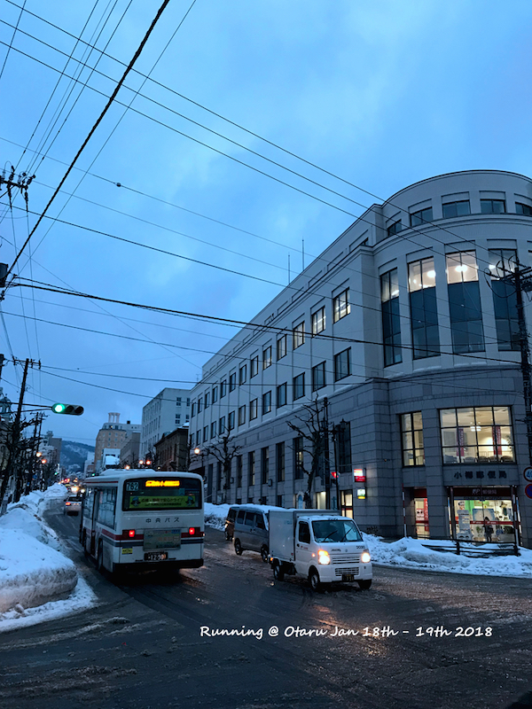

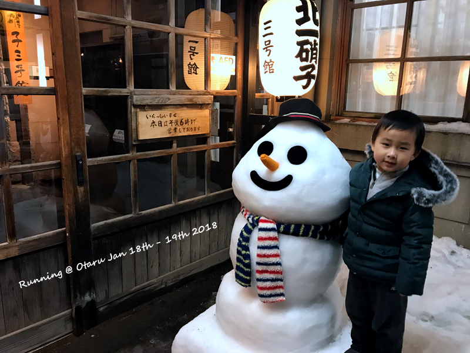
第一天走到最远的地方，儿子喜欢和雪人合影
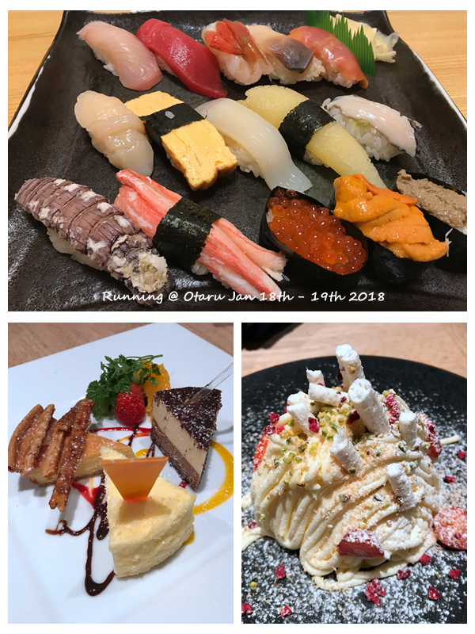

小樽适合吃，letao的蛋糕真好吃。比什么北叶楼之流好几个档次。也不知道看了哪篇游记据说这家只会说日语的店很好吃，价格倒是真的实惠，只是胡乱点一通实在没get到好吃的菜。。
当天的雪断断续续的一直挺大，晚上在dormy inn泡汤居然还会飘雪进来。还好第二天是个晴天。一起来就是走一下当年藤井树骑过车的地方。开始走错了，其实应该是小樽站出站之后左转过一个路口开始左转一路向上。所谓的船见板上，应该就是可以看得见船的路？

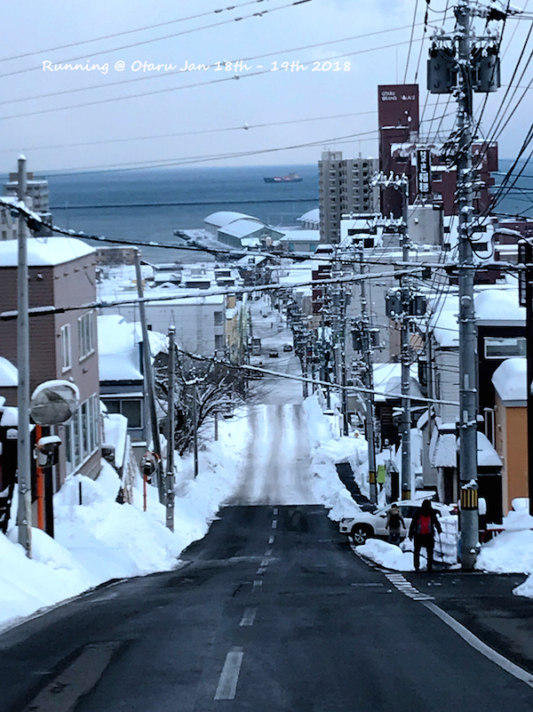

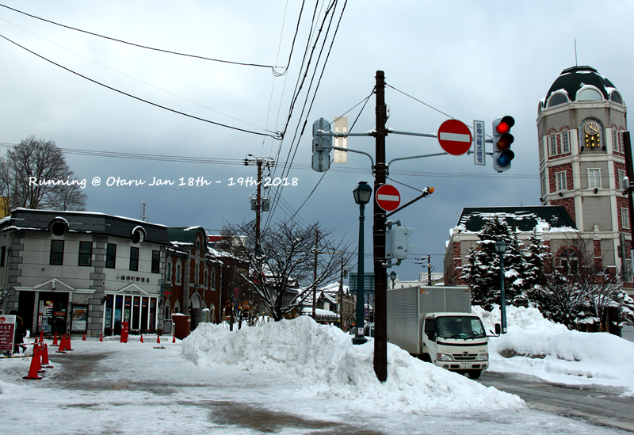
从南小樽一路往回走，有名的景点由此开始，白天的人真的比晚上多好多，只是晚上的店都在18点左右就关门了。。。
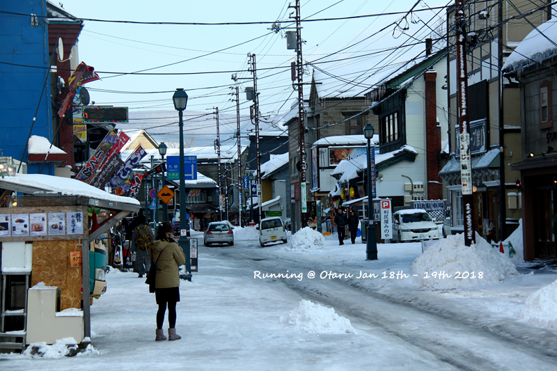
充满旧日时光感的电线
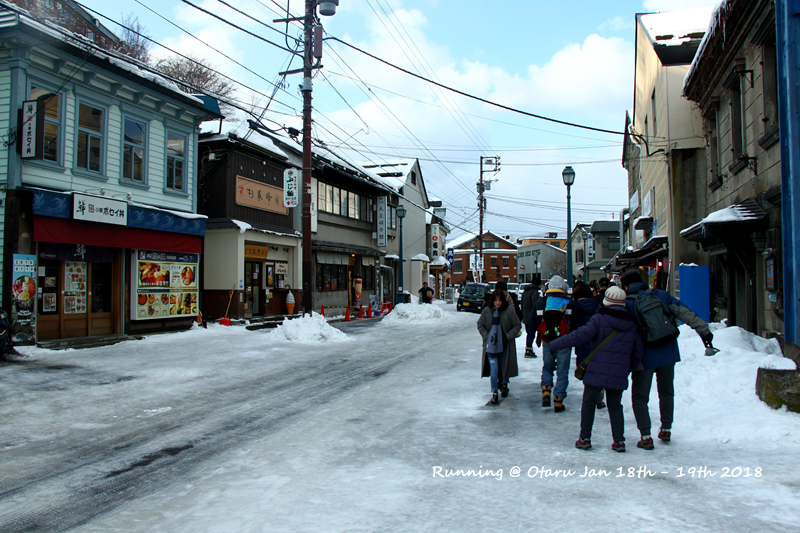
小樽真的超滑，亲眼目睹N多人滑到。lionsky也差点跌倒，在他提醒我不要跌倒的时候。。。
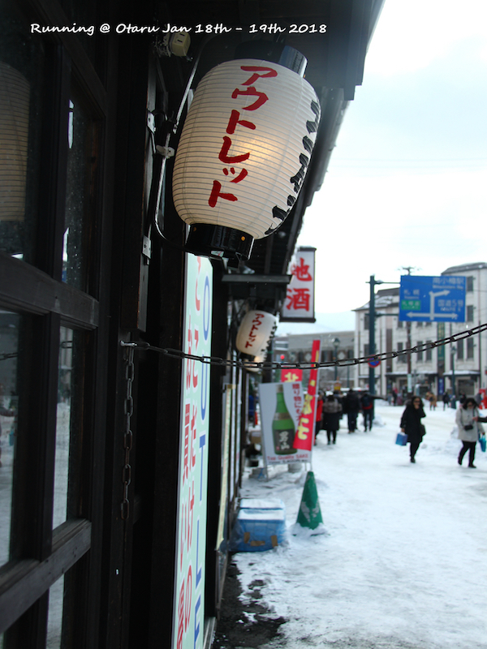

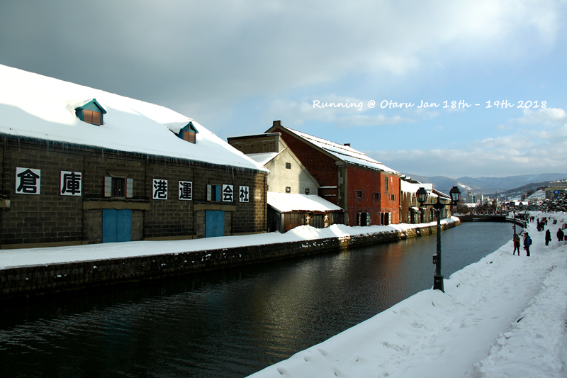
阳光下的运河

在小樽还是不能免俗的买了哨子，被Lionsky称为几百元居然还是次品的玻璃。。。主要是听到一家台湾导游在那里振臂高呼说这边就是北一哨子馆的outlet，马上来了精神进去挑。原来是一些在吹玻璃过程中稍有差池不那么完美的，自家用用很实惠，毕竟没有货比货。

走到小樽拿了行李回的札幌，小樽到札幌这一路虽然在海边，被很多人说超美，但实在很难拍到什么好看的景色。。。

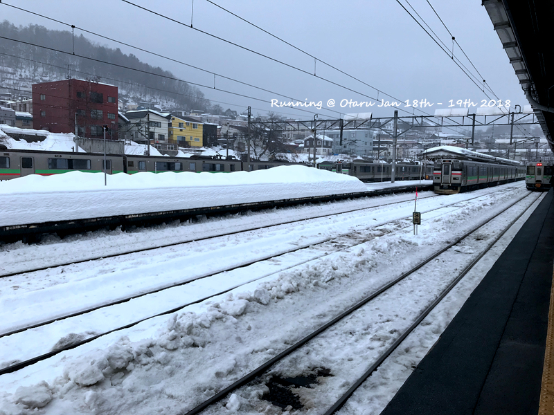

