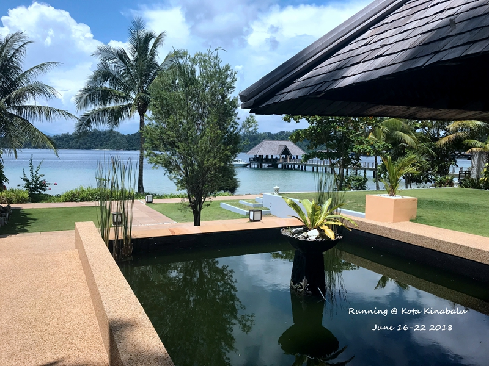
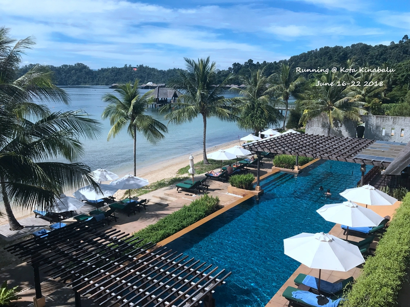
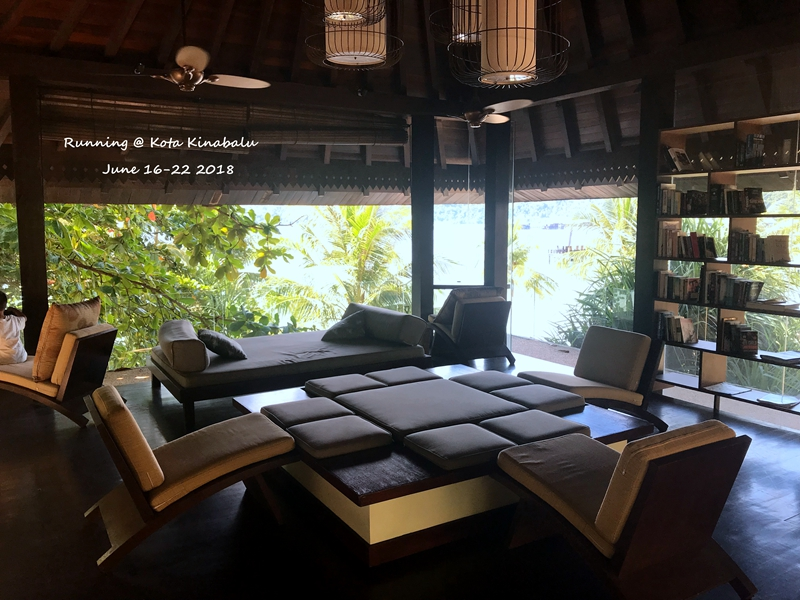
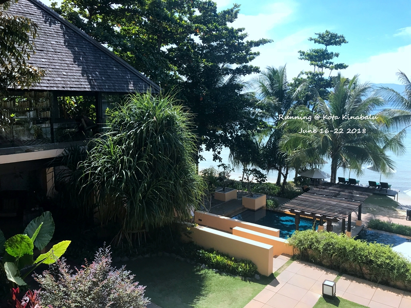
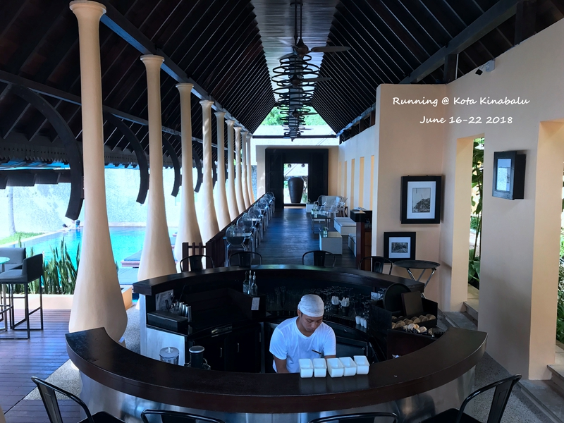
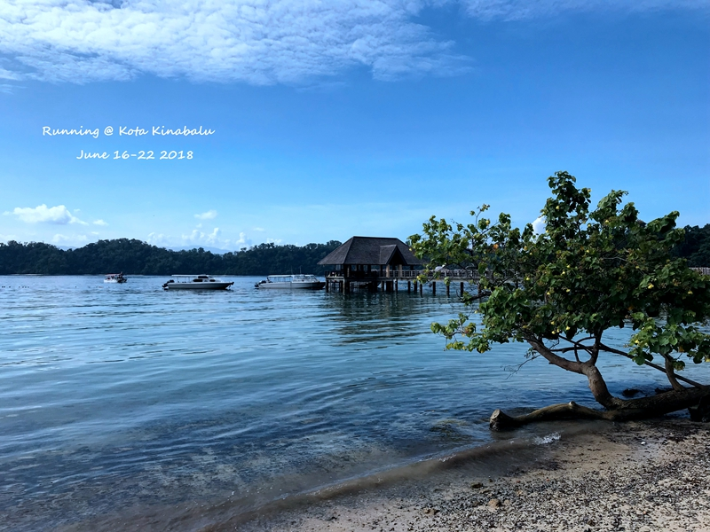
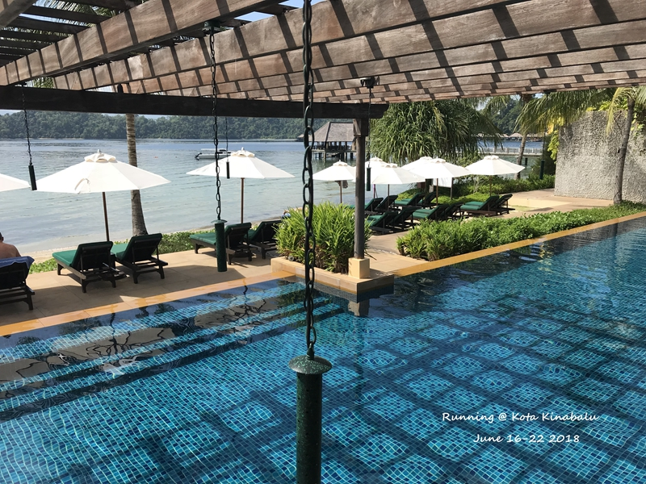
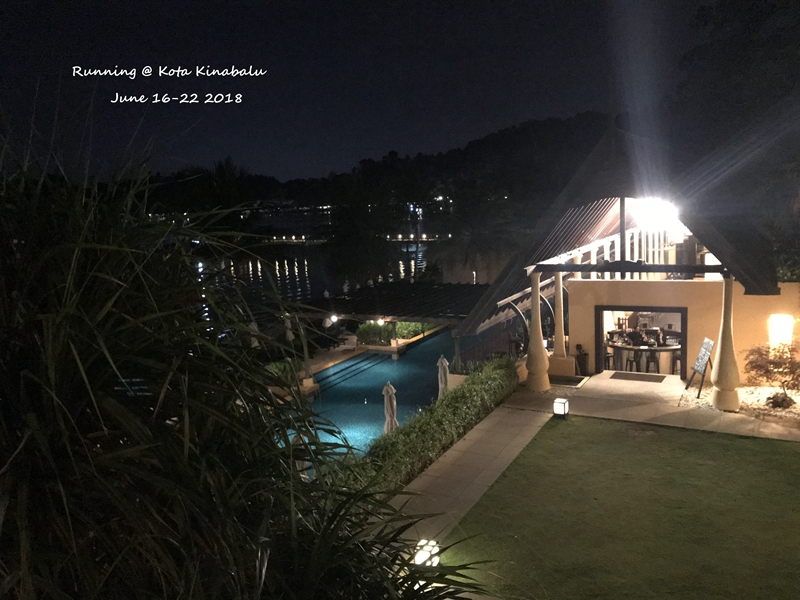
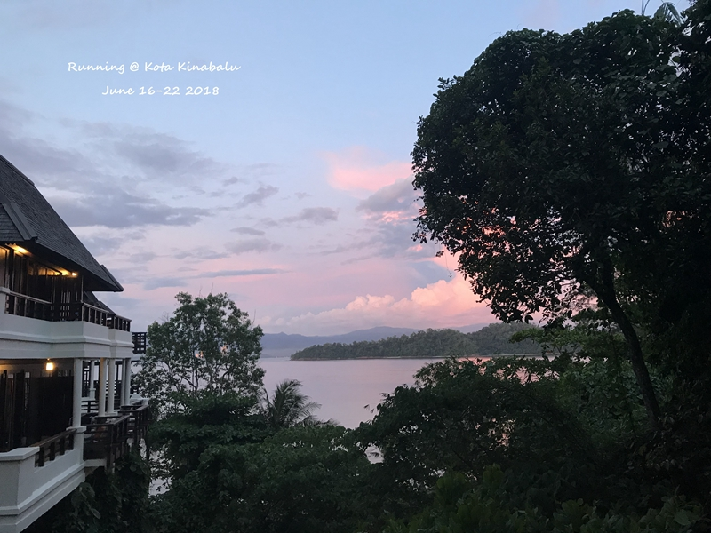
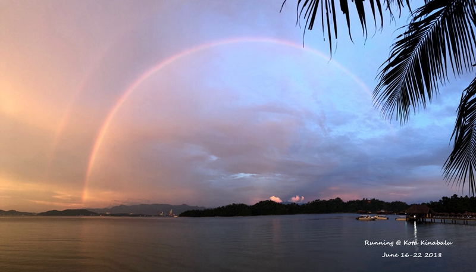

选择gaya也是偶然看了篱笆的帖子，有人买了三天两日的package做推荐。当时就觉得不错，于是很快也淘宝找了那家店付了定金。纠结了很久到底是最便宜的房型还是海景房，因为差价不多（三天两晚2大1小大概是500），最终还是选择了海景。事后在其他帖子有人说推荐的那个人是个托（哎，论坛就是这样各种声音难辨真伪），好在也不算贵，最终还是付了尾款上岛了。

<!--more-->

gaya上一共三个度假村，面向亚庇市区的gaya island resort和一个都是水上屋的，还有就是背面的大红花。在ctrip上比较了三个酒店，由于大家都只住过一家，并没有很客观的横向比较。总得来说，三家餐饮都一般，都有蚊虫困扰。住下来总体对于这个度假村还是满意的，除了给的海景房太不正对海景，其他都还算不错。海景房最好的应该是9字打头，在酒店的左侧，但是那边也是最高的区域，进出酒店中心区域估计得要10来分钟而且一路上坡路。不过好在酒店进出行李都可以由度假村帮忙拿，因此如果一天只进出一次也还算可以接受。8字头的房间都在右边，相对视线会差一些，但是走起来也更方便一些。6月份感觉蚊子并不多，不过餐饮倒真的是一般。整个度假村有4个餐厅，日式料理，大餐厅，大餐厅2楼的特色餐厅以及bar那里，因为package只包括大餐厅和bar，因此所有的饭菜基本都是在大餐厅吃的。第一天的晚餐buffer最差，不过厨师们态度都不错，可以帮忙炒个蛋炒饭之类；第二天午餐点菜，相对来说菜品精致好吃一点；第二天的晚餐又是buffer，不过这天有牛排有烤虾有烤羊腿，而价格跟之前一天是一样的；最后一天午餐居然还是buffer，据说是来了个团人太多来不及了，哎。。。

岛上地图介绍

大堂看码头

图书馆看泳池

图书馆

健身房view,可以看到有两个泳池，娃娃池和大人的。不过泳池晚上7点就关闭了

pool lounge bar

沙滩看码头，沙滩不大，也就是前台这块开始到餐厅过去一点

有一排对着大海的沙滩椅，位子不错，因为人不多，所以一直还是有位子的

package：
1. 两日海景房
2. breakfast*2, lunch*2，dinner*2
3. 来回船票（ms单程船票是70+RM）
4. spa*2
5. 免费租借浮潜工具1H（带娃没有使用）

除了房费，整个附加费用应该是在2000左右（2个人，饭基本上算120rm/人/顿），这样加上两个人的房费，比不定package便宜不了多少。唯一坑的是，小孩要付一半的钱，这样算下来比在香格里拉之类住贵很多，这也是不推荐带娃的原因。度假村本身带一些免费的活动还不错，包括yoga，丛林探险，只是带娃都没体验上。其实第一天可以早上就到，中午在酒店吃个午餐，然后在休息区域睡觉（就算游泳玩沙也Ok，泳池那边卫生间可以洗澡)，一直到下午再入住。早上到中午码头那边鱼非常多，如果不想出海浮潜，那这家酒店就相当方便了。spa的话虽然价格不便宜，但真的只能算摸遍全身。。。

晚上回房间拍的view

给的海景房view很一般，推荐9打头的，虽然走走比8打头的远很多，但是view感觉真的好很多。在没有上岛的时候其实已经安排好了住宿，所以要事先邮件跟酒店沟通一下。

就这个角度看得到海，第二天下午下雨了，躺在阳台上还是挺舒服的

最完美的是居然在走之前的傍晚看到了这么完整的彩虹，还是双德。有个广州小女孩跟点点叫着rainbow，点点说window？最后终于学会了rainbow这个单词。
