这次选酒店基本没有挣扎，亚庇最主要的活动就是看日落和玩水玩沙，而香格里拉就是最方便的。虽说这家香格里拉有点老，不过占据着丹绒亚路最佳日落观赏点外加不错的亲子设施，还是值得一住的。而且这家香格里拉送的是欧舒丹洗浴用品，茉莉花香型，可惜最后某人没有关好大半瓶都倒在箱子里。。。

<!--more-->

第一天的行程有点倒霉，飞机延误了两个小时（平时准点率80%以上的），然后接机的司机居然接错人（也不知道哪家人也不看清楚名字就上了车，也怪自己前一天没注意车牌号），最后房间的锁居然电池用完一直开不了，可怜的lionsky来来回回两次（关键在于山景房和前台好远）。

亚庇机场到酒店相当近，如果不是半夜到，绝对推荐grab打车。原本2点多可以到酒店的，结果一到就是日落时间，某娃直接就是沙滩一坐开始挖。香格里拉除了中国人就是韩国人，分辨方式很简单，韩国人的防晒绝对是不分男女老少而且绝对到位。

这一天还是马来新年，没有听从前台意见去预定香宫，结果直接没位子。只能退而求其次吃了意大利菜，价格不便宜，PIZZA之类都是70RM。还好最后说办一张香格里拉会员卡全单85折。

香格里拉的早餐很一般，第一天居然连pancake都没看到，需要注意的是有些摊位只在外面。第二天就发现在外面角落的pancake。马来西亚的早餐好的地方在于每天每个地方都有粥，对于每天都是粥+白煮蛋+酸奶的娃来说，有粥就等于有了一切。

第二天继续挖沙，早上真的很晒，挖了一个多小时终于愿意转战滑滑梯区，不过只敢玩最小的一个。大的几个我去try了一下，发觉就蓝色那个比较平缓，另外的都蛮快的，也不知道是不是我太胖了，滑下来水花好大。之后看到一个小孩滑下来MS水花没这么大。。。这次点点最大进步就是穿着臂环之类可以自己游起来了，终于enjoy了游泳。于是开始进入挖沙游泳循环播放模式。

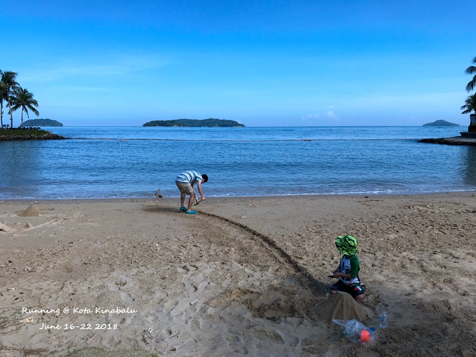

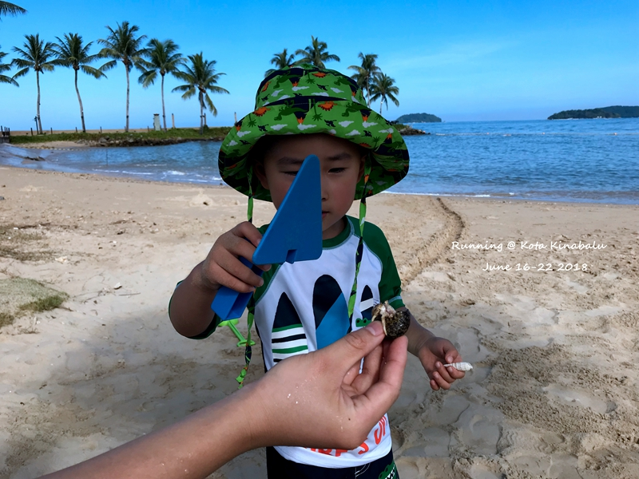

香格里拉沙滩就这么大，对于娃来说足够了，只是白天真的很晒。某人捡了很多不错的贝壳回来。不知道为什么，儿子看到螃蟹的第一反应都是用沙子埋起来，对除了猫猫之外的动物完全无兴趣。

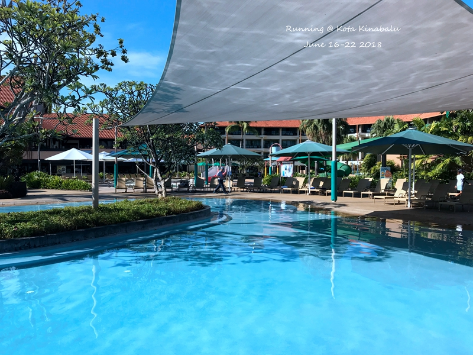

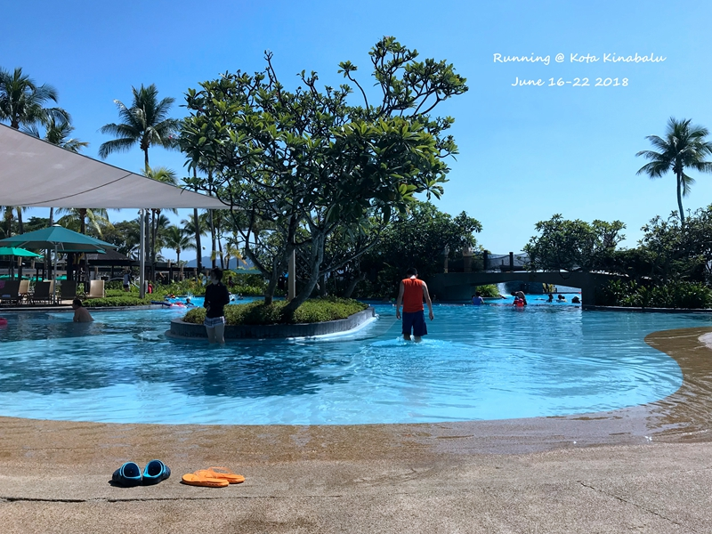

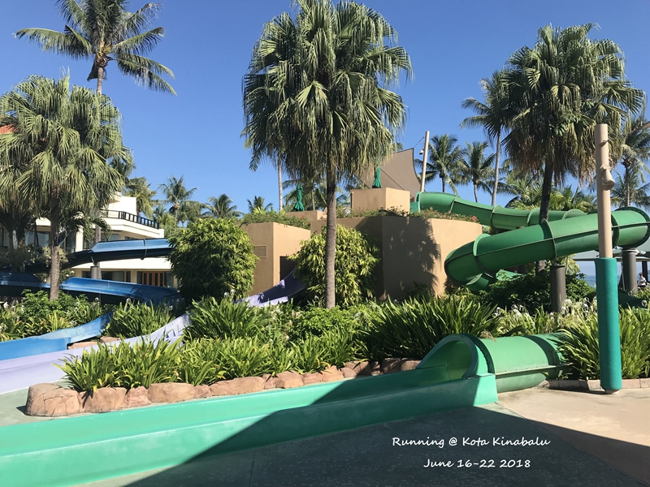

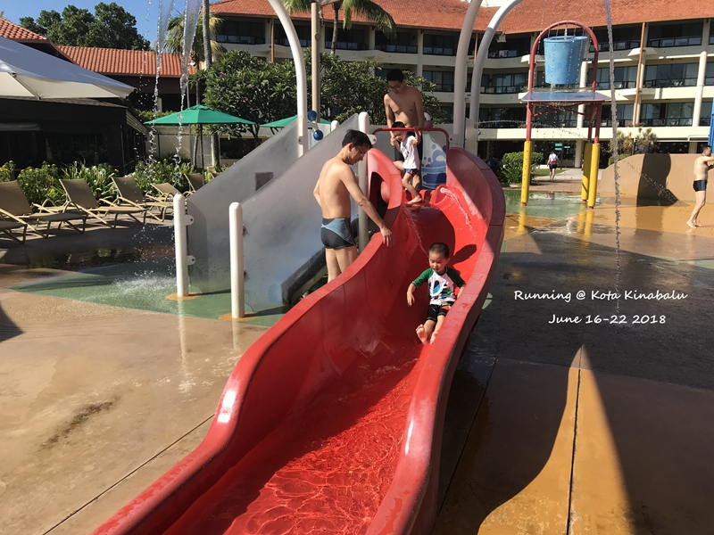

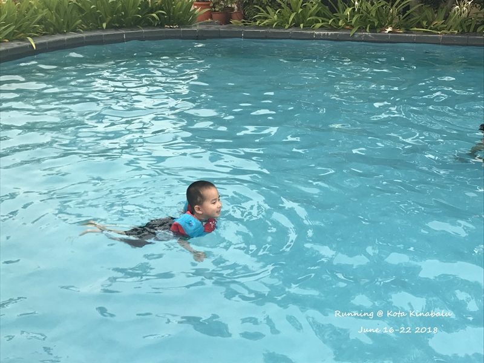

儿童玩水的地方包括几个滑滑梯，还有一些比较浅的娃娃池。可以租借水上ball，每天那个打水战的地方每个房间好像可以打4桶水。

中午去了大茄来，12点开门，早一分钟也不点餐。马来新年刚过，中午只有鱼和沙白，不过做法口味很适合国人。海鲜都是下午陆续进来，所以中午总是货不全。第二次中午来也只有老虎虾，东风螺，鱼之类；吃到一半沙白、蟹什么好像也到了。人均100RM的确是可以吃到很满足了，如果不是带着娃绝对是中午晚上每天来的节奏，五星推荐。这次去亚庇唯一遗憾的就是好吃的没吃够，比如lasa之类都没吃，海鲜也没有吃到扶墙出。亚庇的海鲜比普吉的要好，主要在于做法上更贴进国人口味，不太喜欢普吉什么都是酸酸甜甜或者椒盐或者就是辣。

来回都是grab打车，相当方便。grab打车的价格都是系统算出，然后驾驶员决定接与不接。感觉这个还是蛮有技术含量的，我问司机这个到底划算吗，他说这个算超市价，量大所以就赚一点点也不错。最后从码头打到机场只有11RM，10KM左右，而且单子几乎都是1分钟之内就有人接，真的都是良心好价。

这边都是早上大太阳，下午开始多云甚至于下雨。原本以为第二天也看不到什么夕阳了，没想到还是挺赞的。最后挖不动沙子又不舍得走的点点开始呜哇呜哇，回房间教育一番之后又开开心心去吃饭了。这是这次旅行唯一一顿自己吃的，一边吃一边还说阿姨怎么不看我，我很大一口。。。香宫的海鲜不贵，普通的菜也不算很便宜，问新鲜的海鲜的价格，只有蟹有最后几只，告诉我最后三只30。以为是很小的蟹，结果上来满满一盘，lionsky还一直问我是不是听错价格了。这天开始意外发现娃还蛮适合吃扬州炒饭（香格里拉扬州炒饭料很足），对于米粉普遍比较硬的地方，还是炒饭比较方便，自带蔬菜。

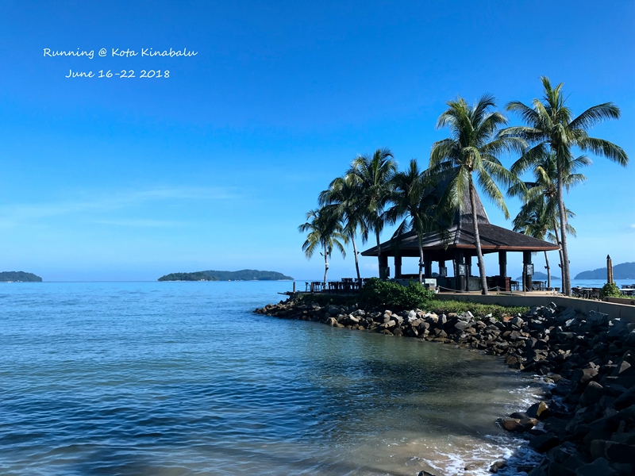 

sunset bar, 早上都不开放。特意在夕阳的时候过去溜达了一圈，没感受到特别棒的view。

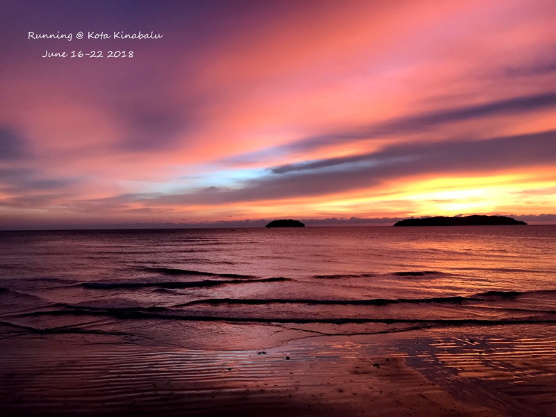 

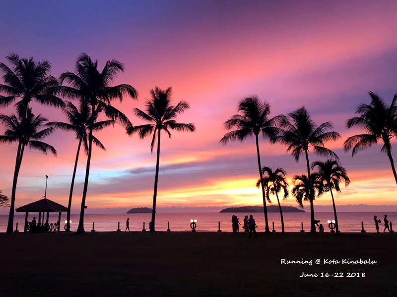 

夕阳棒在颜色层次很好，不是单一的日落。好看的日落都需要丰富多彩的云。

第三天玩到中午左右退房，直接入住grandis。

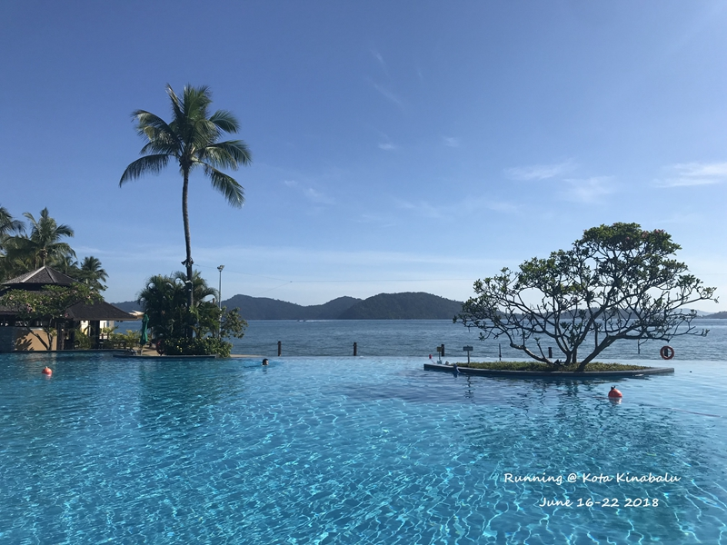

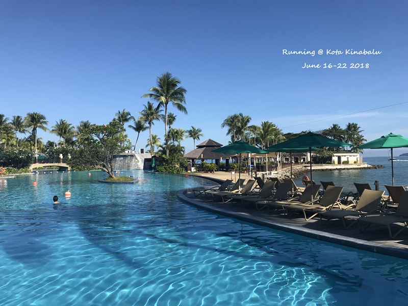

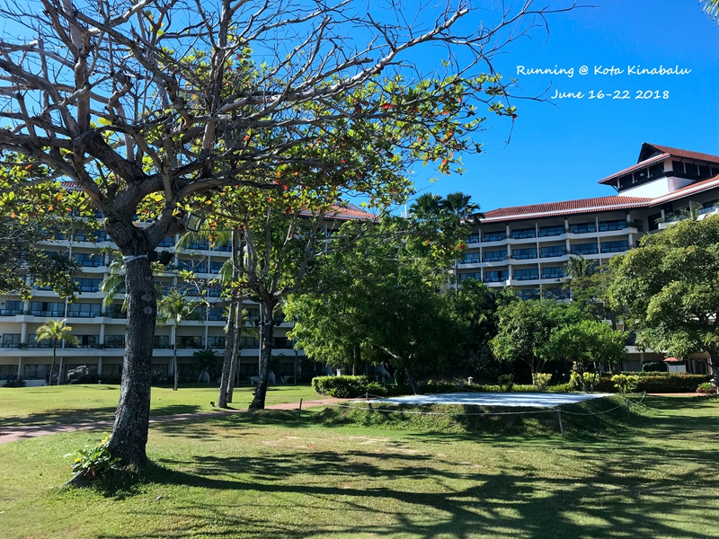

最后拍一圈香格里拉，大人游的无边泳池，感觉比儿童那边要更晒一点。最远的就是我们住的山景房，后来认识路了不从上面绕感觉走过去也不远，就在香宫楼上。

grandis放好行李比较晚了，想早点给点点吃饭，就直接选在了隔壁的海鲜酒楼。其实如果提前看一下就会发觉grandis旁边就是曙光商场，地下一楼有很多实惠可以吃的。海鲜酒楼就一个茄子煲还不错，点了两个老虎虾比起后来大茄来的真是又小又贵。吃完稍微休息一下接人的大巴就来了，还好是辆大巴，不用担心点点会吐了。先是市区的水上清真寺，到此一游照之后点点开启睡觉模式，一直到下午茶地方。这个半日游行程真的是一言难尽，其实只是为了看一个萤火虫，硬是凑足了半天的活动。
- 水上清真寺 30min
- 开车 1.5H(当中还下车吃个椰子布丁)
- 下午茶 30min
- 坐船红树林找猴子 45min
- 自助晚饭+看日落+玩泡泡(就是给个工具给个泡泡桶自己玩)+看烟火表演（真的只有1分钟！） 1H
- 萤火虫 30-40min
- 开车回 1.5H
点点因为不能直接在沙滩玩沙子很不爽，因为前几天在香格里拉都是直接坐在地上各种蹂躏沙子，而在荒郊野外不能用水冲，沙子很难清理，所以只让他玩了一会儿就不允许他玩了。他好不容易吃完饭就等着玩结果玩一下就不行了，难过的要哭了，还好1分钟烟火表演开始，转移了注意。不过后来在大家都开始看萤火虫的时候，他开始说眼睛里面有沙子不舒服，好在被我吹了几下就好了，不然真是。。。萤火虫真的不错，就是完全拍不出，花了12元买得APP也是没帮上多大忙。

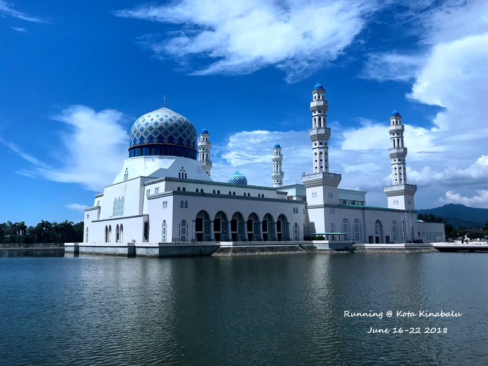

中午太晒，加上开始没有在注意要到绿顶的屋子租好长裤，就没进去。没想到后来因为抖音事件就关闭了。。。早知道怎么样都要进去看看了。。。

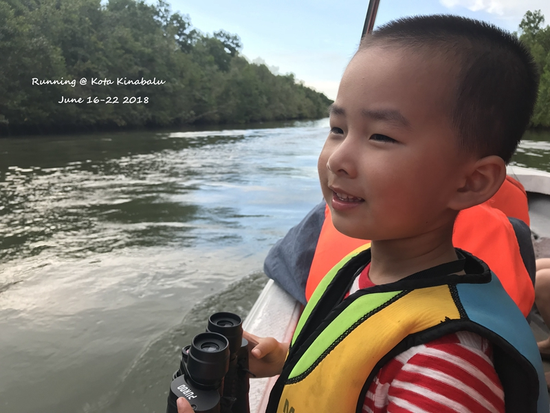

看猴子就是点点玩望远镜的时间

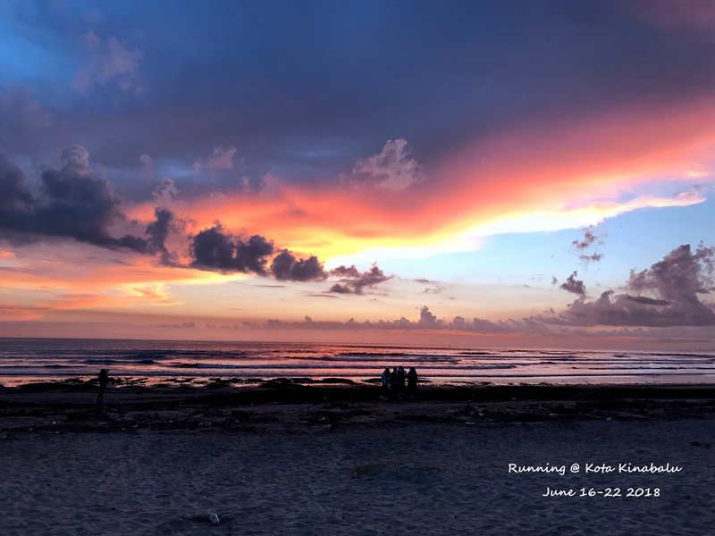

所谓的私人沙滩日落也不错，但是沙滩不能快速洗澡对于点点来说实在不适合玩沙。。。用湿巾纸完全无法清理干净

退房之前还是去享受了一下grandis顶楼的游泳池，一早晒得很，只能打伞游泳。。。曙光百货真的没啥东西，SK2并没有很便宜，随便买了件MANGO的衣服。。。中午还是大茄来之后上gaya。

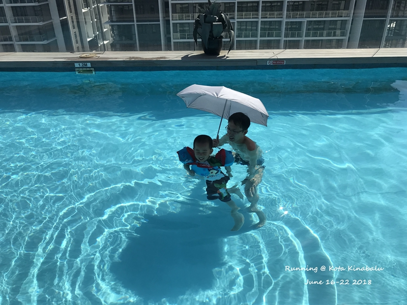

