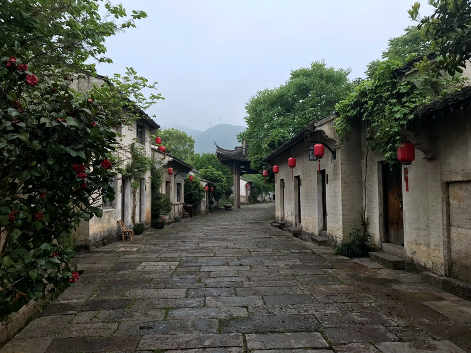
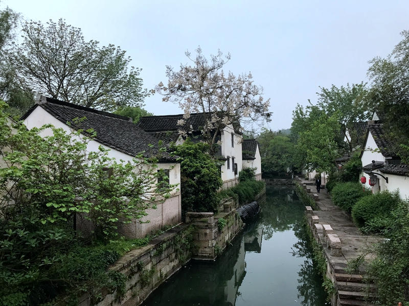
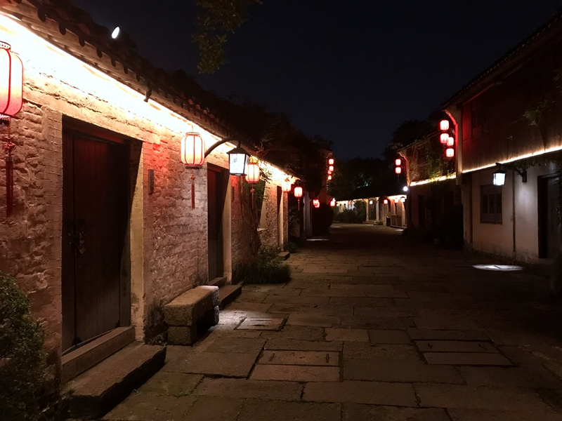
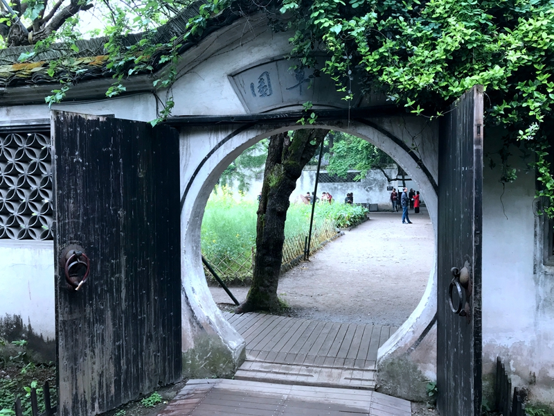
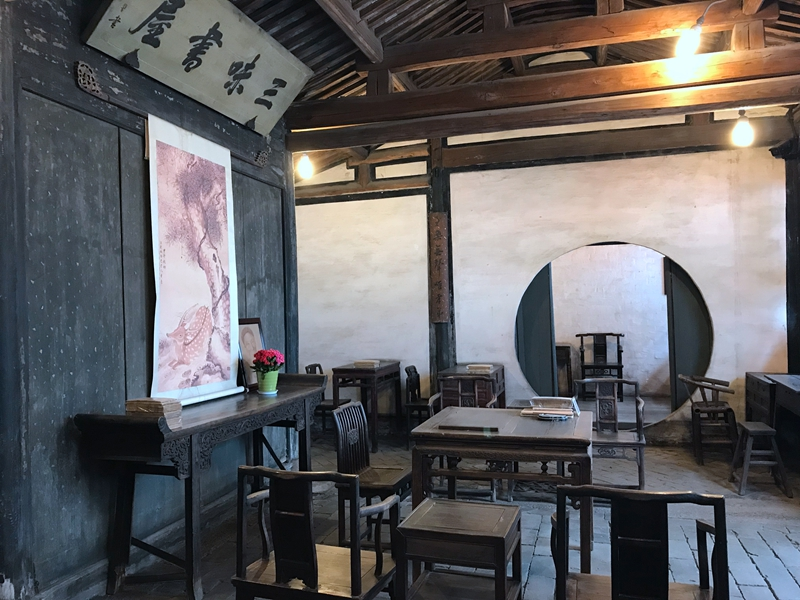
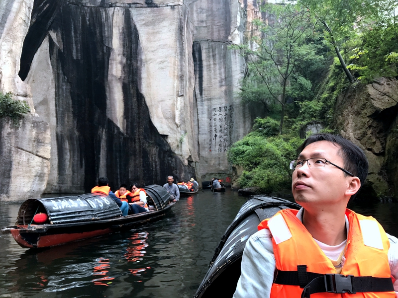
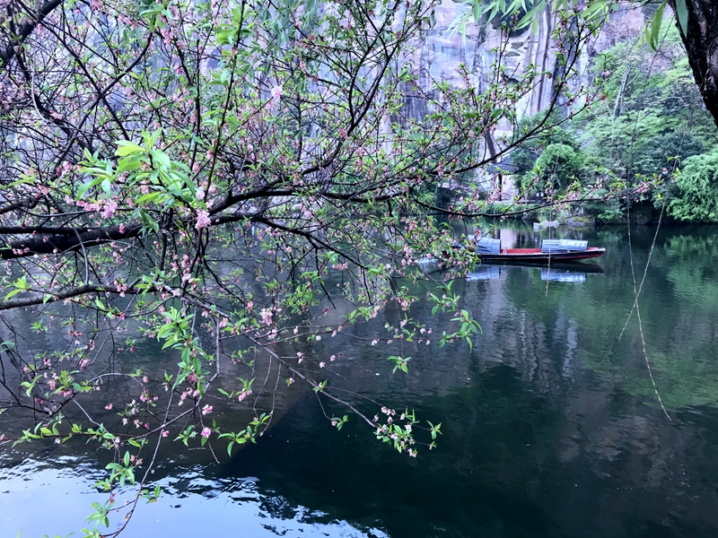
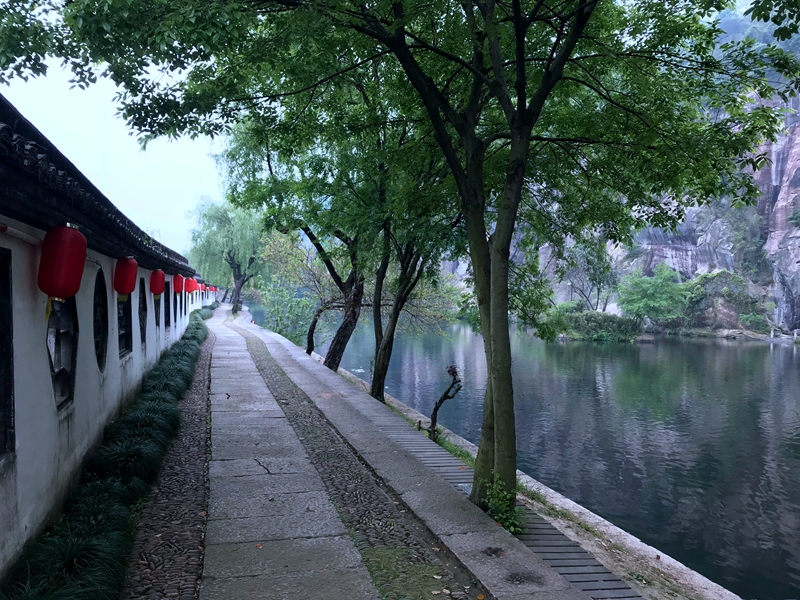

2017的双十一基本是把之后六个月的酒店都给透支买好了，按照原定计划预定了4月的绍兴大禹开元。尽管原本想预定的周六-周一没有订上，幸好还有周四-周六还有房，终于成行。
<!--more-->
开元是这几年颇为红火的国内五星，千岛湖开元、绍兴大禹、宁波十七房、宁波九龙湖都在论坛看到别人去过。这次选了绍兴大禹开元，除了这家本身是一个度假村有的玩之外，更主要的是绍兴本身是一个很小的城市，到景点都是十几分钟来去自如，特别适合带娃。据说2016双十一的价格更优惠，不过当时并没有关注。2017是613/两晚送餐券300-100*1 + 200-50 *2。不得不说加价还是有点狠的，周末都是300/晚，而节假日就是800/晚。完全不用周末估计只适合退休人士，带一晚周末性价比更高一些，这样就是913/两晚，在4月一般的订房网站基本在1400两晚左右。如果是周六-周一，只需要请一天假，也是原先的安排；可惜周六实在太火爆，最终只订到周四到周六，请一天半假。好处就是，周末（周六-周日）绍兴大禹吃饭居然加收15%服务费，而平日是不收的。

上海到绍兴，百度地图导航基本2.5-3小时，实际开下来大约要3个小时左右，堵都堵在上海市区。查了一周的天气预报都显示有雨，结果从去到回来一直多云，运气真心不错。

Agenda:
Day 1: 酒店逛，酒店晚饭，晚上沈园
Day 2: 鲁迅故里，咸亨酒店午饭，东湖，酒店晚饭
Day 3：酒店逛，酒店午饭

花费：4000/四大一小，人均800-1000
酒店：913*2（含早）=1826
吃饭：270+290+210+230=1000
门票：90*2(60岁以上老人套票)+(80+50)*2+85*2=610
路费：115*2=230（过路费）+300（油费）=500

大禹开元本身分为一期和二期，一期是以前的古镇，房间里面都翻新了；二期则是新造的，感觉房间还有点味道。本身双十一应该是一期的大床房，订的时候已经没房只有二期的双床房，也要了。从ctrip之类的价格来看是差不多的。如果住二期，可以直接停车在二期会稽楼后面，进出很方便。度假村整个逛一圈1个小时走走拍照绰绰有余，可惜的是原本看到别人说得有送坐乌篷船已经没了，现在是95一船。原本打算下雨就让点点去儿童乐园，68一天，不过后来一直没下雨，也没去。健身房游泳池免费，看上去倒不错，只是这次没带游泳衣，看来以后要有备无患。

点点的自行车新装了外公退休的牌照和警灯，硬是要带过来，倒意外的不错。每天起来后可以绕着酒店骑几圈。

酒店的早饭还不错，中西都有，即便是周六小馄饨之类现煮的也排队不长。值得一提的是酒店的饭店，禹家大院，相当实惠，尤其是不用加服务费的时候；最后一天午饭原本打算在酒店那家禹家面馆随便吃一顿，结果发觉一碗面要60+还不如点菜实惠。禹家大院推荐菜肴包括：鸡汤，茄子，上汤西兰花，属于连点几顿的菜。相较而言，咸亨基本就是吃个名气了，尤其是那个菌菇汤，同样68的价格，只有味精味。
绍兴的景点除了兰亭都不远，离酒店都在4-5KM，开车也是10多分钟的路程。本着不下雨就赶紧去的原则，第一天晚上就去逛了沈园。绍兴是有景区通票的，但是本身就只打算夜游沈园+东湖，因此并没有买。老年人买通票还是划算的，60岁以上只要90。沈园晚上时18：30开放，唱戏大概是19：40开始。其实到绍兴这样的地方看戏，主要看的还是以前的味道，沈园之夜有点超前了，还是喜欢以前露天老戏台的感觉。

第二天早上吃了早饭慢悠悠的去了鲁迅故里，百草园、三味书屋好像还是书本上的样子。还记得昏昏欲睡的语文课，咬文嚼字得估计连鲁迅都没想清楚的文字解析，以及当时那个能听得见时间滴答滴答慢慢走却恨不得时光飞逝的自己。现在那块就感觉是绍兴的城隍庙，啥小玩意儿都有的卖，买了套壶放公司用。

中午点点睡了觉就带去了东湖，在东湖坐了乌篷船，景色各方面还不错，就是船实在划得太快了。。。其实整个东湖随意逛逛2个小时差不多，我们是大约3点40到的，稍微赶了一点。

现在来去点点都可以在车上睡一觉，带去上海周边2-3小时车程的地方很合适。今年这样的券绝对可以再囤一些。
