   羚羊谷作为朋友圈最出图的景点，第一次去美国玩怎么能错过呢。于是拉斯维加斯这一圈也一样被排进Plan，拉斯维加斯、大峡谷南和page，基本就是一个三角形，两两之间路程基本就是4.5小时左右。研究了诸多可能，包括page坐飞机回去，大峡谷附近机场飞回去，phx回去，结果还是老老实实的开车来回了。这一圈异地还车很贵，而且像page机场的航班很有限。

Day 1 黄石西-las vegas
Day 2 las vegas主街逛+北outlet
Day 3 las vegas - hoover dan - No 66 street - Grand caynon
Day 4 Grand caynon - 鲍威尔湖
Day 5 马蹄湾 - 羚羊谷 - las vegas

<!--more-->

   从黄石飞到拉斯维加斯，感觉就是进城了。按照网上的攻略，给了前台一些小费，想要一个好点位置的房间，结果也就是给了一个面向侧街的连着的房间，看不到主街也看不到摩天轮。威尼斯人带的早饭就是每天去定点领面包盒+咖啡，走之前看到这个觉得太烂了吧，结果到了觉得还不错，聊胜于无啊。每天早上三个大甜点（量蛮大的，而且并不是网上说的甜的要死，感觉有一个是咸味的蛮好吃的）+水果+咖啡倒是还是很管饱的。两天的面包盒我还cover了大峡谷的早饭，至少省了一个人30刀。拉斯维加斯基本没啥行程，逛各种酒店+shopping outlet。基本上早上就是一路从威尼斯人走到百丽宫，酒店都太大，感觉走了很久，还在凯撒。最后回来的那天还看到了很像迪士尼城堡的酒店，感觉应该百丽宫另外一边还有大约一半的酒店可以逛。因为带着儿子，没选啥show，以后等他再大一点，可以去澳门看一下，我记得那个带水的show澳门也是有的。中午选择了凯撒的自助餐，很一般，当然价格也不贵（主要是不要小费），中午没有很多推荐菜，比如什么牛骨髓还有蟹，在上海这个真的只能算非常非常普通的自助餐。

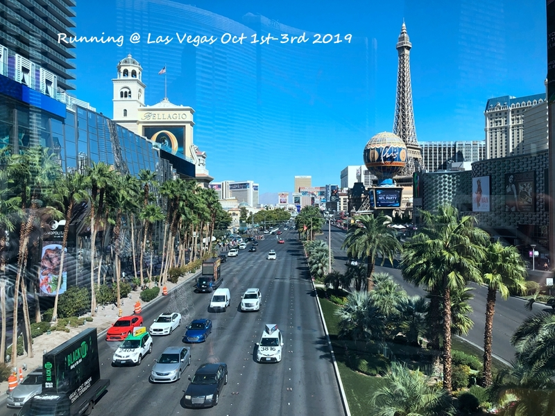
笔直的一条主街，很好走。路上有公交，不过没买，因为最远也就走到百丽宫。las vegas如果不去outlet，不租车也可以。租车的话，利用部分酒店免费停车来主街也可以。主街上的酒店度假村fee实在是有点贵。
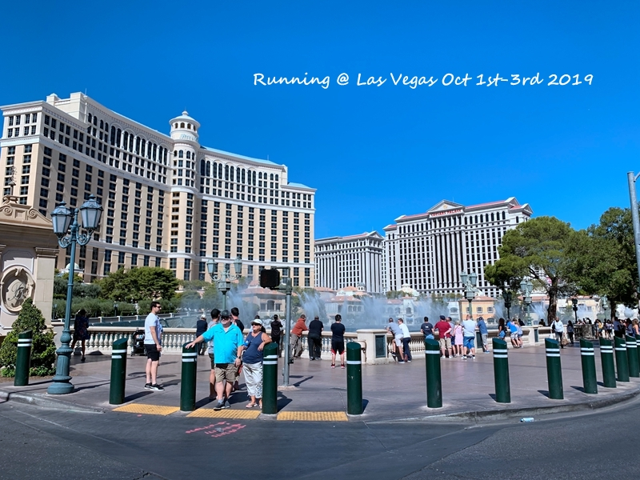
百丽宫的喷泉是从早到晚的
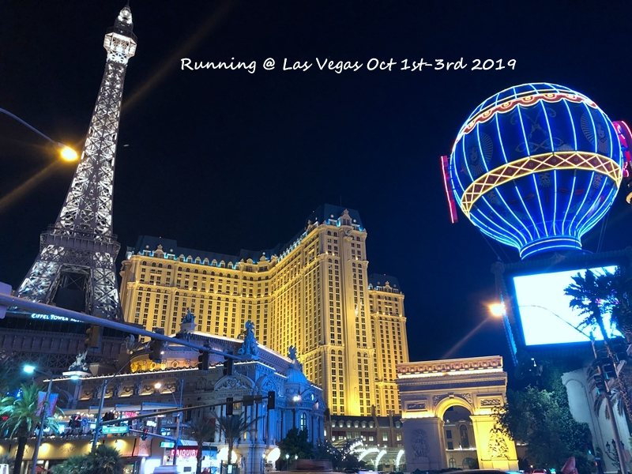
还是晚上更好看，人也更多
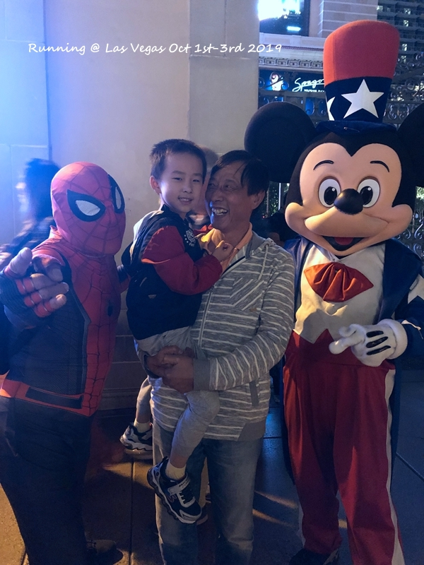
此行最贵的照片，主街很多人装扮一下找人拍照，老爸以为都是凑热闹的，其实人家是赚钱的，拍完就开始要钱。主要是当时lionsky在停车，老妈害怕，别人说20就给了。其实直接拒绝给个2刀左右即可。
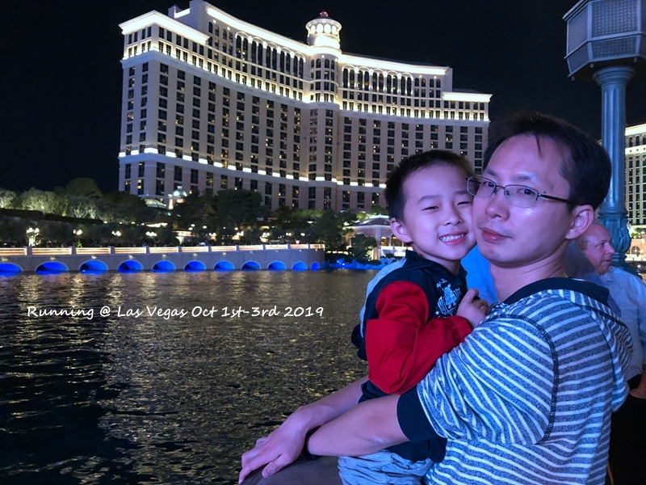
点点说不如音乐广场，音乐广场和吉隆坡的喷泉是他心目中最高的规格。音乐广场宏伟，远近皆有又带火。吉隆坡的小巧灵活。好像也就是15分钟左右一场，看了一场没过几分钟又来一场，点点说多看一场已经很开心了。

 

   吃完自助餐就是outlet，还好在las逛了，真的比lax便宜。早知道我还不如最后一天晚点才去LAX，继续在las逛。晚上也是outlet类似于panda的中餐，至此开始了panda之旅。
   第二天的安排就是胡佛大坝 + 大峡谷日落。走之前看到路上会路过kinman，可以看一下66号公路，看一些照片觉得还不错。结果就是因为吃panda+kinman耽搁，大峡谷到5点45才赶到。而结果66号公路除了到处贴着的No 66，也没看到啥好看的，而大峡谷的日落因为缺乏准备，也没找到好的位置拍摄。放弃该放弃的，当初安排的时候就是大峡谷日落，就应该尽量早的到大峡谷然后静静的等待日落，而不是这么匆匆忙忙的，最终啥都没玩尽兴。其实选择一个景点，像网上说的大题顿只要一个早上啦、大峡谷也就一个早上啦，如果慢慢玩一下，基本还是要大半天才可以比较爽的。我个人推荐大峡谷呆两天，可以选择两个点看两次日落。

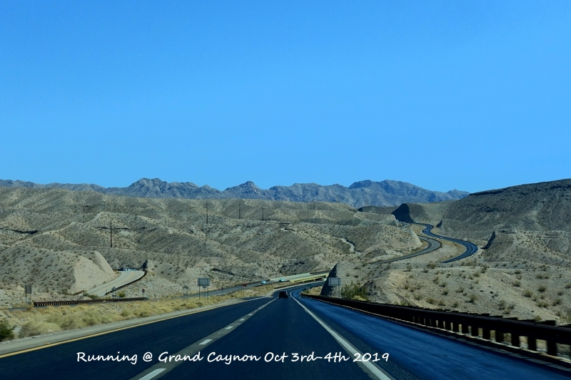
拉斯维加斯在沙漠区，除了繁华的市中心，周边都是荒芜
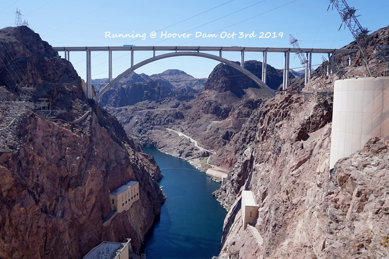
每个国家都有这么一个时期，需要靠一些大型的建设来刺激经济，团结国家。美国比中国早了几十年，很多东西如今看已没有特别的感受，但就像百丽宫的喷泉，在90年代末，一骑绝尘
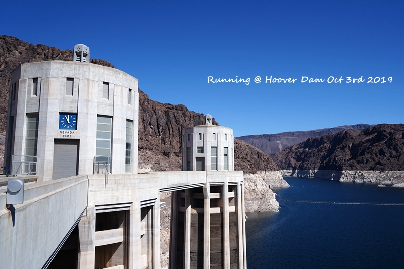
胡佛大巴正好处于内华达州和亚利桑那州中间，两边有一小时时差
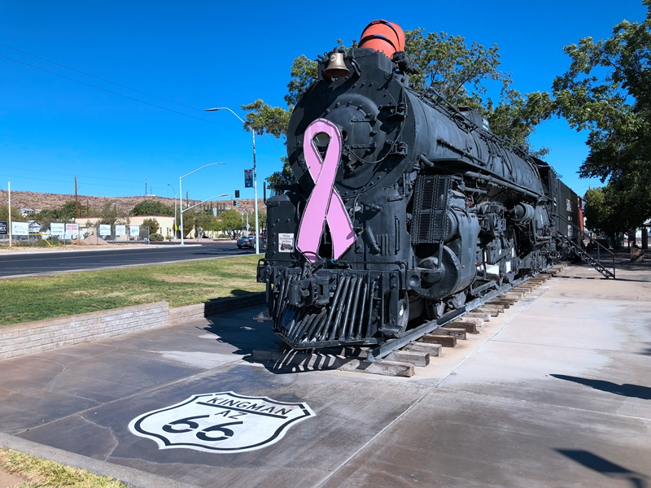
66号公路说是有个早期的火车在博物馆对面，虽然可以上去，但不能进驾驶室之类，本来点点还是很期待的。

 

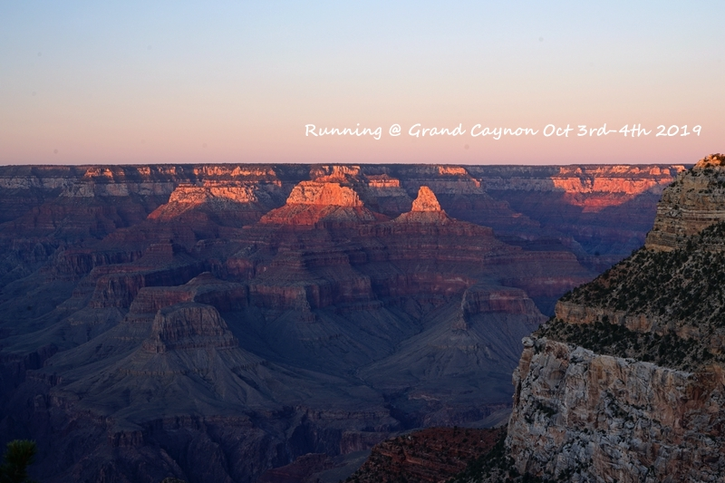
    
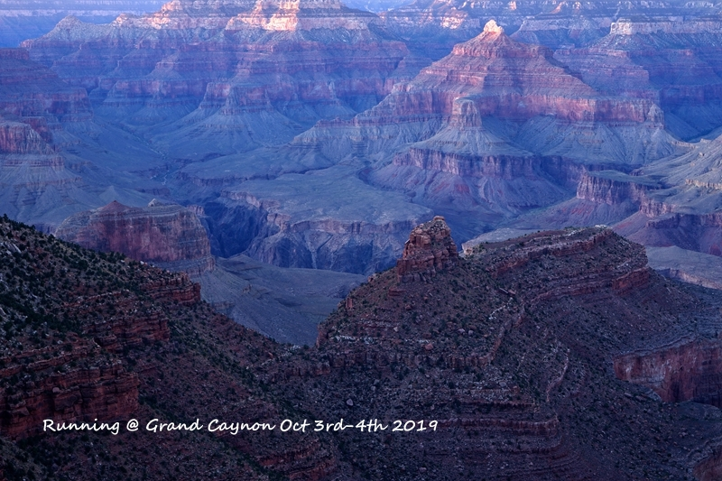
    
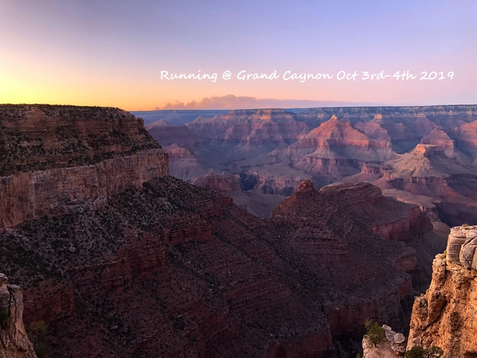
跨越几个世纪的岩石，静静的看着沧海桑田。就像我们在这夕阳下，静静的看着他们，一层一层深深浅浅
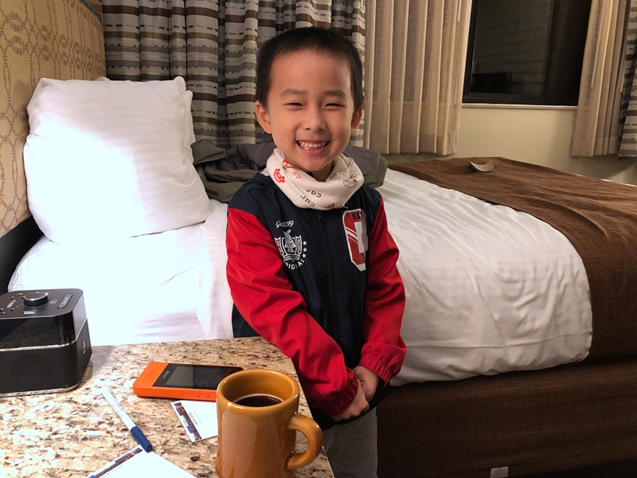
点点在酒店最爱做的事情，用胶囊咖啡机帮大家煮咖啡。晚上也要来一杯。

  
   第三天就比较轻松了，鉴于前一天失败的日落，当天提前做了功课。红线选择了hopi开始的步行，主要看点点可以走多少。除此之外还选了Pima可以看到河（河居然是黄色不是绿色的。。。）。而橙线除了lipan还停了博物馆那里，应该来说还是橙线最好看，当然酒店那块看起来最省力。

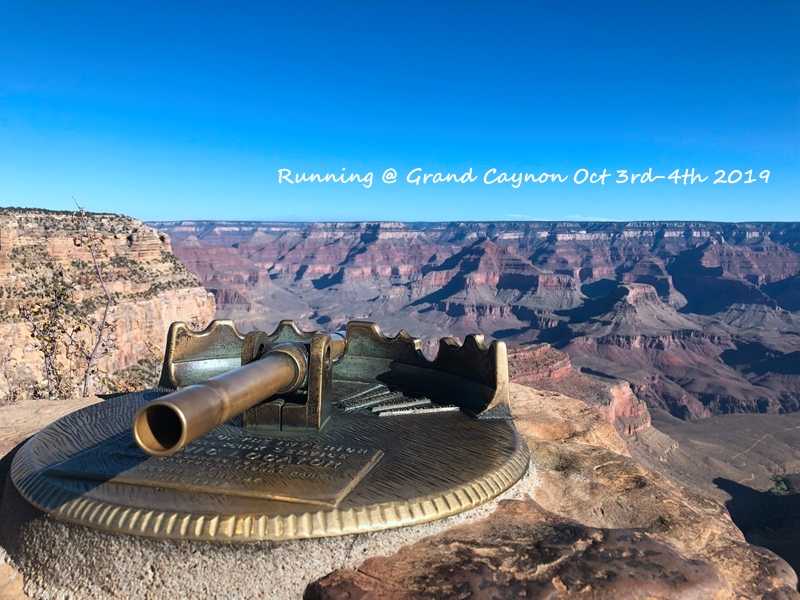
酒店后面那块
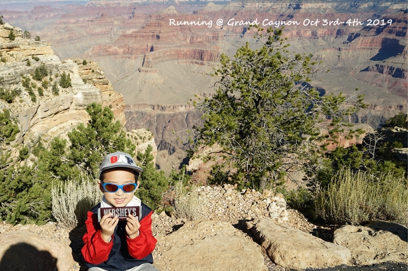
这块ms是黄石那里送的巧克力，结果点点那天都吃完了。后来买了小袋的，每天吃个两块充饥
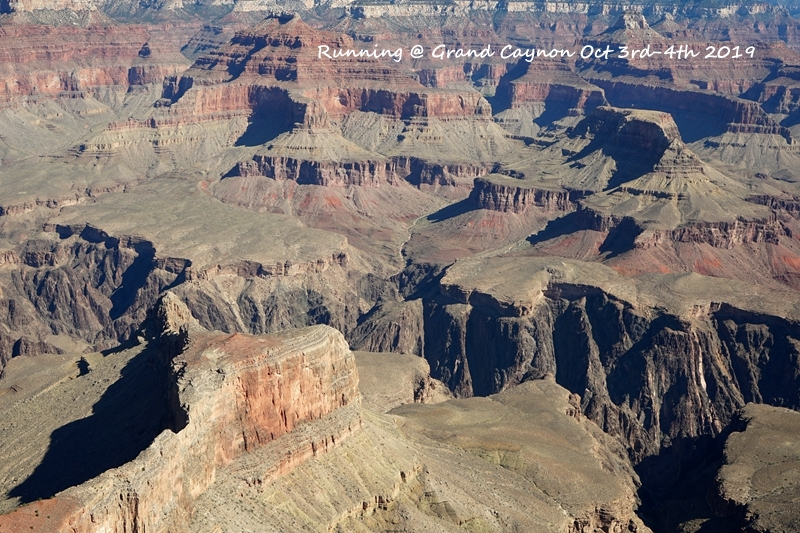
     
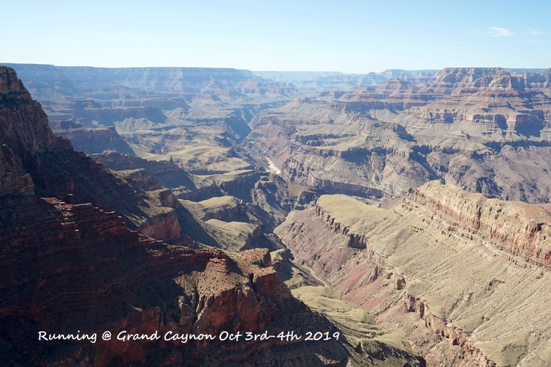
黄黄的科罗拉多河，就跟蓝色多瑙河一样，难以分辨

   吃饭一直是酒店，里面的汉堡和tuna三明治很不错，后来我发觉只要是热的其实做出来都不错，后来在las机场买的也不错，价格不贵无小费。
   大峡谷玩好一路没信号，也没下google离线地图，还好基本没岔路，开出大峡谷。后来问了淘宝店主才知道我的卡在大峡谷和page这块都是有问题的，还好这段路线比较简单。开到page还早，但是对于鲍威尔湖不太熟悉，不知道观景点在哪儿，还好时间够多，慢慢兜兜转转看着还不错。看时间还早，想就顺便看一下马蹄湾日落吧，结果，开到马蹄湾说是走进去至少25分钟，放弃。

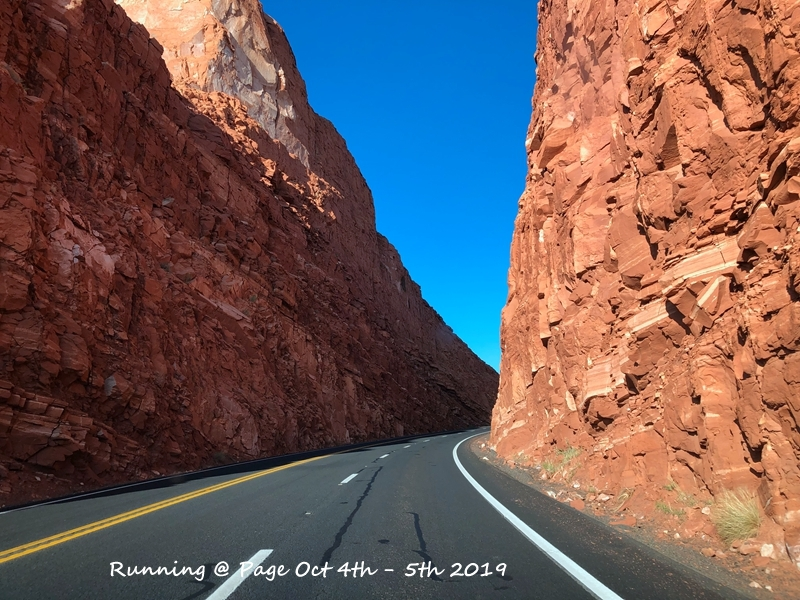
一路开到羚羊谷，都是这样红红的岩石了
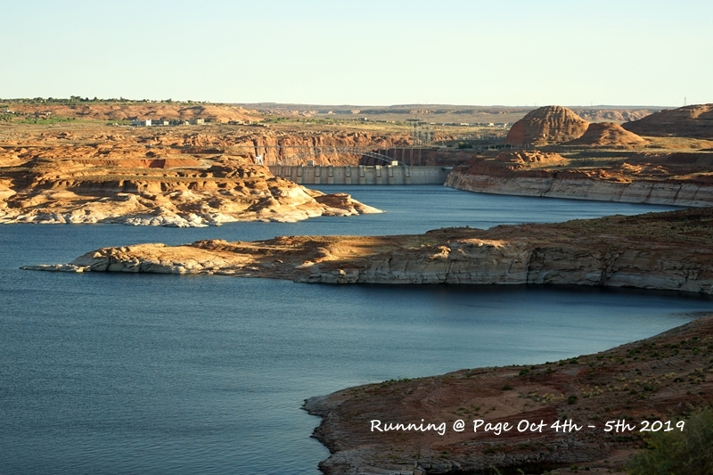
好像是美国第二大人工湖？其实观景点都是开过那个大坝，然后一路往码头，路上可以随意停
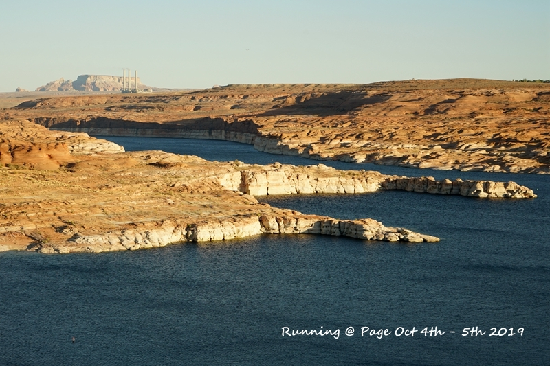
可以看到page大大的三个烟囱，page现在基本应该就是一个旅游城市了
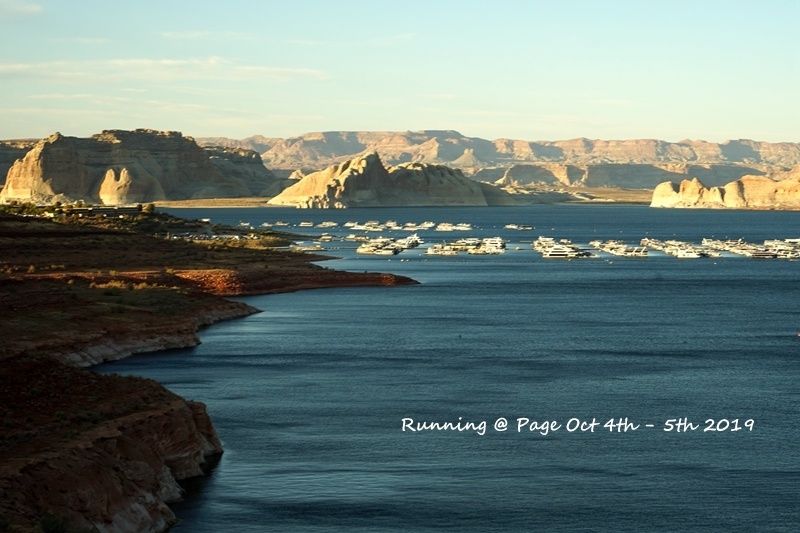
码头停了很多船，不过没感觉游湖会很美

   
   第二天12点的羚羊谷，但是要提前一个半小时报道。其实可以很早去报道，然后到11点45到就可以了。网上都说早上去看马蹄湾合适，因为顺光。其实不然，太早的话，马蹄湾部分是照不到光线的，应该是要到近中午或者夕阳，才是最合适的时间。走进马蹄湾真的还是有点路的，加上是沙地，感觉来回的确是要50分钟的。美国的景点都很原始，意思就是并没有一个点是让你到了坐一下站一下拍照即可，就算是马蹄湾这样简单的景点。还是可以爬啊走啊，玩个一小时也是ok的。马蹄湾最适合的拍照方式是自拍，因为自拍才可以自上而下拍出整个马蹄湾+自己。

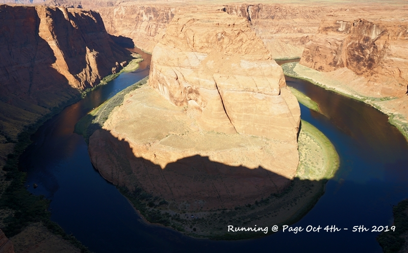
肉眼可见的阴阳分割线
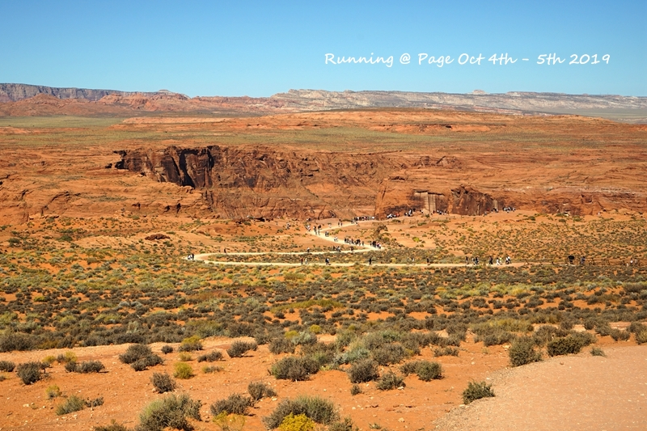
翻过最开始的坡，然后就是长长长的一段路。不明白停车场不能再往里面推一点？又没有收费摆渡车咯

   
   羚羊谷作为美国之行门票最贵的点，本身是让人充满期待啊。当然并不是不好看，质地之类还是差不多的，只是色彩，真的就是“照片”。虽然不是摄影团（儿童不能参加摄影团），但全程基本导游还是比较慢的，想拍的地方前后人都会比较配合让开，不过相对开阔的点导游都是让一个队伍一个队伍过去拍的。那所谓的正午的光束，也只有在夏天才有，而且每天就几分钟。中午还是选择了自助，第一天找的是great wall自助，小费居然只要10%，我后来想是不是小费也就是加州特别高（我全程都按照15-20在给）。这家自助其实还不错，主要是虾不错，走的时候我们说明天再来，居然劝我们明天去另外一家同城自助，说更好吃？！第二天去了可并没有感到更好吃，也不知道是不是中午，菜并没有晚上的great wall丰富，难道是给老乡打广告？

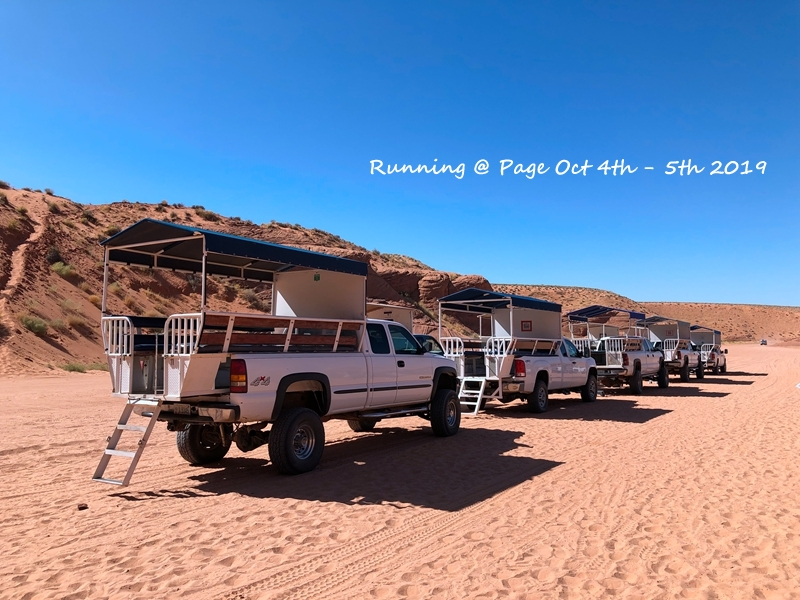 
无风，围巾口罩一路都用不上。。。
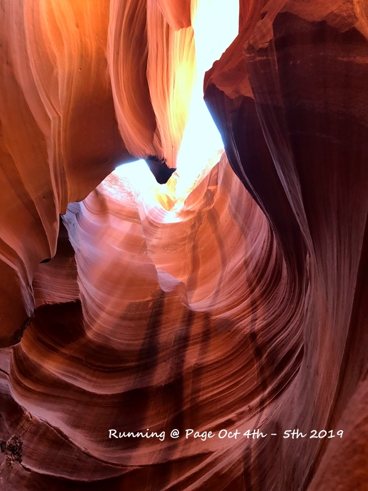
iphone show time，鲜暖色
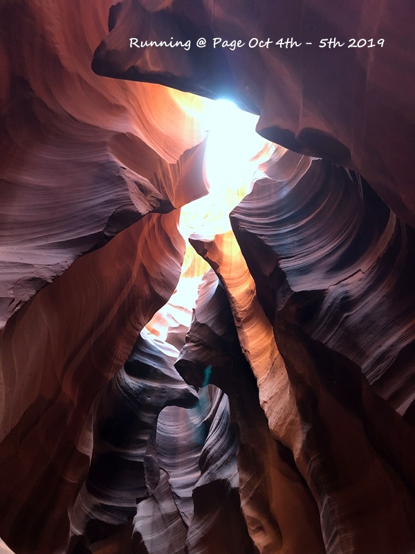
鲜冷色
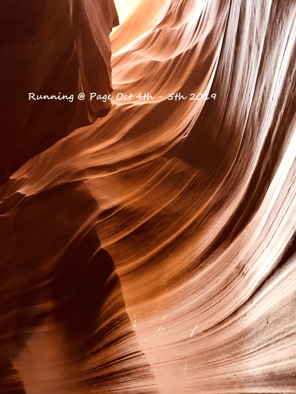
丝绸般的质感，在iphone的映衬下，格外鲜明
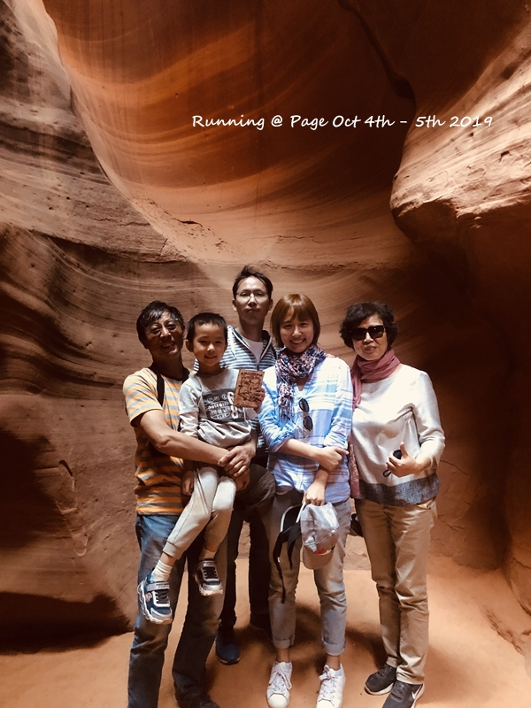
本次旅行要落下帷幕了，马上点点要上小学了，再也没有国庆的随意长途游了。一代一代就是轮回，结束也不过就是新一个起点。好像昨天我才在开学寒假开学暑假中度过，转眼我儿子也开始了。    

  
   羚羊谷出发因为已经3点了，一路没休息直接开到了拉斯维加斯，辛苦Lionsky了，还好点点一路睡，比较安静，四小时多的行程对谁来说都是比较漫长的。
   再次入住拉斯维加斯，选择了机场旁边的家庭套房两室一厅，带双卫带早饭，个人觉得比威尼斯人好。住这家再找一些可以免费停车的酒店就是完美。第二天还车的地方就在隔壁，然后就开始了悲剧的延误。主要是走之前没有再查一下，其实还没出发就直接延误三小时，如果还在酒店就可以吃了早饭再走。逛了几小时机场吃了个星巴克早饭，差不多都轮到要登机了，说是还需要再次检查上的人又回来，来来回回的通知，最后有隔壁的华人说肯定是空姐喝大来晚了。开始还不太信，最后真的是一个空姐匆匆忙忙的赶来之后大家鼓掌然后瞬间就检查好了登机。晚了大约6小时到LAX，收获赔偿1500+1400=2900，划算吗？ms也还行（主要对于LAX没啥期待）。赶到LAX之后，就是吃饭+Outlet，价格比LAS贵，还好当时安排了两次outlet。不过美国outlet的确是适合屌丝的Outlet，ck/tommy/polo，基本就是国内优衣库的价位。
   
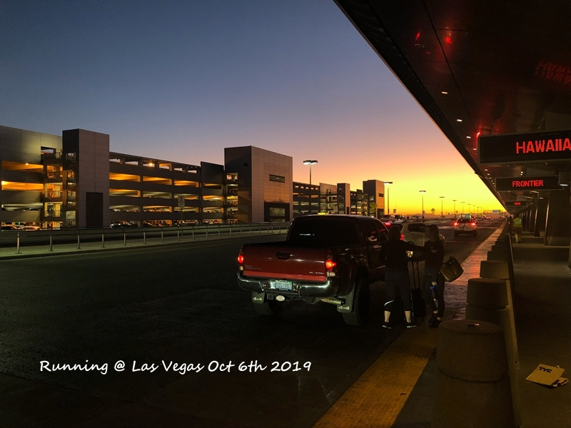
早上6点的las vegas, 88 

