   福冈作为北九州的最大城市之一，周边有一众可玩可泡之地，包括由布院、别府、黑川、长崎、熊本等。还是本着休闲游的宗旨，节奏慢一些，玩玩泡泡为主，选择了由布院和别府。由布院号称是小资一条街，一条路走到底就是唯一的景点金鳞湖。别府就是一个Mini黄石，有着号称第一亲子酒店的杉乃井，似乎可以景点游玩两不误。
<!--more-->
   九州以小火车著称，虽然我没看出由布院之森有什么特别之处，还是人从众的跟买了。依旧没有选择买周游券，其实城市与城市之间有时候JR并不方便，巴士又便宜又能让点点休息。而且如果要提前在网上预约由布院之森的位子，还要加1000，因此直接在线上购买其实更经济划算。不过12月初并不是旺季，当天车厢位子都没坐满。从福冈到由布院就两趟车，早上9:30和10:30的，福冈比上海早一个小时，于是选择了10:30的。一直以为日本列车就跟德国一样，准时，没想到这班由布院之森慢了30多分钟才到。火车上的盒饭饭团都是冷餐，虽然样子是很精美，我还是吃不太惯；现在也没有b-speak可以买，也就是一些布丁小蛋糕，般般；纪念品还行，手机链毛巾吸铁石都挺可爱，火车上人不多，排几次队也来得及。
  
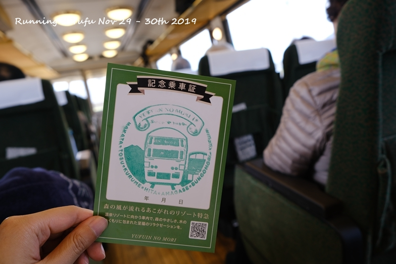
  精细的日本，没东西好玩就搞点特色火车特色章
  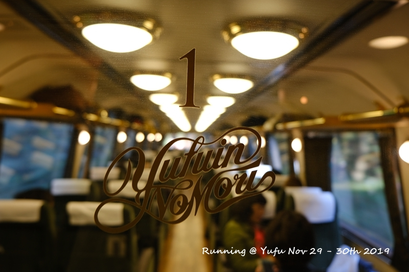
  古朴的装修，欧洲风
  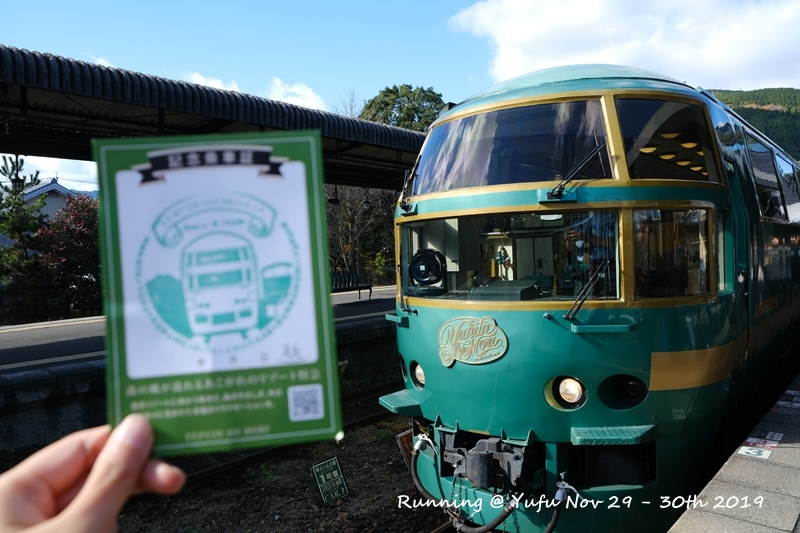
  糊了。。。
  
 
  到了由布院就是吃饭，点点依旧是吃饭慢慢慢。吃完入住酒店，人带着介绍一通差不多就要三点了。房间不大，酒店倒是小而精致，没几个房间，温泉倒有五个。室外私汤两个，室外公汤两个，室内公汤一个。由布院12月大概晚上只有几度了，室外的私汤，尤其是洗澡也在室外，还是有点冷的。第一次尝试私汤，人不多，而且还不需要预约，感觉不错。
  
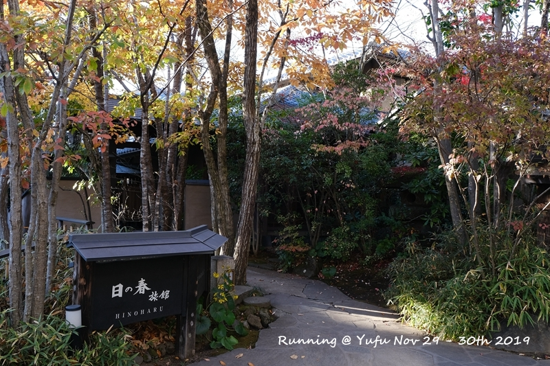
  

  入住完依旧是隔壁的滑滑梯先玩，玩好一路走一路逛。b-speak当天只有整只的蛋糕卖，不过隔天可以预约。一路走走走到了金鳞湖，算是探探路。走回来到隔壁的药妆店买买买，这边的价格比福冈贵，一般还是大城市买好。回到酒店才5点多，想改晚上吃饭的时间，已经来不及了。只能去隔壁7-11逛一圈买个牛奶，7-11对面正好又有个退税商店，好处是食品也有，顺带买了点咖啡还有一些存放衣服的袋子。回来开饭，点点这餐要加4000+日元，不过真的是挺丰富，儿子吃的也很不错，也算超值了。
   
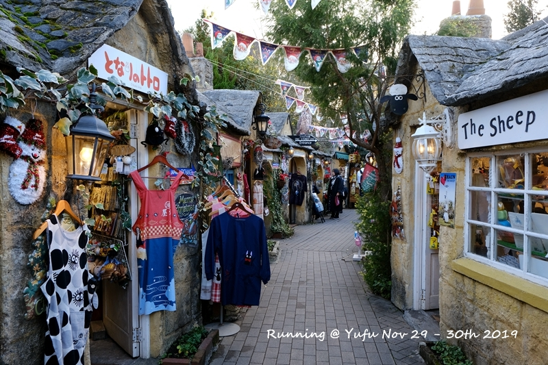
   完全就是上照
   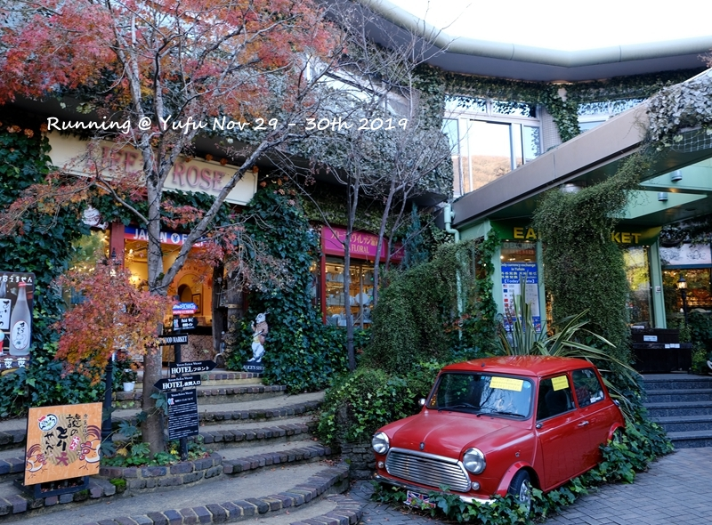
   mini世界
   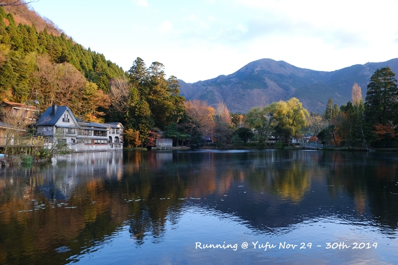
   太阳好什么都漂亮，后来才知道那个楼原来是法国设计师特别设计的
   

   第二天一早起来去看金鳞湖晨雾，结果太早了，雾是足的但啥都看不见，只能随便拍拍。
   
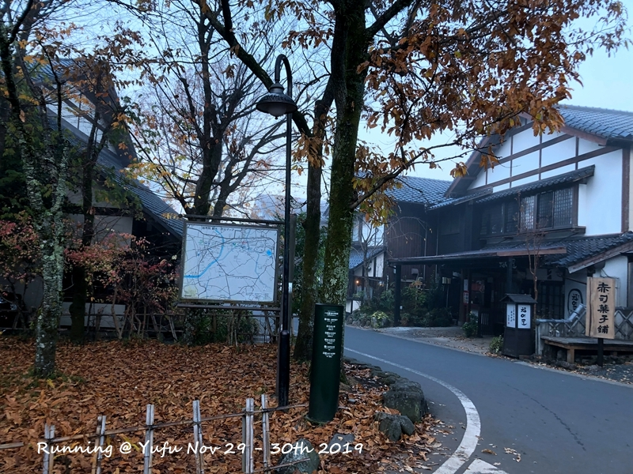
   酒店路口，这片银杏很漂亮
   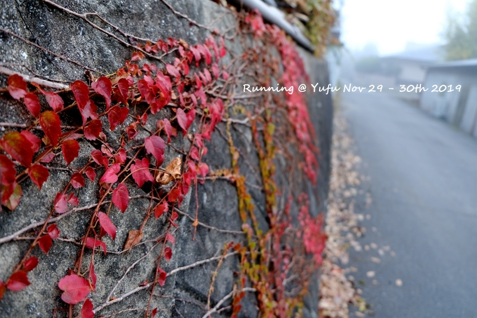
   红枫谢了大半
   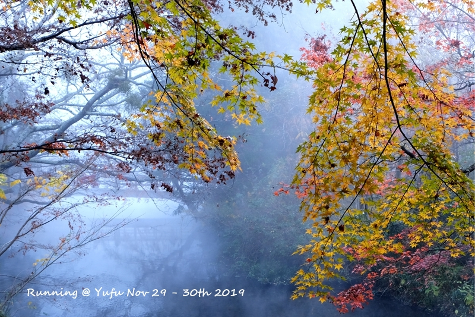
   雾雾雾
   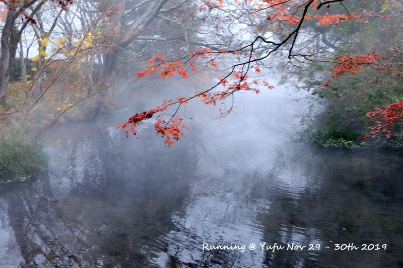
   

   回来吃了早饭再去，结果雾还有，就是太阳不够。其实金鳞湖看晨雾早上吃完早饭9点多绰绰有余。
   
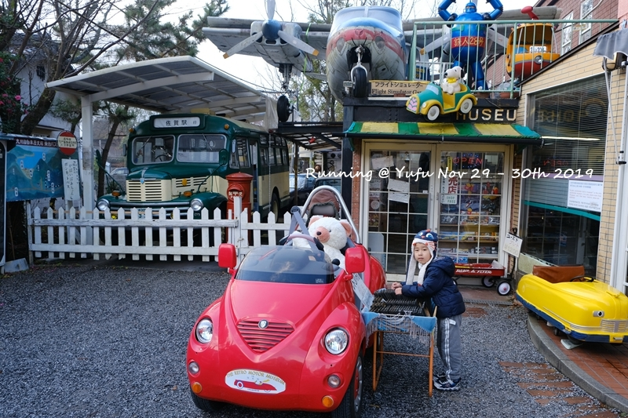
   汽车博物馆，小点冷风中玩一会儿
   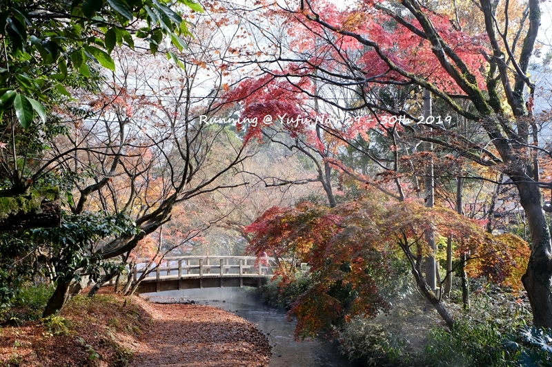
   无人的早上，9点多旅行团才会到
   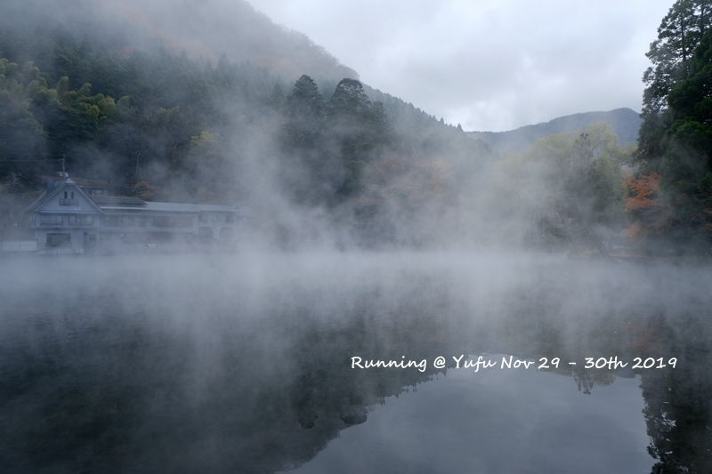
   9点多雾气还是这么厉害，所以根本没必要早起啊
   

   一路再走回来，吃个蛋挞走走走，b-speak拿了蛋糕再继续往前，差不多就走到靠近车站，其实由布院也是高原，牛肉很不错，吃了一顿，午饭料理一般都很划算。回去拿了行李（没有老公，这种体力活都必须自己干了），赶回车站正好1：25去别府的车。本来害怕点点高反加上山上路绕，正好今天起得早，一上车就是睡。这一路开到别府风景很不错，中间居然还有个很大的游乐园，有过山车，挺适合秋天郊游的。
   到了别府，以为别府的西口是在左侧，结果别府车站其实是东西向，西面口就是后面的出口。上了杉乃井的车，然后就是酒店半日游。
   
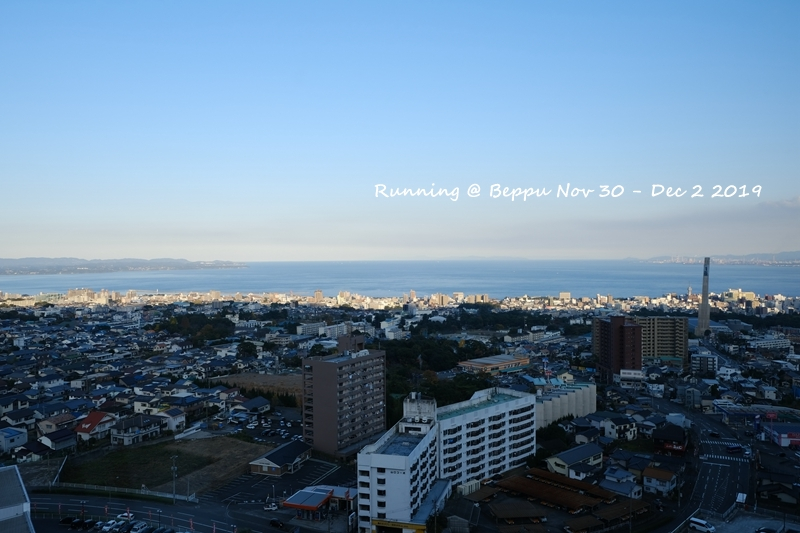
   第一眼别府
   

   B-speak的蛋糕和milch的布丁正好当做下午茶，泡个汤然后就去吃了自助晚饭。晚饭其实很一般，自助的一般都很普通。不过好处是，第二天居然发觉了有清淡的牛肉萝卜汤，点点很爱吃，吃了一堆萝卜。其实日本的饮食品种也是比较单调的，基本上都是饭对着一个菜吃，而且蔬菜就是天妇罗/蔬菜色拉。不过好处就是饭一般都不错，点点就是白饭也可以吃一顿的人。
   杉乃井的温泉真的是大，室内，室外带顶棚，半遮以及全露天的都有。因为太大，所以管理比较随意，第一天看到有带小男孩进去的，第二天也带着点点走了一圈。点点对于温泉来者不拒。说是亲子最佳，就是玩啥都要钱，温泉楼上还有个小的玩乐园，500/30分钟，然后是250/30分钟。保龄球的话入住免费送一场，游戏机是送10个牌子，只是玩的地方很有限。hana馆相对是方便一些，本想到本馆B1泡一下，不过最后还是都在最大的棚汤。晚上的灯光表演因为天气太冷了，在室内隔着玻璃看看，感觉般般，可能天气再热点在游泳池里面看效果会好很多。
   第二天本来担心下雨，结果天气还不错。在别府站买了车票+门票，别府站买门票套票便宜200。其实也就海地狱好看点，不过一路6个1800，加上中午吃个别府地狱蒸工坊，正好一天。
   
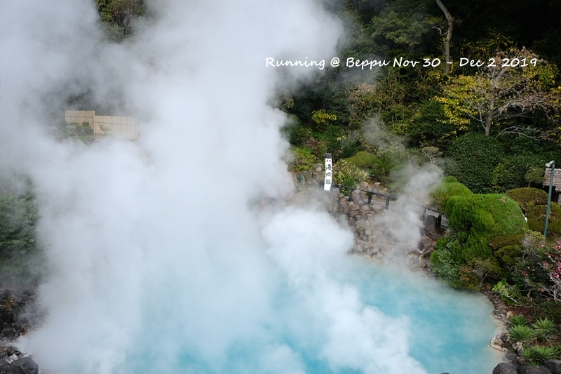
   海地狱，最大最兰
   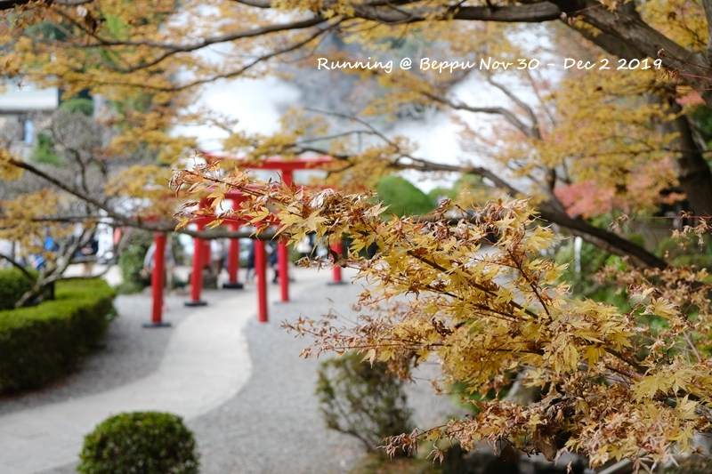
   地狱旁边放个红色的桥啥的，太为拍摄者着想了
   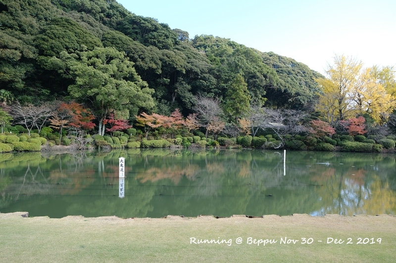
   温泉水养育的植物
   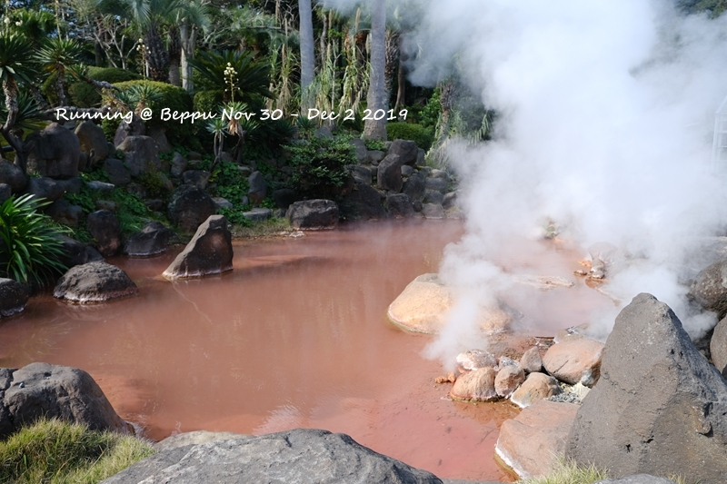
   海地狱里面也有类似于血地狱的红水，所以如果时间来不及，就看个海地狱也就够了
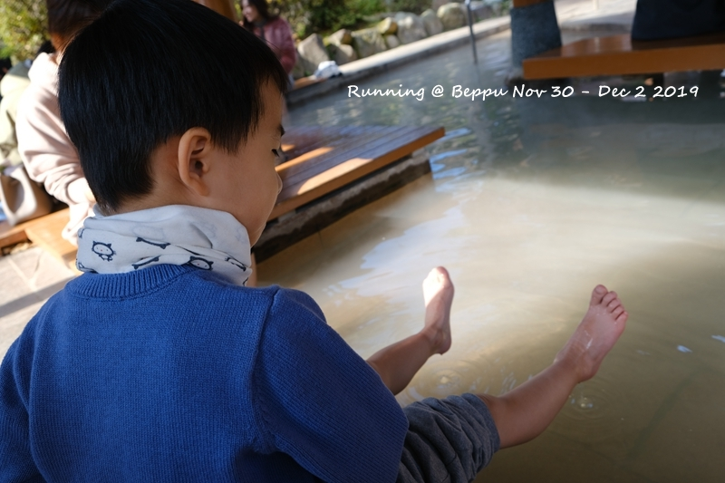
走累了，免费泡个脚
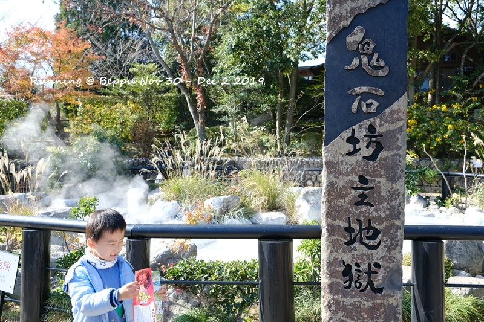
泥浆的鬼石坊主地狱
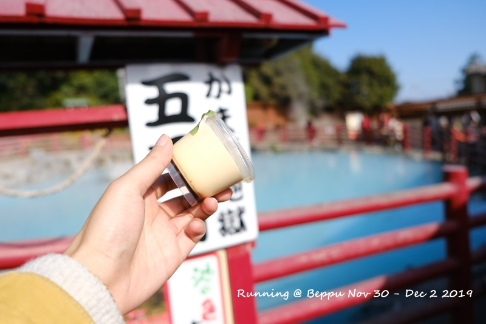
一个比一个没看点。。。这个就主打温泉布丁了
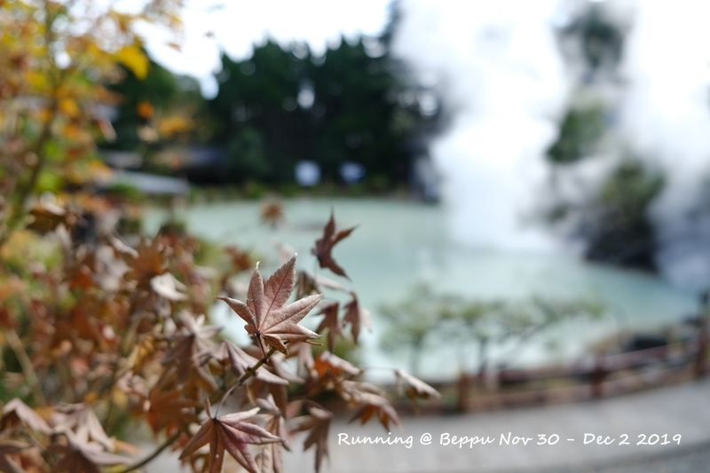
小地狱走一圈都只有5分钟，绝对是买一送五的节奏
   

   蒸工坊居然是我这些天吃的最贵的地方，海鲜/牛肉一堆，吃了差不多10000，不过味道还不错，lionsky应该会很喜欢。
   
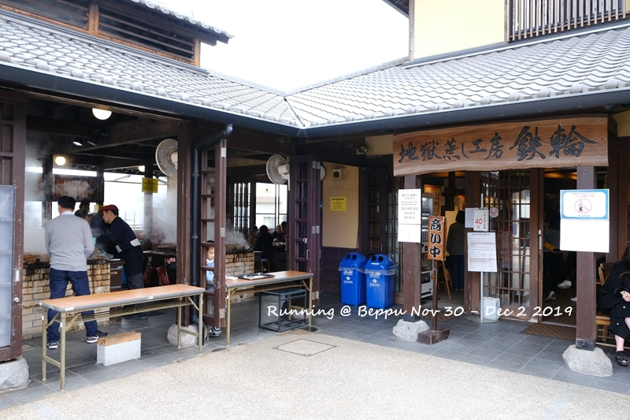
   自己看时间拿进拿出来点参与感
   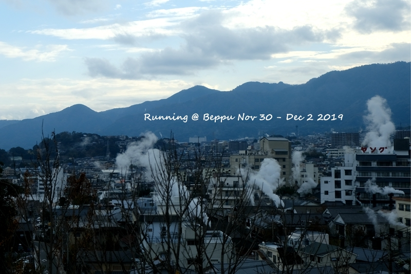
   充满蒸汽的铁轮地区，公交车路过，其实在蒸工坊旁边，没有多走两步拍一张再走
   

   下午就是剩下的两个，血地狱和龙卷地狱。最后回到酒店差不多又是近5点，点点玩乐园放飞一个小时，吃饭温泉。
   
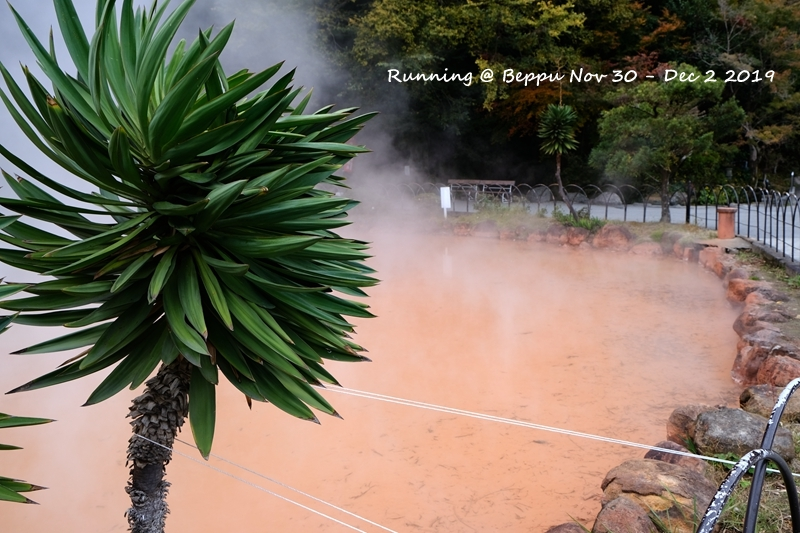
   血地狱种铁树
   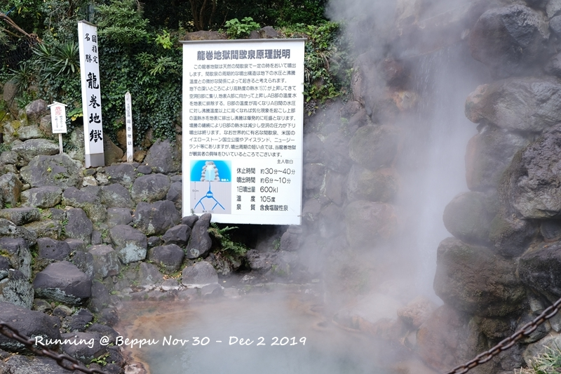
   超级Mini的龙卷地狱，不过就是可以喷很久
   

   最后一天早上泡个汤，终于有空在海景房的房间内看一下海景，可惜当天开始下雨。下次来别府，还是选择海边离别府站再近一点的住两天，好像更方便点。
   
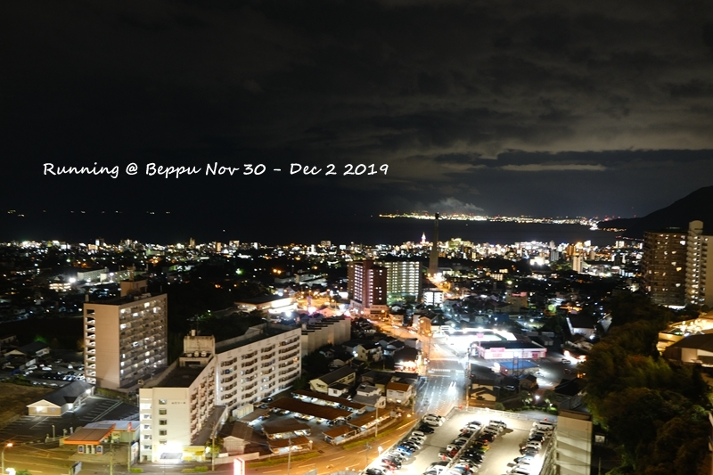
   

