   来福冈前都没搞清楚，以为是之前核辐射那个，其实那个是福岛。。。福冈看了几遍，感觉景点都比较远，虽然之前看了点点幼儿园同学的游记是去了海之中道，有那个超级大蹦床。但单程一个小时，里面还有无数走走走，加上老爸这次买去，还是放弃了。最终福冈两日，主要逛了太宰府、福冈塔以及福冈城这块。
   <!--more-->
   第一天原本打算去栉田神社，结果点点玩乐园玩的时间多了，加上等车怎么都没来，结果就直接skip，就去了博多运河城。选择了最适合单身的一兰拉面，真的除了拉面没啥东西，而点点硬是给自己点了一碗白饭，本来以为他要浪费了，结果他生生的就是吃了白饭+飘着的那几块叉烧。博多运河城正好有圣诞的灯光喷泉表演。原本想逛逛moussy之类，结果点点死活不给我逛街，只能回去泡汤。
   
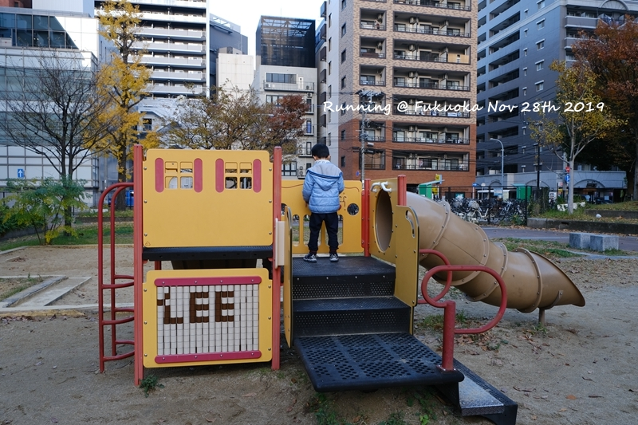
   永远都不能缺的小花园
   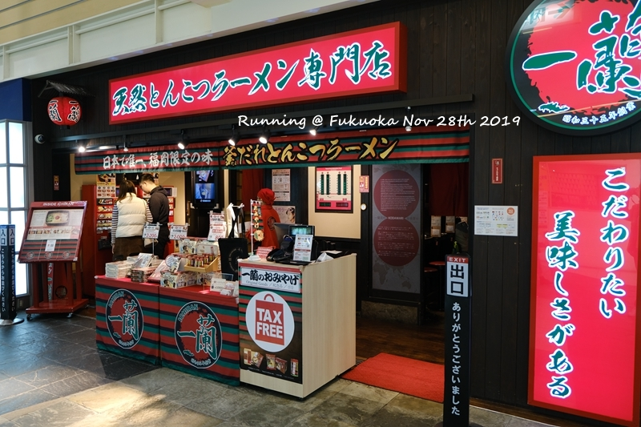
   单身者福利之一兰拉面 
   
   当天正好有圣诞的水幕喷水表演
   

   等从别府回来，当天也比较晚了，于是当晚也就是吃个拉面买个包。最后悔的就是在免税店忘记用携程的优惠code，虽然我在iphone中添加了，而iphone也反复提醒我，但自负如我，总以为都是差不多的优惠券，痛失一个亿。第二天去了太宰府，旁边的光明禅寺的银杏掉的差不多了，sign，就是晚了1-2周。让点点在太宰府拜拜，结果小子听到要好好读书就不肯了。在旁边被我反复的做工作，终于去好好许愿了一下。太宰府里面居然有个游乐园，很幼稚，买了通票结果可以玩的东西并不多，还是单独进去买票划算，为了把通票用出本，硬是在吃饭后又去玩了三遍小火车三遍划船。大冬天的工作日，10来个工作人员就等着我和我儿子两个人玩。。。
   
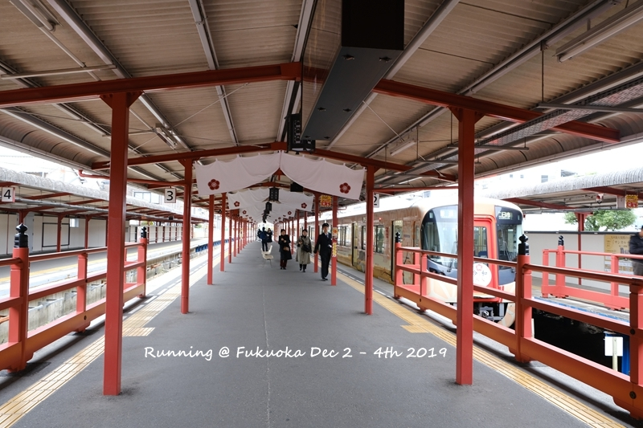
   居然坐的是太宰府特别班次到的太宰府，好像不同车厢也有章可以敲
   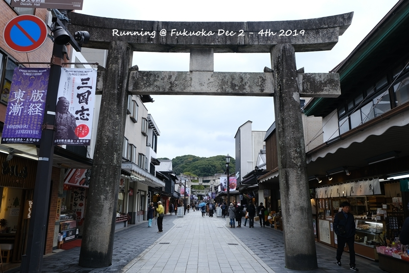
   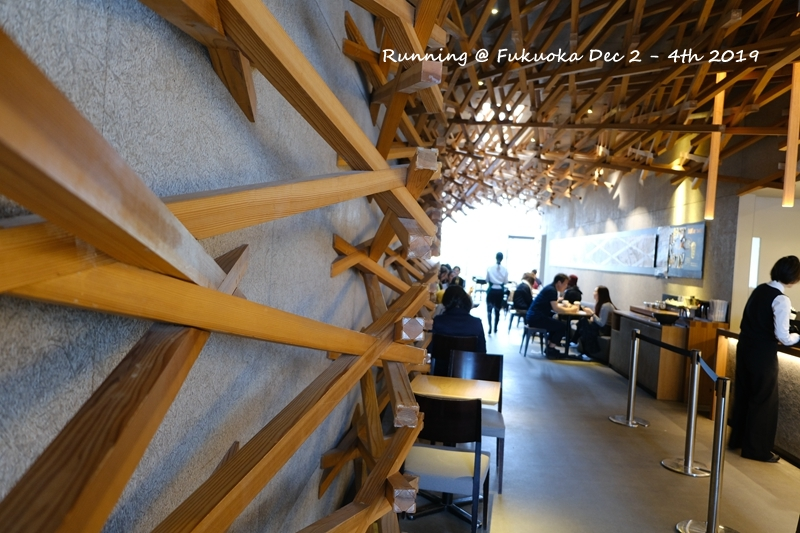
   不能免俗的星巴克
   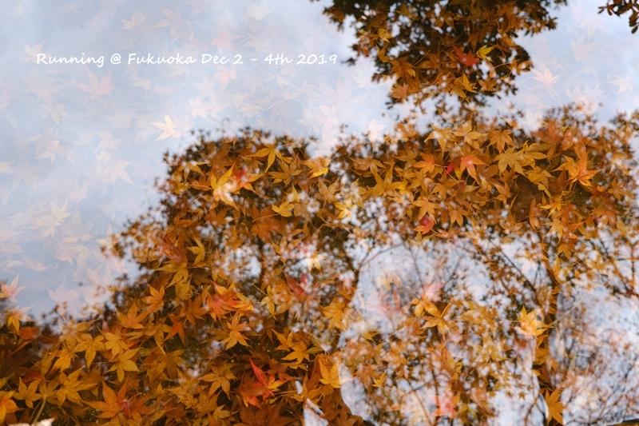
   在找旁边的光明禅寺
   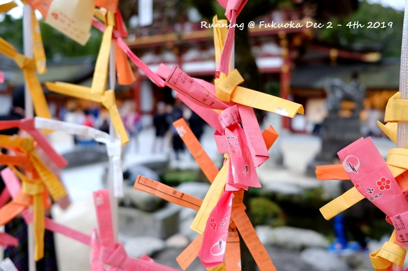
   当年自己不需要做这种迷信工作，现在对儿子是各种没信心啊
   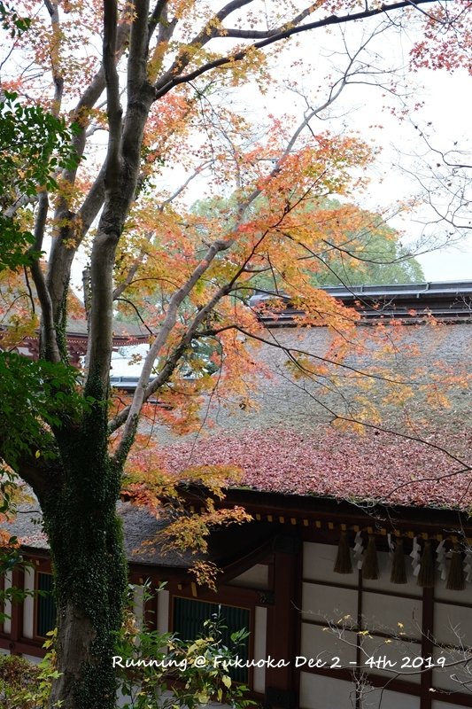
   光明禅寺的大银杏基本都谢了，只能到处拍拍
   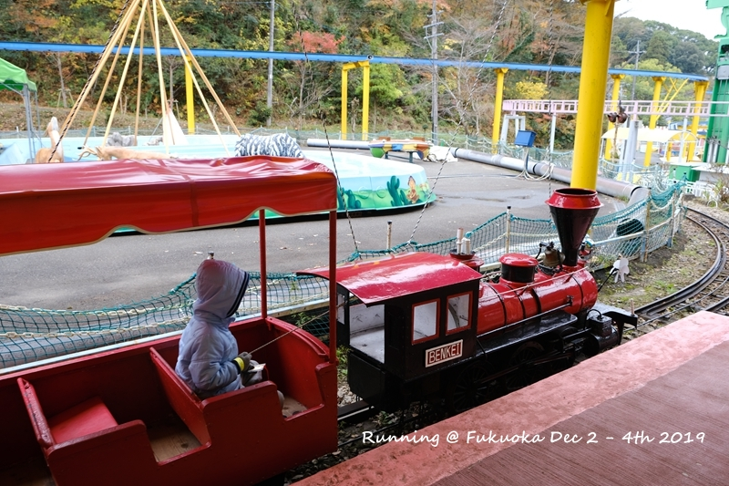
   为了用足通票，小火车坐了5遍
   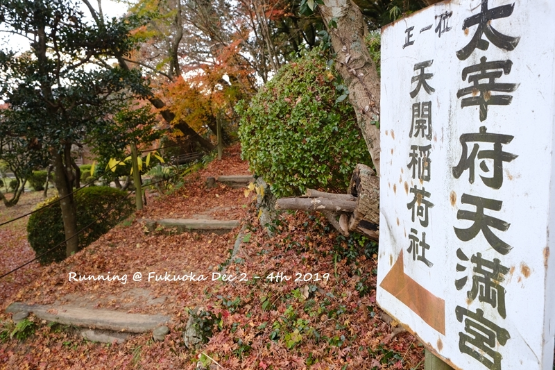
   

   从太宰府回去时间差不多就去了福冈塔，不得不说日本门票这块便宜多了。但我还是错失一百万，第二天在酒店楼下大堂看到福冈塔20% off优惠券，我怎么就没早一天呢。。。
   
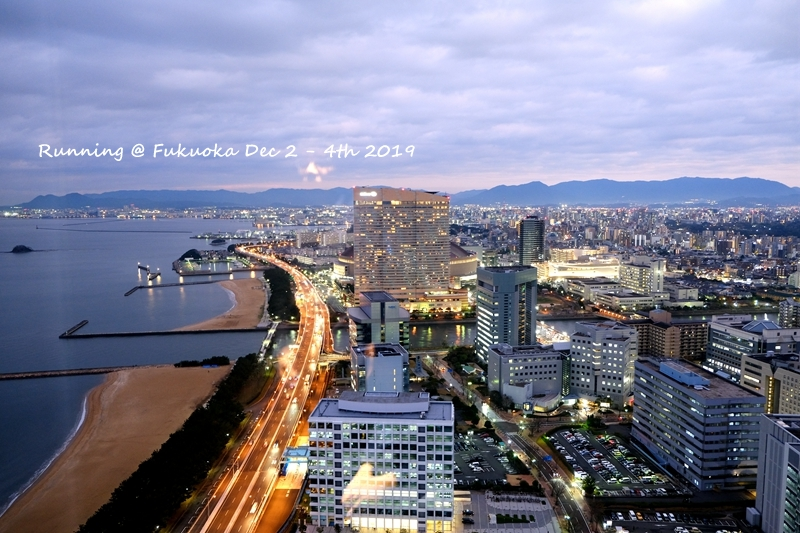
   傍晚到的，天瞬间暗下来了
   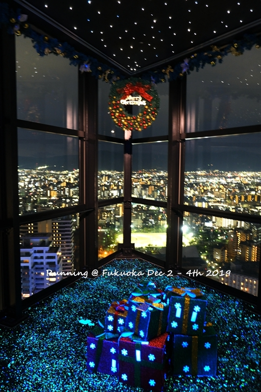
   拍照居然不收费，良心啊
   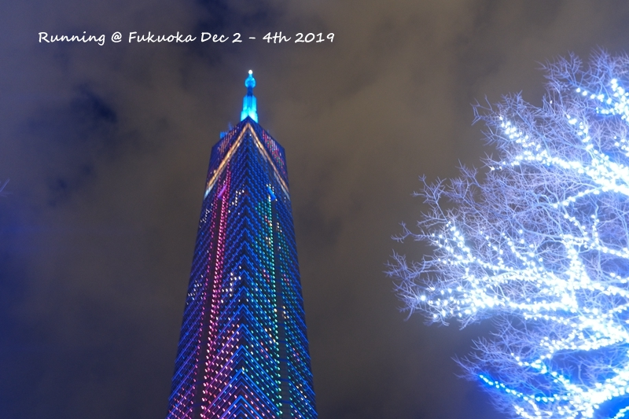
   据说福冈塔会切换不同颜色
   

   福冈的大国药妆很便宜，感觉比之前名古屋买的很多都要便宜。有些特价的每天限买一个，而且同性人员就限买一个。当然你可以装作不认识，但是一旦他们发觉认识就不给你买了。当然你也可以第二天来买，就买那一个，比如说资生堂那个发膜之类。
   最后一天是下午的飞机，早上看天气好，想想就去大濠公园走走吧，结果倒是出乎意料的不错。大濠公园里面有个200元的日本庭院，很小，但是很精致。大濠公园旁边就是福冈城，里面有好几棵特别大的银杏，满地落叶。最关键的是，到处都没人。。。从景致来说，国内和日本很多地方是类似的，差距只在密度上。东西买多了，多了个纸板箱，懒得再去坐机场大巴，直接大车去了机场。福冈机场虽然满50000送5000，只是不同柜台（比如便宜的资生堂和贵的资生堂就不在一起）无法累加，市区免税店相对来说更划算一点了。
   
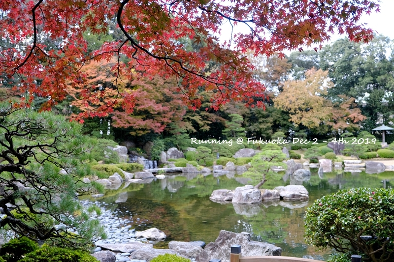
   日式庭院，其实古漪园也差不多，差距只在游园人数上
   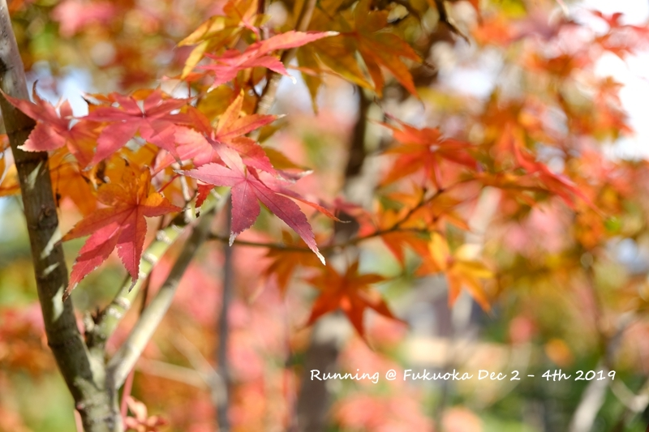
   红叶半谢
   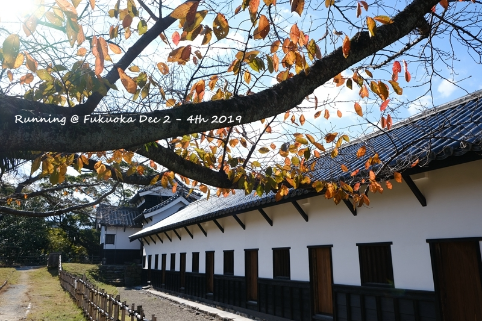
   总感觉日本的墙一直在刷，该红的红，该白的白
   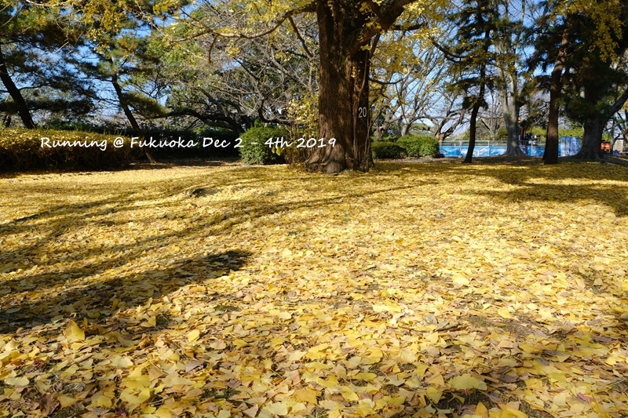
   一大片银杏，惊喜
   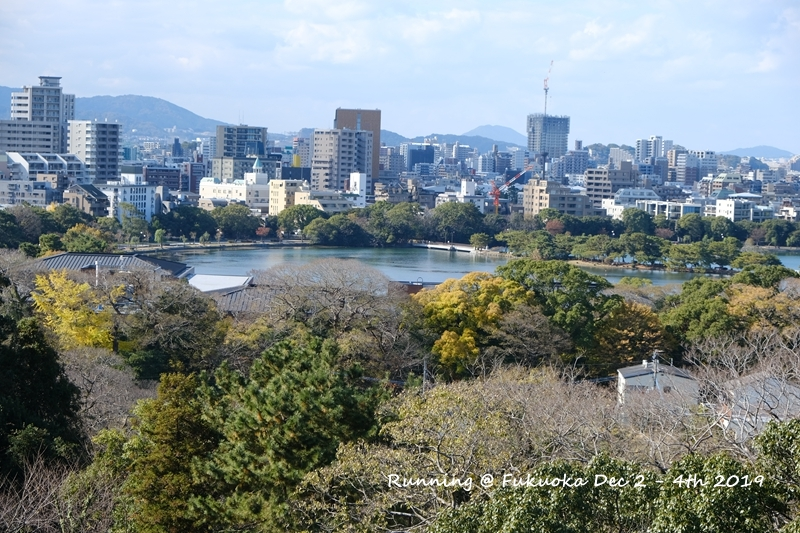
   福冈城最高点看大濠公园
   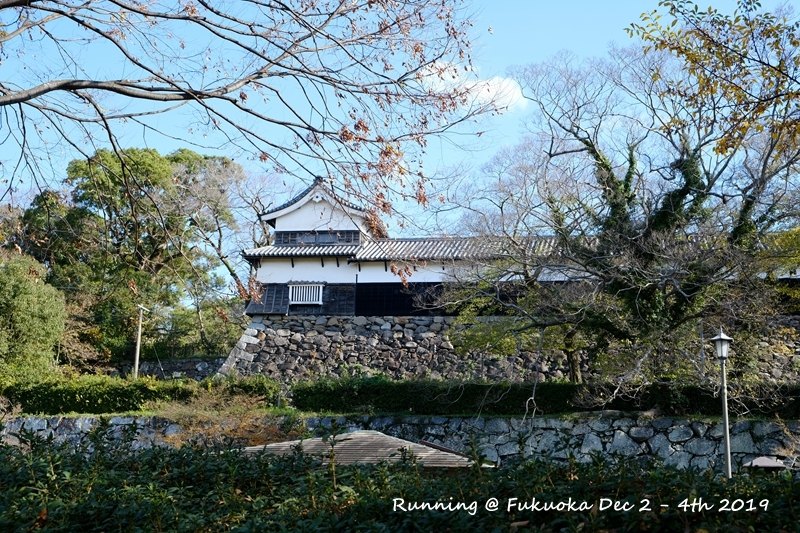
   

   最后一年的秋季随意出发，今后只有寒暑假。老母亲瑟瑟发抖。。。
