普吉本岛其实很大，也有着很多的海滩。一般游客的选择都是芭东、卡伦和卡塔海滩，这几个海滩一般预定所有的项目都是免费接送的。芭东相对而言商业化程度最高，第一海鲜市场、江西冷等都在这个海滩附近。一般的人都会选择在芭东住几天，然后去卡伦/卡塔清静几天。芭东的酒店我选了很久，主要就是因为海滩和商业区鱼与熊掌不可兼得。离海滩近的，离江西冷之类都比较远，虽说走路可能也就15-20分钟，但太阳下带着娃，这点路估计都是TUTU车。普吉的TUTU车好像都是一个价，200THB，相当贵。最后选在离海滩近的住一晚，离江西冷近的住一晚。

Banthai的位置离海滩真的很近，不挑剔的话，它的泳池也有三个，足够普通游游。早餐该有的都有，而且人不多。虽然离第一海鲜市场之类有点路，但隔壁的兰花之类都可以吃吃。出门5分钟走到海滩，房间也够大，一家三口大孩子睡在沙发也是可以的。淡季的价格400不到一晚，实惠首选。当然，更便宜的比如sleep with me只有200+，但sleep with me真的就是个商务酒店了，就适合睡一觉吃个早饭。

<!--more-->

第0天下午的飞机飞的马来西亚，搞笑的点点。。。

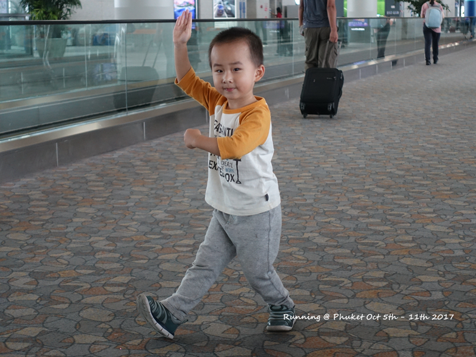

晚上近9点的飞机到达的吉隆坡，直接入住机场酒店。第二天直接在机场喝的爆大碗的粥，味道还可以，只是回来的时候居然没了。。。说8点才有卖。。。

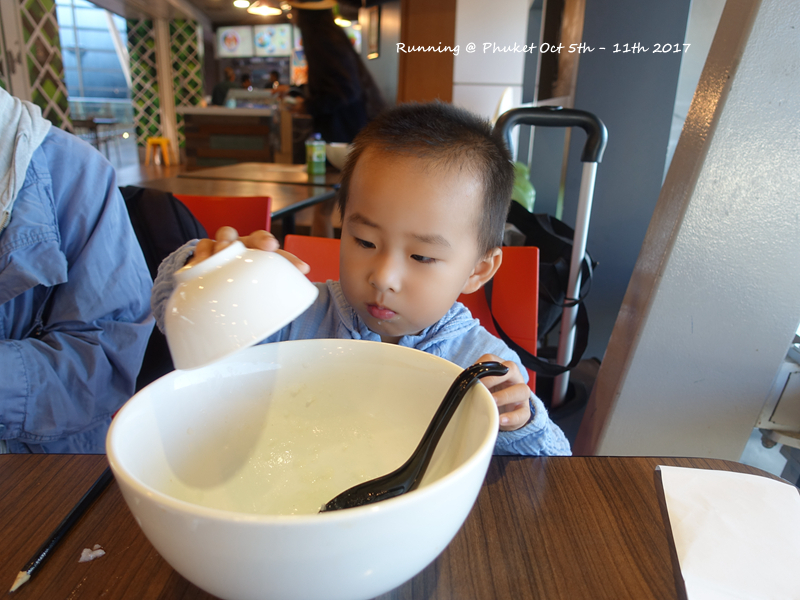

第一天早上的飞机到普吉，用了机场的wifi找到浪花朵朵接机的。由于是早上的飞机，基本没什么国人，等了一会儿上了车。司机开的出乎意料的稳，点点开启了上车就倒模式。到Banthai办理入住，时间没到，只有一间房OK了，直接点评找了附近的点去吃。结果选了直线距离只有700米，但走过去至少15分钟的song peenong，更悲催的是偷懒选择了团购套餐。号称有龙虾、螃蟹、鱼，有是都有，但味道都不咋的。点点开启书写模式，一个人写半个小时菜单。。。吃完回去给儿子睡觉，结果儿子没睡着，老爸睡了一个小时。。实在睡不着不如就下去游泳，终于用上了迪卡侬的救生衣，小子也可以扑腾几下了。

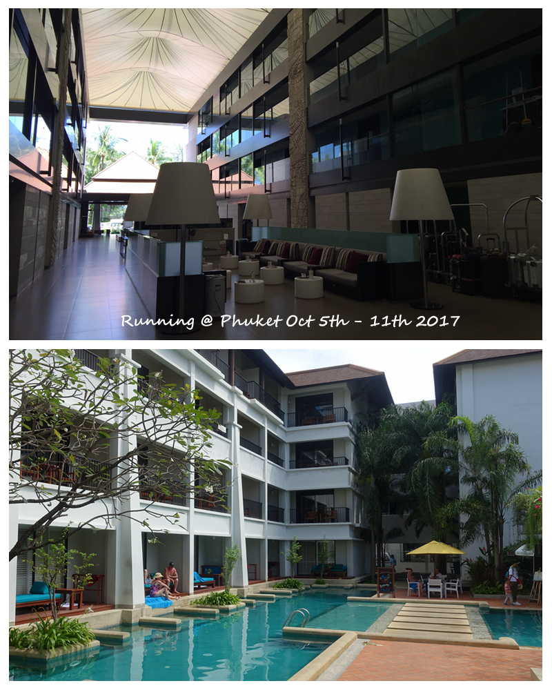
banthai的大堂和泳池

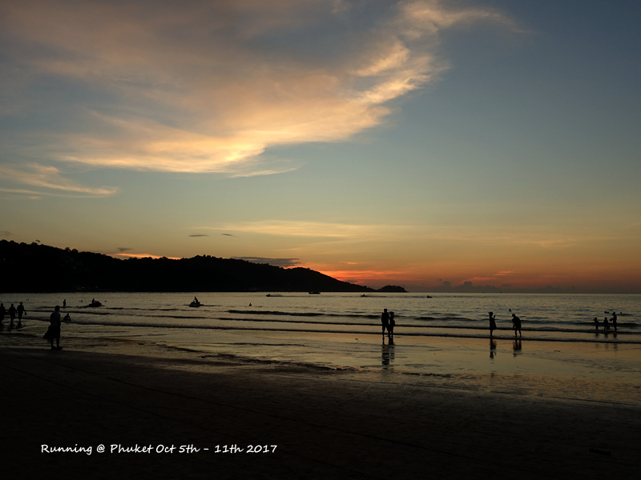
第一天吃晚餐等的时候老爸出去拍的日落，其实芭东海滩也不错的。

第二天一早放晴，吃完早饭海边开启挖沙模式。。。

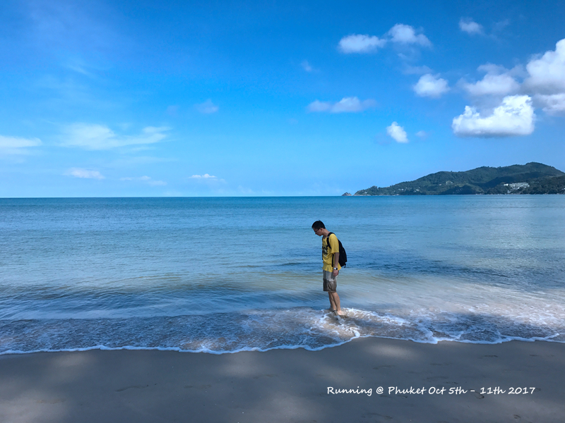

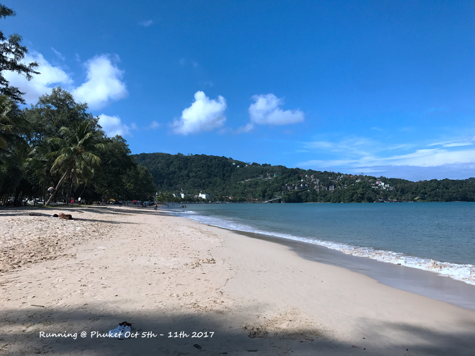
芭东海滩国庆节人也不多啊。。。这可是10月6号哦

依旧是一个小时的车到码头，这天有点浪，大家都有点晕船。点点在船上昏睡2小时熬过去了。。。原本以为回来也会很艰辛，结果回来一点也不晕且一分钟没睡，一路兴奋。。。

从皮皮岛到普吉艾美差不多就6点多，办理一下入住就直接吃饭了。日式料理还不错，人也不多，直接是一个包房。晚上在艾美的海滩玩一会儿，某人又是一阵猛抓螃蟹。。。点点就在找，我的伞呢。。。由于第二天有包车半日游，因此当天还是早点睡。

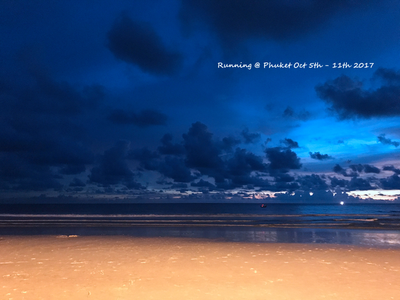
第一眼的艾美海滩，艾美门口还是气派挺大的，不过酒店本身住宿的地方很集中，就在餐厅周围一圈。

除了皮皮岛第二天下午下了2个小时雨，就数半日游这天下的雨最多。刚到普吉老街，就一阵暴雨，等了20来分钟还不见雨小。于是打电话给了司机来接，说放弃这个景点。司机的英语不咋的，但人超好，由于那边都是单行道，冒着大雨来找我们到底在哪儿，可怜我们才刚没走几步，逛了一个点，买了个明信片寄出。找到之后还开车带我们大概逛一下，普吉老街感觉是葡萄牙风格的，如果不下雨就是逛逛街的赶脚。到了查龙寺，没下雨，但很快，乌云再次到来。。。这次还好下的不久，一会儿雨就停了。万幸下雨的时候没有正好进寺庙，不然鞋子在外面就全完了。然后去了拉威海滩吃午饭，当时看浪花朵朵很多评论说司机会特别带你到某一家让你去吃，感觉会拉回扣。我们那司机就开到市场入口处，直接放下，说你们吃完打我电话就跑了。。。我也懒得选，主要带着娃时间也不早了，直接第一家。感觉泰国烧菜还是一般，各种香辣调味，还是菲律宾的lemon butter烧法美味啊。。。

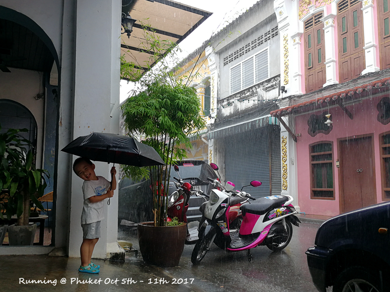
暴雨的普吉老街，浓浓的葡萄牙风情

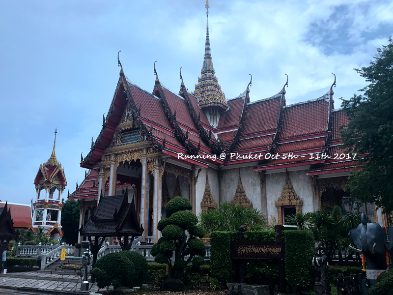
雨还是跟着来的查龙寺，寺庙还不错，东一块，西一块，不收门票

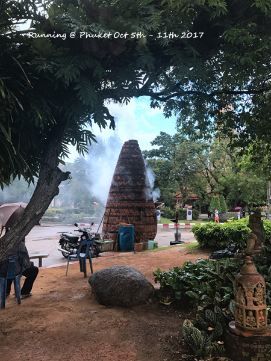
查龙寺放鞭炮的地方，烟不会弄的到处都是。点点又怕又要远远看着。。。好矛盾

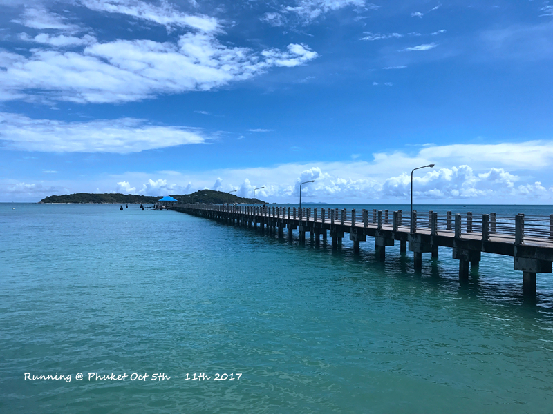
拉威景色也不错，天气好海水颜色也会好看些

最后就逛了个神仙半岛，不知道好看的点在哪儿，据说是看日落。。。我选了6小时的套餐，回到酒店刚刚好下午3点。。。还有比如什么山顶大佛，什么卡伦观景台，留待下次吧。。。点点很争气的玩到结束回来的路上开启睡眠模式，一路睡到下午快5点，然后开心的去沙滩玩耍了。

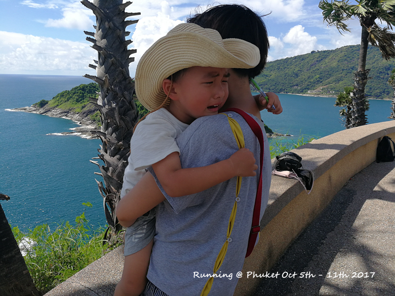
每次到睡点就容易受伤的小作点在神仙半岛

晚上以为海滩边的那个餐厅有表演所以直接在那里吃了，结果刚点了个菜表演就结束了。不得不说，艾美儿童餐还不错，一个streamed fish with mixed vegetables大人吃一份也差不多，就是饭太硬了。虽然说艾美各个餐厅的儿童套餐菜单都一样，但感觉烧的厨房不一样。不知道日本餐厅吃的话饭会不会软一点，可惜第二天也没吃到。吃完老爸带着娃继续沙滩模式，终于可以舒舒服服的点一杯奶昔刷刷朋友圈了。。。

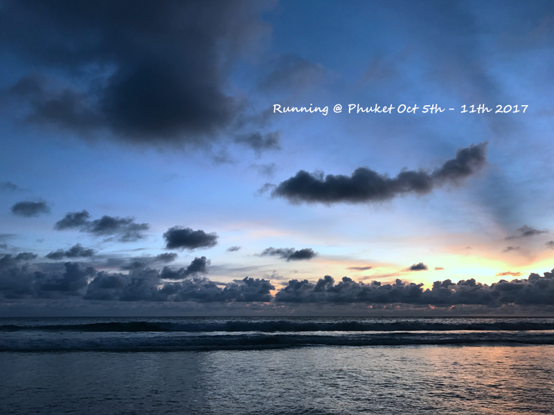

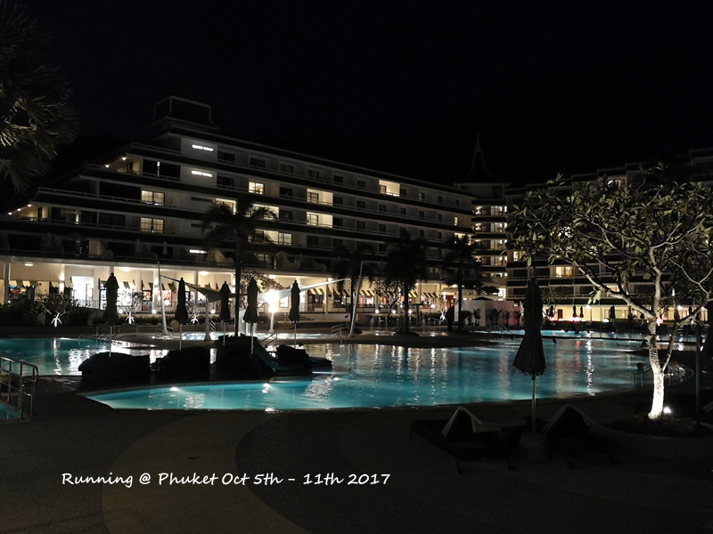	

第二天一早又是好天气，沙滩边玩疯了。。。艾美的好处就是沙滩上玩具很多，都不用自己带了

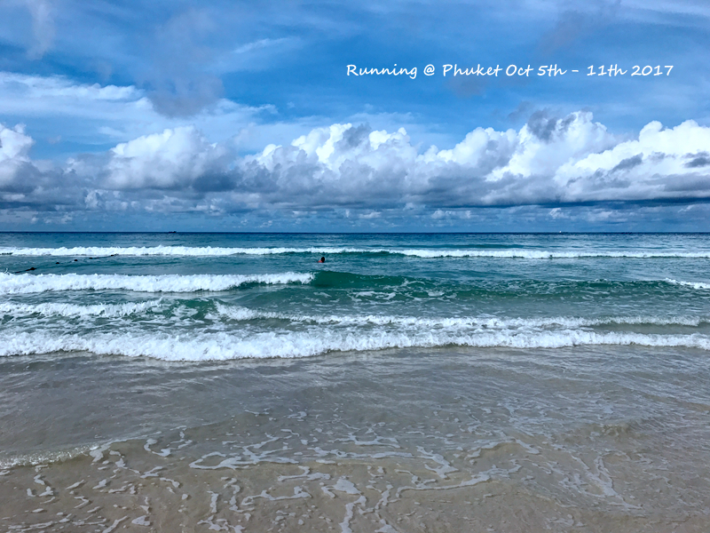

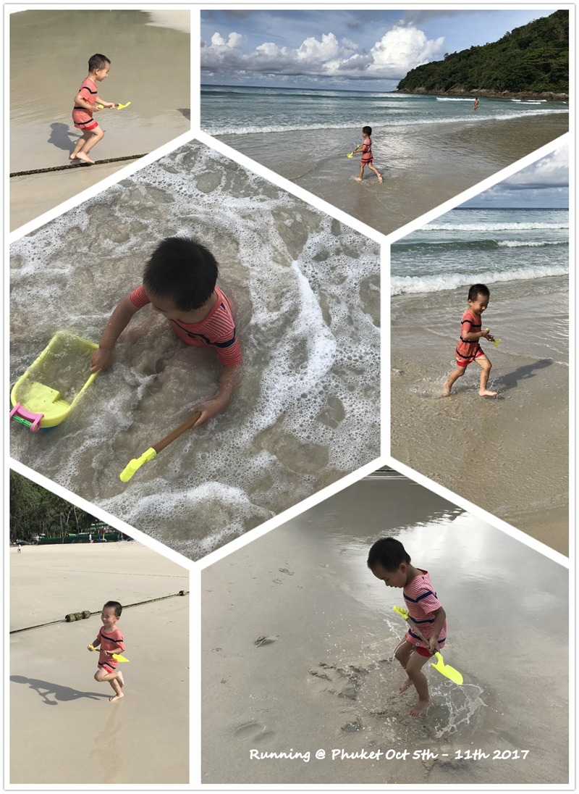

可能好运气都在前面几天用完了，最后一天各种背。前一天晚上发觉最后一天订的两间房一间用了lionsky名字，为了以防万一，和携程确认是否可以。携程表示不一定，要和agency确认。结果一直确认到第二天我快check in了才说要加600THB。我想着还不如我直接和酒店确认，结果酒店直接就表示OK，我也就懒得理携程了。因为入住时间没到，我只是办理了入住，但并没有拿到钥匙，然后把行李扔那里了。赶上check out高峰，而下午的spa又是预约了1点，结果午饭就想快点在酒店餐厅解决。说是20分钟上菜，结果一直到快要走，菜都不来，只能要求打包，最终，40分钟以后菜终于带走。还好点点乖，安心的做了两个小时泰式按摩，感觉力度还是比较轻的，不过价格也很实惠，99。结果走的时等车送又是各种再10分钟，最终等了1个小时左右，至今还在考虑要不要给差评。到了酒店更悲催的事情来了，酒店说agency要求不给我入住，除非他们确认。跟携程反复确认，最后他们说改名字的600THB他们来出，让我先付了。结果酒店说他们不要钱，只要agency确认即可，而携程完全联系不上agency，只能让我再付一遍房费再退给我。。。而这时也已经快5点了。。。为了这两件事情白白消耗了2个小时+国际长途电话费，还好后来点点睡了，只是醒了之后依旧是满满的起床气。。。

晚上江西冷逛一圈，levis/lee都不便宜，买了点小摆件，没看中合适的吸铁石。DQ稍微便宜点，80THB大杯。江西冷下面的BIG C还是蛮适合买水果之类，可惜最后一天才看到，不然第一天应该多买点水果带着。不过热带真的是，水果也大多是热性的，柚子之类很少，至少在酒店早餐里面都没怎么看见。

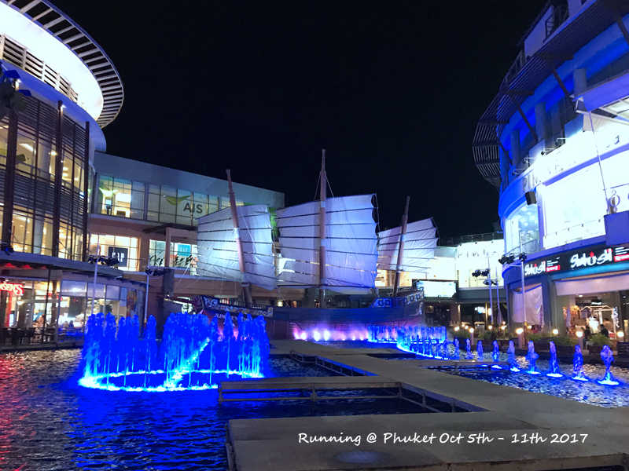

最后一天下午2点的飞机，又是舒舒服服的睡到自然醒，吃个早饭。只是最后一天司机不太准时，催了好几次终于在迟到15分钟之后到达，还好11点多也到机场了。马航真是懒惰，只提前2小时办理check in。进去依旧吃了个日本料理，点点真的是一个成人的饭量了，一份铁板鳕鱼一人妥妥的吃完。。。机场没有很多时间闲逛，不知道为啥，马航的boarding时间都是起飞时间-1H。不过买到了可爱的M&M也是不错。老妈看到了欧莱雅的唇膏，200元5只，吐血ing。。。看来YSL对她来说还是太高端了。