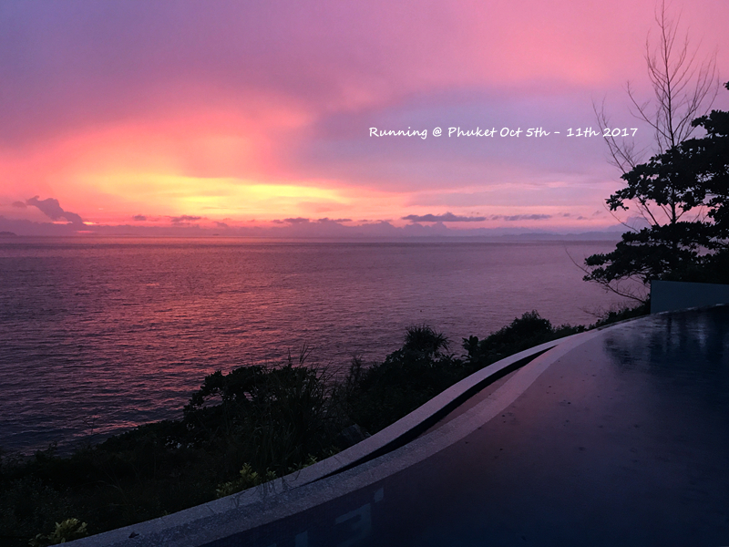

普吉的外岛诸多，皮皮岛、皇帝岛算是相对成熟的两个。如果7天6晚都在普吉本岛感觉似乎有点无聊，所以就在皇帝岛和皮皮岛里面选择一个。皇帝岛就是the racha酒店，据说最美的就是酒店门口的那片白沙滩。但是感觉不好的是白天一日游客人太多，有一种动物园被参观的赶脚。价格是另外一个因素，the racha本身价格不菲，还必须要酒店的快艇接送，加上额外的费用，感觉颇为不值。同时，上the racha都是快艇，感觉在雨季会更难熬一点，而皮皮岛有普通的船，感觉相对会没那么晕。所以最后选了皮皮岛，皮皮岛北部虽然没有通赛湾那里这么热闹，但酒店相对都好一些，而且沙滩和海水都更美。包船去周边的竹子岛、蚊子岛也都是很方便的。皮皮岛北部一字开就是四家酒店，根据价格和网评，最后选择了Holiday inn，事实证明还是不错哒。

选择了下午的船去皮皮岛北部，主要是早上的船太早了，无法安心的吃早饭。所以到达皮皮岛差不多就是下午4点半了。那天海水退的特别厉害，所以享受了一把拖拉机接送。当天的夕阳很美。
<!--more-->

皮皮岛北部的酒店都会有船过来接自己酒店的住客，一路服务都很成熟了。可以看出皮皮的海水颜色更美，碧绿碧绿。

当天的海水退的那是一个远啊。。。。

最便宜的房型已经满员，于是号称被升级到了珊瑚房。其实这个珊瑚房基本看不到什么海景，而且离reception很远，个人觉得和园景房没啥差。最好的普通房应该是401、402，离酒店门口比较近。当然，成年人走走也还行，带娃的话就叫酒店的班车吧。酒店每天晚上都有自助餐，吃了饱受好评的海鲜自助餐，真的不咋的，主要还不带饮料，4大1小折扣下来也要800。个人觉得最好吃的就是烤虾，咖喱拌饭。。。如果单点的话，这个价格应该也可以吃到不少了。其实酒店的饭菜和门口相比并没有贵多少，差距主要在那个17%的税上。。。

从房间走到餐厅，熟悉一下酒店。酒店房子都是这么一间一间的小别野。房间带两格楼梯，点点很爱走上走下。。。

当天的夕阳，赞

酒店有船可以直接预约，2H的竹子岛大约就是1200THB不到（含税），最多坐六个人。个人觉得价格还挺实惠，从皮皮岛北部开船过去大约20MIN，快到竹子岛的地方让你随便浮潜一会儿（浮潜工具酒店都会提供），然后可以上岛玩。竹子岛不划算的地方在于上岛费要每人400THB，这个岛也就是长长一个沙滩，但是浪很大，而且沙滩坡很陡，基本没几步就没过半身了。所以上下船特别艰辛，有包之类的需要传递，而不能背在身上。对于住在皮皮岛北部的人来说，上竹子岛意思不大，可能更远的免费的蚊子岛会更实惠一点。

皮皮岛周围的海水颜色明显更好一些

当天回酒店之后就在酒店门口旁边的餐馆吃了一顿，中午是涨潮的时间，感觉水都要漫上餐馆了。。。

当天下午到珊瑚房附近的无边泳池游了会儿泳，不得不说，holiday inn就是泳池太一般，还不如banthai的泳池。游完泳就下起了雨，一直等啊等啊也不见停，只能直接叫了酒店的车去了sunset bar。原本就打算今天在sunset bar看一下日落，可惜天公不作美。。。IHG的会员都可以在主餐厅或者sunset bar每人享用一杯免费的饮料，就用在了今天，还蛮划算的，主要那边的一杯果汁含税大约就是180THB了。sunset bar在holiday inn里面的山坡上，没想到里面还有一个无边泳池，正好对着日落。尽管当天下雨，还是可以看到日落。原本打算直接在sunset bar吃完饭，只是sunset bar只提供泰国菜而当天大家都表示想吃点西餐，于是看完日落赶回门口吃饭。

这边居然还有一个小小的无边，就是让人趴着看日落的吗？

鸡尾酒可以换果汁。。。没有橙汁的普吉，mango和watermelon成为必点。

吃完饭雨停了，远远地看到海平面一个白白的东西，不知道是啥。结果酒店的说是MOON。。。然后就看到MOON一路上升。。。天气好，一路走到了隔壁的酒店，发觉这海滩边还是有不少餐厅的，如果不吃酒店，其实选择也挺多的。而点点就一直拿着酒店的长柄伞画着他的火车轨道，以至于第二天在艾美也一直找伞伞。。。

从Holiday inn一直画到隔壁酒店再回来的点点。。。

离开的当天早上就是酒店沙滩海边玩，holiday inn的沙滩就适合早上玩，因为早上开始一路涨潮，涨到中午就基本快要到路边了。。。回去的船还不错，还特别绕一下小皮皮岛给大家看一下玛雅湾，小皮皮岛本身看上去很像桂林那种感觉。如果是喜欢浮潜的，可以多去几个滩啊弯啊感受一下。我等过来度假的，其实holiday inn门口的那片足够了。。。

海边的天气好特别，来了一片乌云，像个帽子。过了就马上大晴

某人从回艾美之后就爱上了捉螃蟹，但这个最大。。。点点每次看到就是用沙子埋起来。。。

皮皮岛明显水颜色更浅一些。慢1.5拍的儿子伤不起，每次都是到要结束的时间才玩得High起来。。。

推荐所有来Holiday inn的住三晚，第一天到酒店，第二天到隔壁溜达一圈，第三天纯泡酒店，第四天中午离开。。。这样比较圆满。。。

