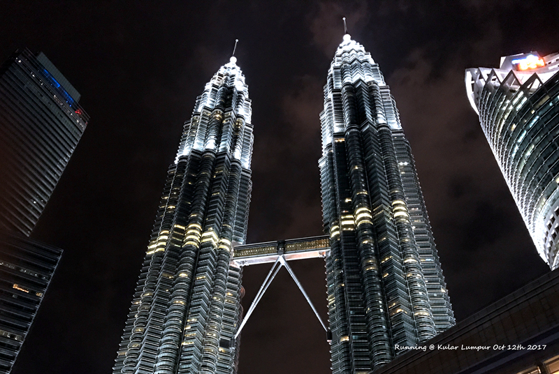
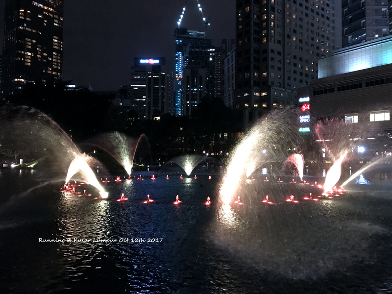
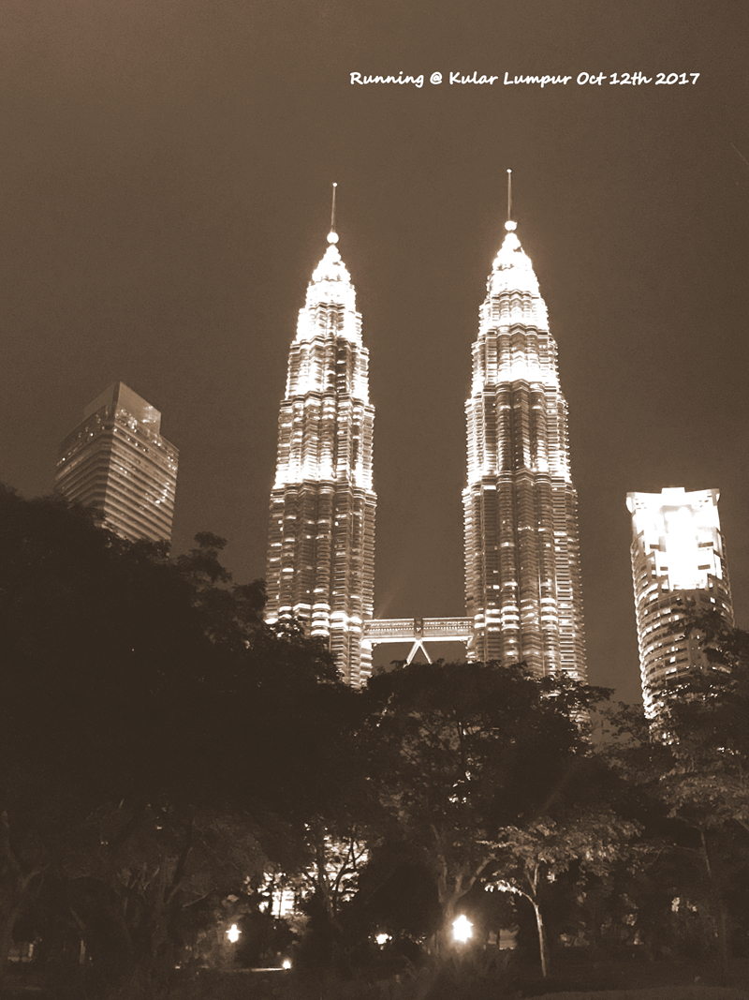

马航的飞机都选了在吉隆坡停留一晚的，过去的时候因为时间比较晚了，直接选择在机场内部的sama-sama住了一晚。回上海的航班比较宽裕，而马来西亚是有免费5天的过境签，因此在吉隆坡出来溜达了一圈，不过这一圈成本也不小。

机场到市区可以坐kila express到中央车站然后转地铁到双子塔（KLCC），kila express到市区大约是38分钟，加上地铁时间也就是50分钟左右。根据最后uber回机场附近的时间，感觉打车如果不堵，应该也就是1个小时以内。而打车的感觉是全程都是高速，不知道上下班高峰是否会堵车。如果不堵车，那人多绝对是打车合算。因为kila express一个人就是55RM，而打车的话，uber才55RM到双子塔。。。

<!--more-->

由于时间不早+双子塔参观门票太贵，基本就到此一游啦。在suria klcc吃了顿饭，看了下门口的喷泉。儿子特别爱这里的喷泉，主要是喷头像小水枪一样会转来转去的喷。国内的喷泉比这个要气势澎湃，但不如这个小巧精致。

穿过klcc前面的公园去trades hotel，这也是号称拍摄双子塔的最佳位置。公园好大，还有很多大型的小孩玩的滑滑梯之类，可惜白天没到，不然点点可以玩好久。

第一次出国的时候其实去过马来西亚，也在双子塔前面拍过照。当时跟着旅行团，不知道在哪条看得到双子塔的马路上，导游赶着下了车，拍了到此一游照。这些年，开始自己学着做攻略，看地图，去过的地方，走过的路，都不再只是照片上的匆匆一瞥，有着只属于自己的记忆。