   名古屋感觉还是一个比较亲子的城市，主要的景点基本都是儿童的，比如乐高，丰田馆，海洋馆等。原本选择了乐高+丰田馆，主要考虑儿子比较喜欢车子。最后丰田馆因为吃吃吃+买买买没去，那就下次吧。日本几大城市里面名古屋的机票算是便宜的，这次赶在寒假前面正好只有1000+一个人。不过整个2018到现在的日本机票比2017涨了很多，要知道2017名古屋春秋的机票只有1000以内。
   <!--more-->
   第一天直接中部机场下来就坐大巴去了乐高，大巴的班次很少，好在春秋的航班正好可以赶上，1000/人，单程大约30-40min。乐高酒店本身挺好玩的。一楼积木池玩->房间内的treasure box->预约的搭积木（这个完全不好玩，就是follow老师搭一个雪人）->二楼的playground->二楼餐厅玩的滑滑梯，基本上玩一个晚上到早上乐园开门没问题。其实还有一个游泳池可以预约，我因为没带点点泳裤，就没预约，不然又是1小时。
   
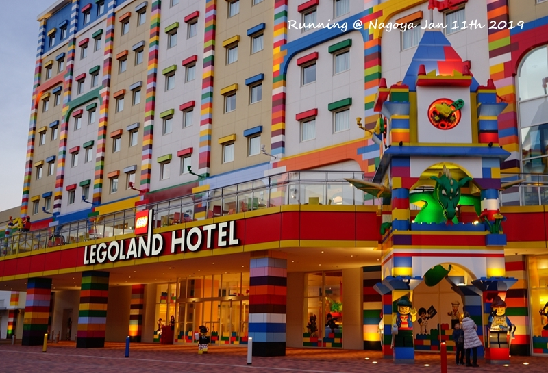
   第一眼酒店，很小，就这么一排在高架边上
   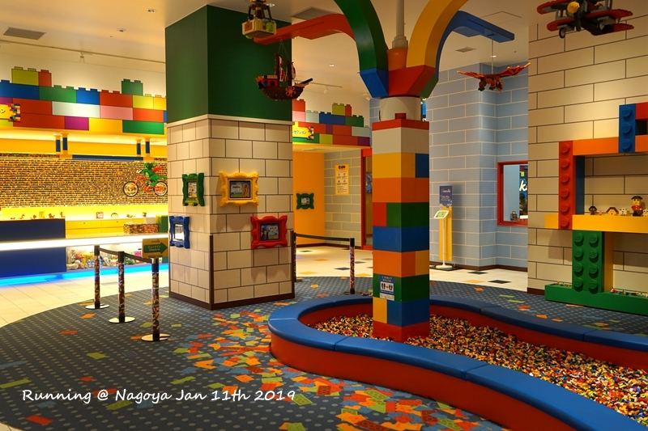
   酒店大堂，乐高元素到处都是
   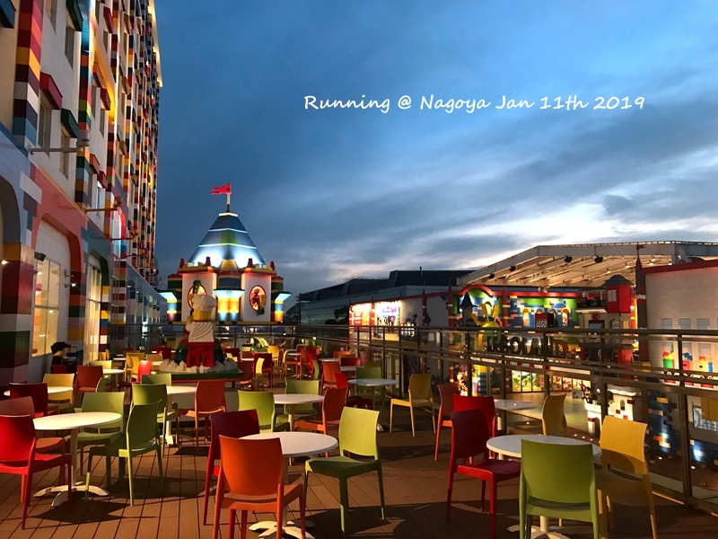
   餐厅外的夜景，很喜欢这个颜色的天空
   

   

   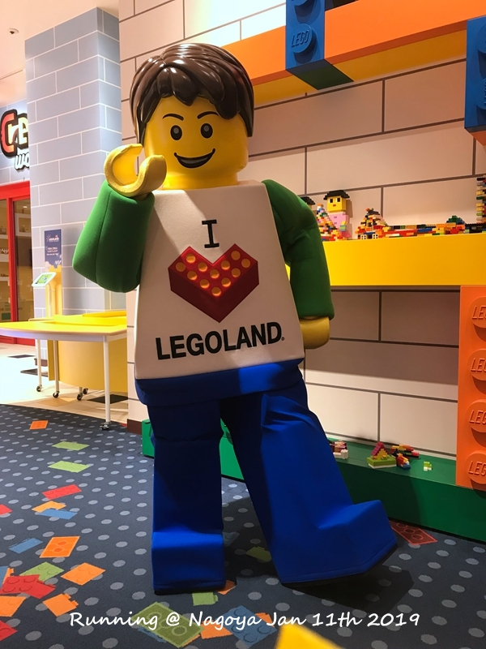
   晚上乐高玩偶还会在酒店大堂跟小朋友互动，第一天点点害怕（儿子真心胆小）不敢上前。
   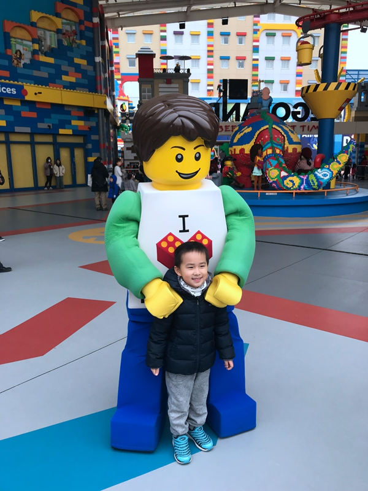
   经过第一天的观察，第二天终于可以在酒店跟玩偶合照了，这个预热。。。
   

   乐高乐园我觉得就适合幼儿园到小学低幼年级的，因为真的很幼稚。乐园本身很小，因此开放时间也特别短，就10：00-17：00。为了玩的尽兴，我还特地改了下午名古屋-高山的车票时间，尽管是下午4：45的时间，在乐高乐园还是差一个乐高工厂没有玩。点点在乐高乐园有不少突破，玩了旋转木马，海盗船，潜水艇，消防车，潜水艇，考取driver liscence。不敢玩的项目就是跳楼机（这真的是一个超级MINI而且还会一段一段下来的跳楼机）和过山车，争取下次再突破。
   

   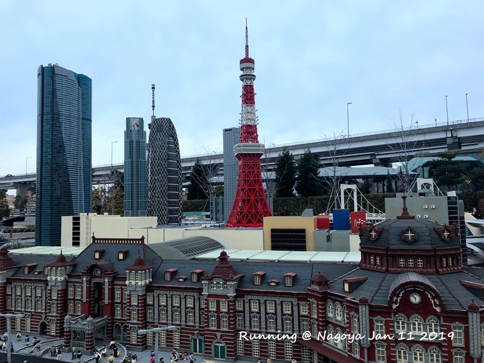
   乐高搭出来的真是逼真
   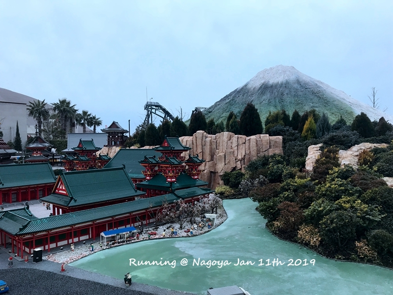
   儿子在最外圈开了一圈，说没有遇到红灯。。。 
   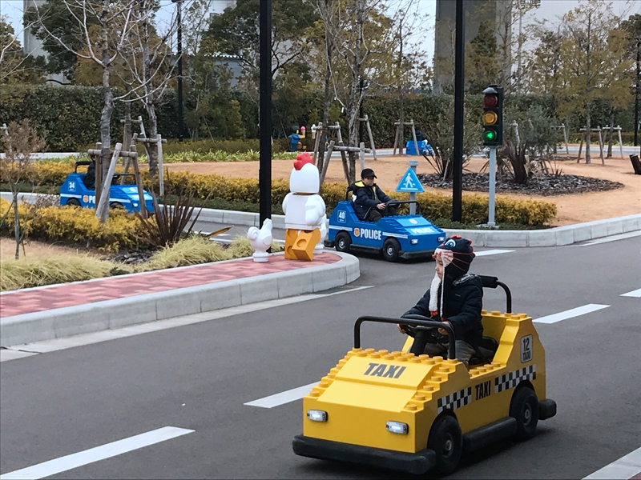
   

   名古屋市区的话，主要的商业区就在名古屋站和荣，两者之间本来就只相隔2站地铁。当时看ctrip住荣附近的比较多，因此选了一家附近新开的酒店（主要是便宜）。从下吕回来到名古屋站，坐2站地铁从摩天轮这边出来，走过两个红绿灯就到酒店，酒店一楼还是个711，应该说是很方便。景点的话，到名古屋城2站地铁，去丰田产业馆也就4站，名古屋电视塔和oasis 21就在隔壁（电视塔1/8开始整修，要到2020年）。购物的话，路口就是24H的唐吉坷德，松坂屋可以步行走到，松本清最近的就在oasis 21。
   回名古屋第一天晚上去了oasis 21，本来在oasis21拍名古屋电视塔夜景应该会很PP，结果电视塔整修要到2020。于是吃了面之后就在松本清直接买了30000，后来才发现这家货全而且价优。
   

   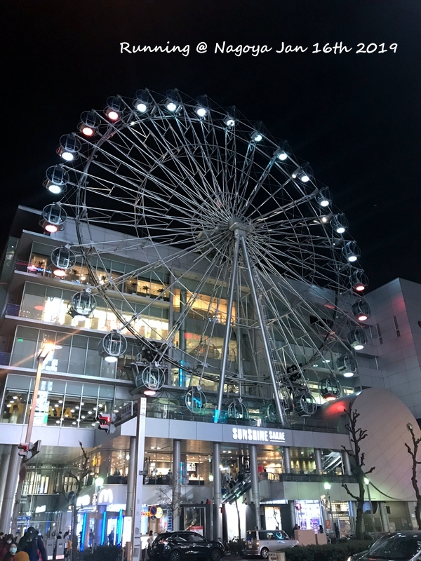
   500日元一圈很实惠，小孩还不要钱
   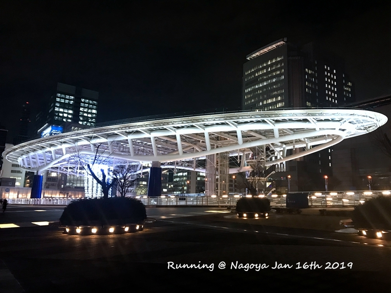
   oasis和电视塔绝对是夜景最佳搭配
   

   第二天早上去了名古屋城（正确的选择，本来想上午去丰田产业馆，下午去名古屋城，结果吃了之后买买买加上点点睡觉就没下午了），名古屋城也在修，天守阁不能进去，瞎逛一圈到中午。
   

   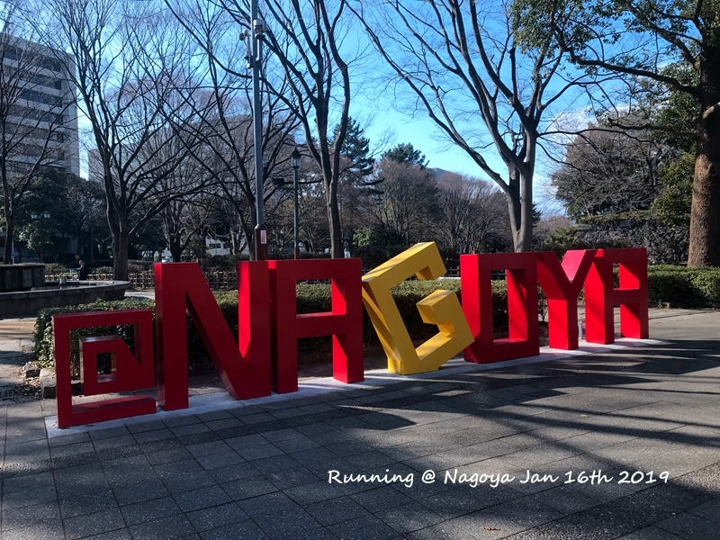
   名古屋城地铁站下来的地标
   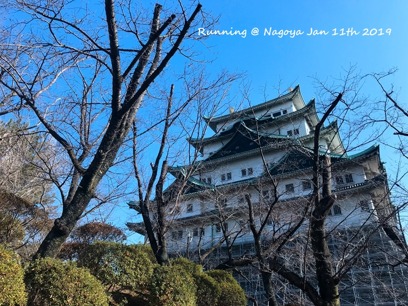
   

   觉得中午蓬莱轩排队会比较短，因此中午去吃了蓬莱轩（后来发觉晚上也没啥人，难道工作日其实就是不排队的？），美味。我最喜欢的还是拌上海苔芥末然后倒一点汤的吃，只是这样吃会吃的很多。发觉楼下就是harbs，吃完饭马上就下楼吃harbs，水果蛋糕真的是好吃不甜，虽然日本的蛋糕最初应该是学习了欧洲的，但是现在真的可以说是世界第一，不甜不腻入口回味无穷。harbs还是最推荐水果千层。下午点点睡了觉就是晚餐（点点肯定很郁闷，不是在吃就是在睡），依旧是松坂屋，蓬莱轩对面的猪排，一客量很大，建议两人share一份加上一份炸蔬菜之类。
   

   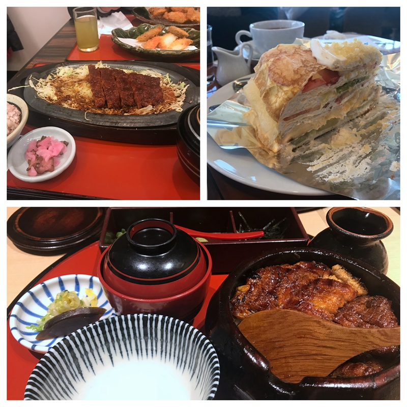
   

   回来坐了荣的摩天轮，本来想登电视塔看夜景，现在上摩天轮也不错，点点免费。接着就是荣对面的唐吉坷德买买买，老阿姨很多，老妈本来慢悠悠挑咖啡，老阿姨一过来抢，马上自己先拿了10包。。。所以说促进销量最好的方式就是限购。晚上点点跟我说觉得这里不好玩，反思，当晚就查了一家附近的儿童乐园（仲之町公园），第二天把儿子扔在那里之后继续买买买。奇怪的是有些东西药妆店那是相当难找，国内taobao倒是多得很，难道都被代购拿走了。。。资生堂的revital眼霜基本在药妆店都看不到，眼膜终于在松本清找到。revital在专柜是金色的，其实跟药妆店不是一款，不过价格几乎翻倍，看看眼膜效果下次再说。
  

   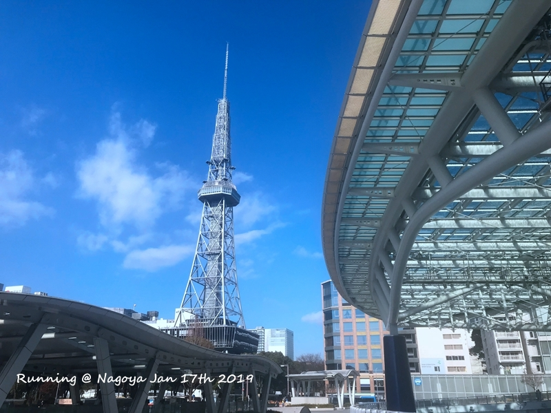
   拿好眼膜最后来一张
   
 

