   选择升龙道这条路线很大程度上是因为这边冬天也下雪，去之前特地还给点点买了个雪球夹。结果除了白川乡雪还比较大，高山只有一点，下吕完全无雪，囧。。只能说运气还是差了点，这几天正好晴好无雪，如果再晚一周MS天气预报都是雪雪雪。看来下次去日光之类要再观察时间。
    <!--more-->
   原本安排的行程是名古屋-下吕-高山-金泽-名古屋，后来因为lionsky要早走，金泽回名古屋时间比较长，因为放弃了金泽。而白川乡一年四次的点灯居然第一次就是1/14，我怕票太难买，把行程改成了名古屋-高山-下吕-名古屋，避开点灯日。总的来说，这个行程很松散，适合带小娃。如果带大娃，可以换下吕到平汤和新穗高，因为那边下雪更大，泡汤之余还可以坐缆车游览+滑雪，等娃大了可以考虑再去。
   从名古屋坐4:45的大巴大约7点多到达高山，原本打算坐酒店的shuttle bus回去，车上查的时候才发现酒店最后一班的shuttle bus是6点半。于是在bus站对面吃了高山拉面，饱饱地走回去。路上积雪不多，都在两边，点点一路走一路扔。到了酒店，研究了下地图就开始泡汤，green hotel的温泉也是来自于平汤，温泉蛮大的，室内也不闷，室外两个池子更舒服。由于第二天只买到13：30的票回来，因此决定是赶上8：50的车去白川乡。第二天吃酒店的甜瓜觉得好甜只是赶班车，因此只是随意吃了一些，想着第三天给点点带着路上吃，没想到第三天完全不甜。
   8点50的车人很多，不过非预约的班次是根据人来发车（不知道从白川乡发车的是不是也是如此，如果这样即使不预约也可以坐3点多的车）。之前在网上预约的车票原本以为提前一天可以去超市付款，不过超市人帮我操作了半天说不行，还好预约的车票在当天还是可以付款的，于是在车站直接购买来回票（更划算）付款。
   
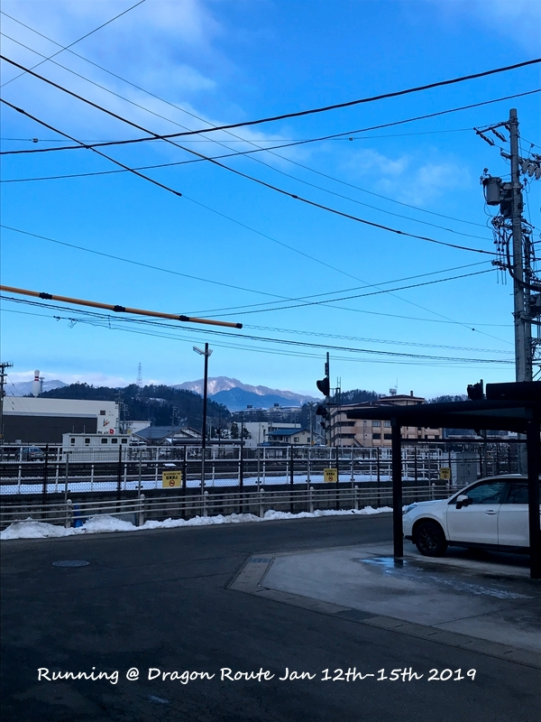
   在高山站等白川乡车的时候拍的，日本很多地方还是90年代日剧的感觉。旧旧的铁轨，杂乱的电线杆
   

   根据前人的指引，先上了观景台。观景台拍照其实需要远景镜头，手机拍不出那个效果，不过点点当天就是各种玩雪。原本提前一天有人跟我爸说白川乡也没什么雪，导致滑雪服也没最后利用一次，当天点点在雪里面滚的时候裤子就会湿（其实带滑雪服就是为了让他随心滚，哎）。白川乡吃饭的地方不多，而且需要排队，随便找了一家吃碗面，然后才开始安心的慢慢逛。真的定下心来才发觉白川乡真的很小，点点一路玩我一路逛，1点半也是挺空闲的。
   
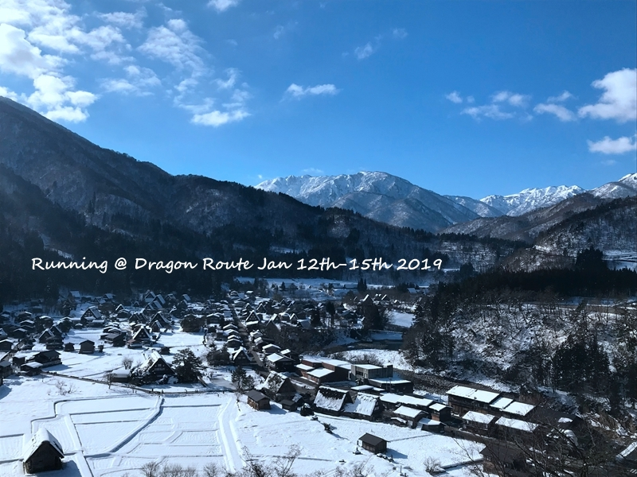
   观景台的view，这么小的观景台点灯日上去的确不容易。而且一定要焦段长的拍。
   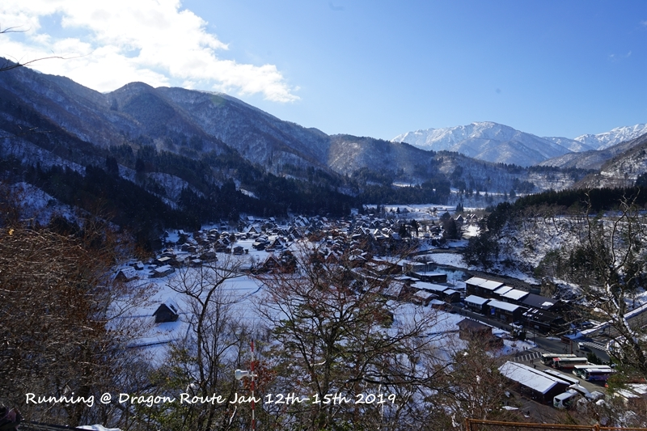
   侧面一点看
   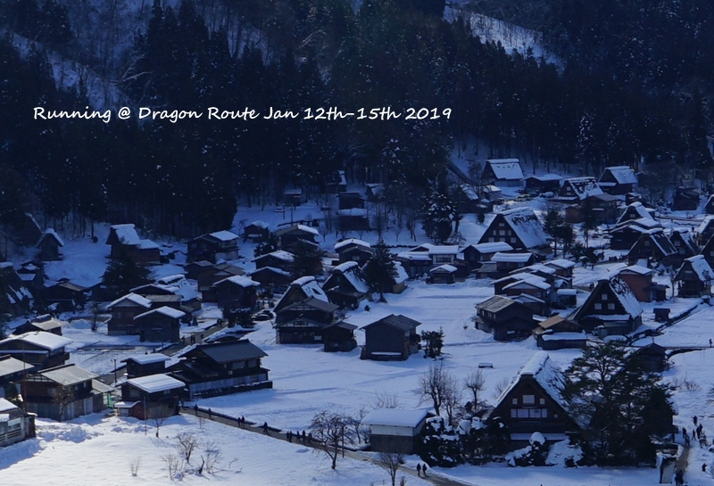
   没有长焦镜头，那就自己截图吧。。。
   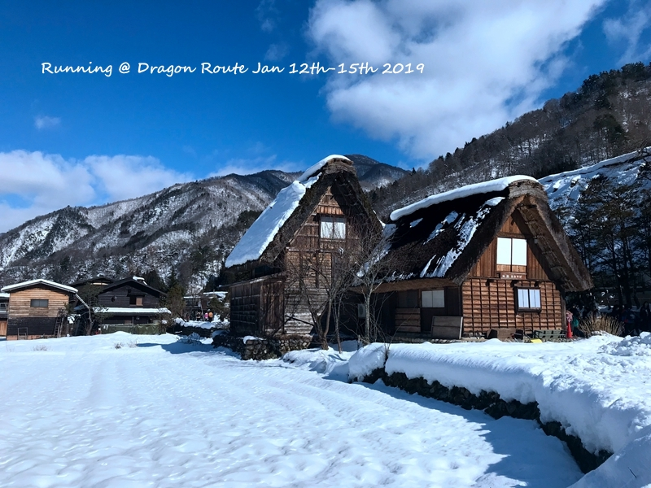
   村落里面走走，白雪中的小村子怎么拍都是美美的
   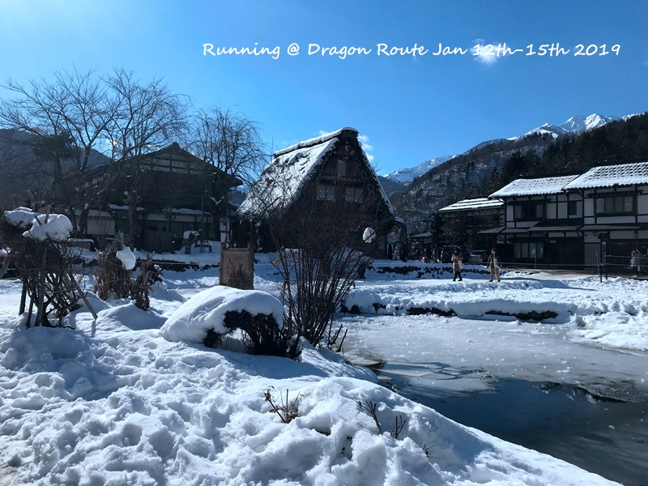
    
   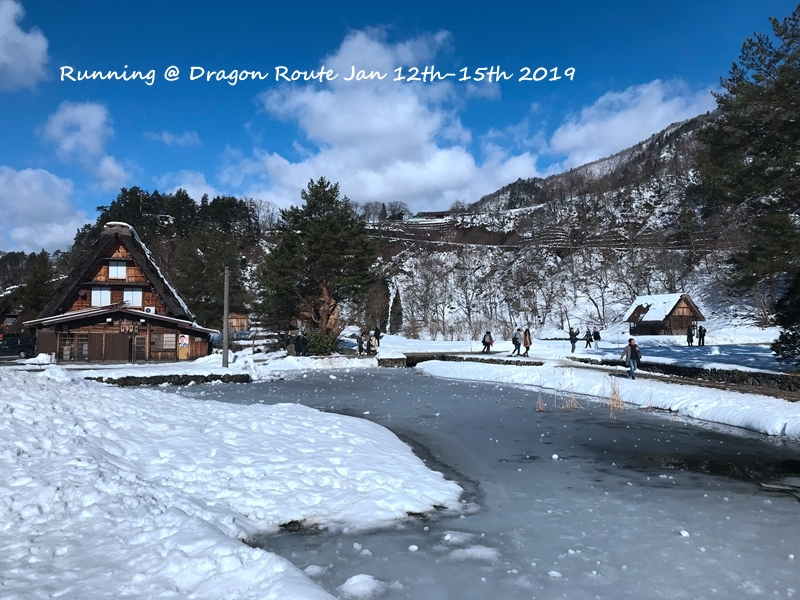
   好悲伤，家里我最黑。。。某人1500买的集体照完全没必要啊
   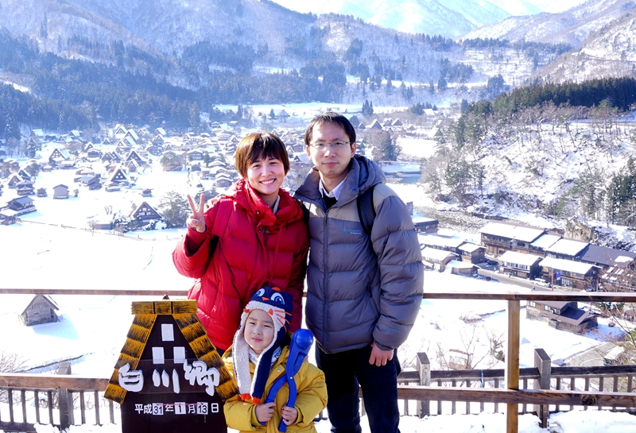
   

   玩好回去点点路上一路睡，到酒店正好醒，开启吃吃吃。酒店的下午茶，提拉米苏很好吃。然后就是丸明的晚饭，选择丸明主要是这家还有火锅，觉得带小孩更方便。没想到高山牛肉是这么的好吃不贵啊，连一向不爱吃肉的我爸和点点都吃了多了。于是决定第二天中午一定要继续吃！当晚依旧是泡汤。。
   第二天早上高山溜达，本来打算坐班车，后来正好错过时间就走走吧。从酒店到阵屋然后老街、早市、国分寺一圈正好丸明午饭。高山阵屋脱鞋参观冷的真不是一点点，入内参观绝对需要谨慎。老街上也有一堆牛肉的东东，不好吃而且贵，还不如丸明之类吃一顿。玉米饼口味调的不错，比牛肉XX好吃。老街号称小京都，只能算超级Mini京都。
   
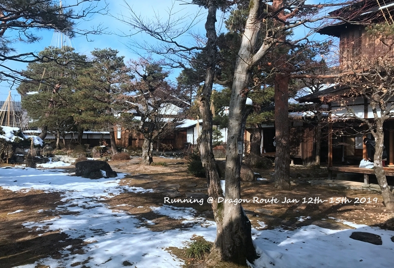
   这绝对是一个清廉的衙门。。。
   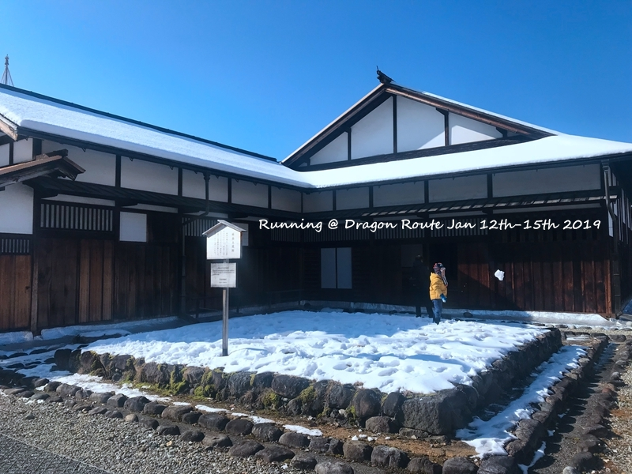
   就这片雪点点也可以玩上个把小时
   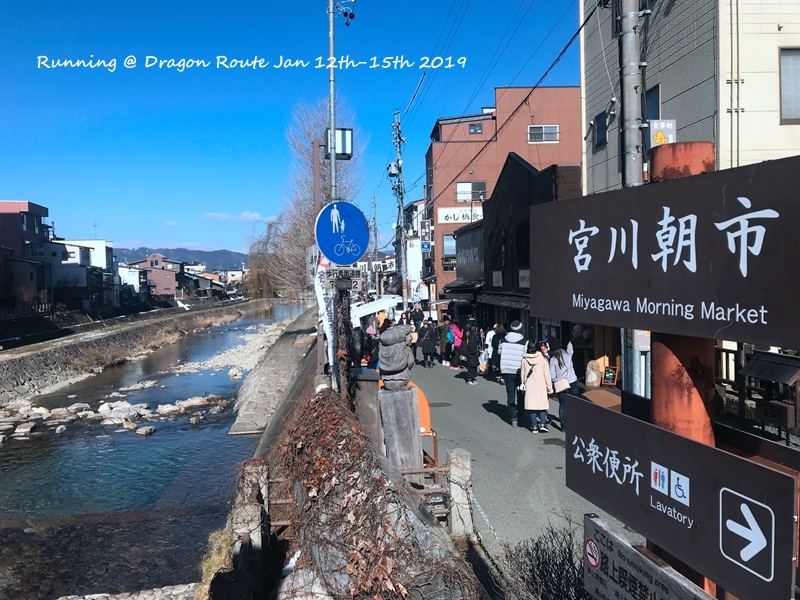
   这是日本老年人再就业的早市，买水果蛮划算的。500日元5个苹果，和国内差不多。
   

   在高山可能住的太偏了（高山深庵位置更好也是温泉酒店，就是价格更贵一些），周边也没啥药妆店。不像登别，第一龙本馆隔壁就是药妆店，吃完逛逛最合适不过。
   下午2点半的车去下吕，儿子又是车上一觉。只要是大巴，儿子总是可以睡一觉。而JR就完全不行，13点多的JR去名古屋，一路兴奋的到达名古屋。到车站就是酒店的车直接来接，下车换鞋进入酒店感觉就被关进去了。。。吃饭泡汤一路敲章章。。。
   
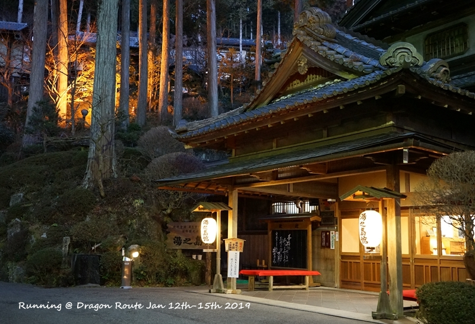
   其实下午三点多就到了，只是一进去鞋就被收走了，照都来不及拍。。。
   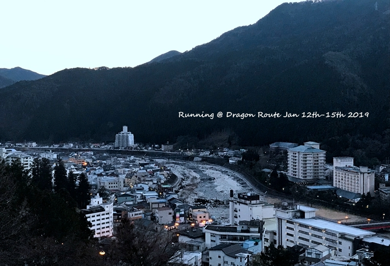
   酒店在半山腰，看小小的下吕
   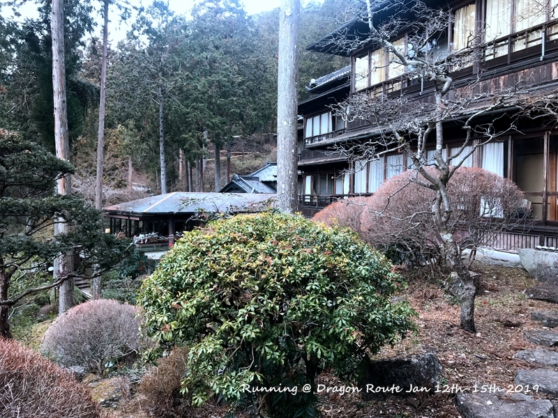
   其实酒店最佳拍摄地点在酒店出门左转走一小段，坐车下去的时候才发现可惜已来不及。。。
   

   第二天原本打算早上10点半的JR跟lionsky一起回名古屋，后来感觉吃饭时间不好。所以早上也泡了个汤，11点的车出去，在温泉街逛了一圈吃了饭下午的JR回了名古屋。下吕温泉街到处是汤池，有人就在河边泡脚，感觉如果春秋天室外泡泡脚走走更舒适。
   
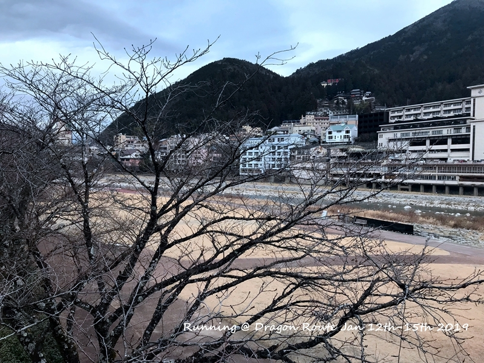
   

