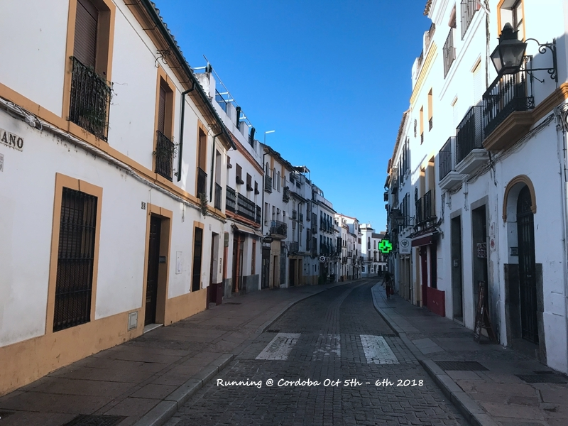

  离开塞维利亚，比较大的城市基本都游览完毕。其实西班牙除了闹独立的巴塞罗那所属的加泰罗尼亚地区都蛮近的，也挺适合自驾的。这次的自驾路线是Sevilla-Ronda-Mijas-Granada-Cordoba-Consuegra-Toledo-Segovia-Madrid, 每段开的时间都不长（大约2小时）。提前功课做得不算细，因此没有发现ronda-mijas其实往下走很多的山路，也没注意segovia-madrid如果没走收费路线也是一堆山路。
  <!--more-->
  离开sevilla的时间比预计的晚了好几个小时，因此到达ronda已经是下午2点午饭时间了。随便找了家店吃了午饭（没有中餐似乎吃什么对大家都是差不多的)，还是尝试了一下当地特色牛尾，味道还行。这家店感觉中午都是欧洲老年团在吃，吵得要命，看来不管哪个国家大妈都一样。由于本身已经晚了，因此skip了本身可去可不去的斗牛场，直接从新桥旁边的观景台开始参观。始终不太明白为什么ronda被称为最适合私奔的地方，因为悬崖峭壁所以私奔不成就可以一起升天？ronda的view比照片要好看一些，倒不是小镇本身，而是ronda本身地处高地，看出去的南部风光还是挺漂亮的。从新桥走过去一点点路往下走就是观赏新桥的最佳观景点，其实往下走的路不算多，不过走上来还是有点累的，ronda的海拔估计也有个一两千的。有个妹子走下去不小心脚崴了，所以老年人还是要注意。
  

  新城这边的镇中心，停车基本都在附近。如果中午12点可以到，最后应该可以在这里喝个下午茶
  
  本来想参观的ronda斗牛场，ronda是斗牛起源地
  
  南部风光
  
  要过新桥了
  
  回头看新区，ronda的parador就在新桥悬崖边
  
  就走到这个点感觉差不多了，来回其实也就20来分钟。锻炼的好处就是上下没有很喘
  
  可能到的时间比较晚，基本上一日游的都在我们到达的时候开始返程了，后来在旧城晃荡的时候感觉人很少
  
  旧城的小教堂，在这边一只狗狗追着点点跑，差点吓哭
  

  逛了一圈从旧桥回到原点，不得不说欧洲的司机都很NB，坡道停车还都是手动挡。6点出发去mijas，google maps显示90KM，想着不远应该可以天黑前到，结果一路山路，点点清醒着吐了三次。到达Mijas的时候差不多天开始暗，懒得去小镇吃饭，想着就在酒店吧，结果酒店晚上只有自助餐。看了一下有饭，好吧，就这边吧。这估计是一家欧洲老年游的指定酒店，也许这也是它booking评分不高的主要原因。拿到的居然还是景观房，就在cafe楼上，view很不错，只是可惜来的太晚，不然cafe坐坐发发呆这个价位真心不错。从这边开始大家尝试了啤酒梨，点点很爱吃，很甜，后来回家也一直买。但我总觉得这🍐不像🍐，因为不是那种很有水分的吃口。
  

  跟随一路的小途安，其实后排坐的还蛮舒服的。动力会有点不足，但炎热午后空调开的比较大应该也算用足了。
  
  终于开出山路上了高速
  
  

  第二天Mijas小镇逛一圈，白色小镇圣托里尼Oia可能已是极致，再难超越。不过小镇随便逛逛也挺舒服，从mijas开始气候都不太热了，早晚都很凉。
  

  一早的米哈斯人很少
  
  

  开到granada一路很顺，而granada并没有安排什么景点，因此早早跑到了观景台混了几个小时。说实话，阿尔罕布拉的外观真心一般，几乎没啥造型。不过格拉纳达这个城市不错，现代化却又充满旧日时光。磨光的石板路，线条优美的各色建筑。
  

  住的酒店对面，一股浓郁的外滩风
  
  大教堂附近
  
  等日落ing，只是这边日落太晚无ending的感觉
  
   
  
  从albayzin一路走回去，老妈觉得一路弥漫着浓郁的伊斯兰味道。。。
  

  第二天一早坐了公车去阿尔罕布拉，按照预先设定的路线，走general life - nazaries - carlos V - alcazaba。除了中间那块花园没逛全，其余基本都走了,连最后那个城堡点点还硬是爬到了最高。看网上说carlos这边有个吃点东西的地方，以为是有个小咖啡厅什么，结果就是两个自动售卖机。一个卖三明治之类，一个卖咖啡，我吃着还好，热咖啡配冷冷的三明治也蛮美味的。点点拒绝食用，靠着吃水果过了中午。阿尔罕布拉基本就是个一千零一夜，但我怎么还是觉得塞维利亚王宫也有种不一样的漂亮呢？阿尔罕布拉的门票提前购买也就是14欧，但是如果卖完了就会有guided tour卖价格就涨到了60多欧，还有人买了60多欧没注意nazaries进入时间而错过的。
   

   花园和小喷水
   
   桃金娘中庭（这名字好诡异）。在这边我的照片被点点删除了很多，主要是general life那块的，被我骂了一顿表示不会再乱搞
   
   狮子中庭，尽管是一波一波的，但怎么样都无法等到人散尽。而很快，下一波人又要进来了。。。
   
   美轮美奂的高柱，感觉把经文都刻在上面了
   
   好像蜂巢
   
   外方内圆的carlos V
   
   这一天点点不容易，走了全程
   
   公交车就是终点到终点，四个人其实不比坐出租车便宜。granada城区真的蛮漂亮的。
   

  离开阿尔罕布拉回到酒店开到cordoba差不多又是下午5点了，原本想着参观那个庭院博物馆，没想到车停下来之后才发觉有点远，根本走不到，想着就skip这一个吧。毕竟cordoba逛逛也挺好的。没想到古罗马桥旁边有个点点最爱的小花园，集下水道，挖沙等于一体，基本上两天都在这边玩了，当天傍晚古罗马桥拍拍拍就过去了。
  

  开往cordoba，下午3、4点那是相当的晒。带着墨镜都觉得眼睛酸
  
  镇城之宝，古罗马桥。很多人抱怨城里难开车，所以住在了罗马桥外，但感觉还是住里面更方便。
  
  本次之行点点小花园之最爱
  

  第二天早上免费的清真寺+随意逛景点，lionsky穿跑步鞋说腿疼skip了陪儿子继续玩小花园，下次暴走看来也不能穿跑步鞋。逛着逛着依旧是delay到早上11点不到出发.
  

  清真寺免费是早上8:30-9:30免费，赶在这个时间去还能看到罗马桥日出
  
  柱子蛮好看的
  
  这算是站在前人的肩膀上还是偷工减料呢。。。
  
  满园橘树
  
  百花巷，ms两边店的货物都不换的
  
  早上空无一人的街道，跟着穷游逛了几个不算景点的景点。那个白马广场真的是。。。
  
  xxx广场，cordoba和granada还是不太一样。granada更现代化一点的城市，cordoba更小更文艺一点
  

  下午1点多赶到了consuegra。绕着小镇开了一圈，感觉像个空城，最终随便搜了一家餐厅进去吃饭。没有会英文的服务员，没有英文菜单，不过好在菜单简单，只有套餐，而且每个选择都只有4项，所以每个来一份。。。本来看别人游记说是从information center可以一路走到风车，结果开到information center依旧是空空如也.于是继续开车，还好没走，这一路也不知道谁这么锻炼身体去走。。。风车这块真的是上照，也是我这次最喜欢的景点之一。
  

  第一眼，美
  
  走过一个风车就要来几张
  
  跟老妈在这里折腾半天，她就是拍不出我要的景。下午车多了，包括跟团的，很多车都开到最后这个风车这边。
  
  最后上那个古堡拍个全景，高处拍好像的确更好看点
  
  儿子也跟着爬上去的，不容易
  

  儿子一直在那个会转的风车二楼看人家磨麦子，然后在那个小窗叫，妈妈，我看到你了，我在这里。。。
  拍够了，开到toledo。提前就找好了中餐馆，到了就直奔那边。之前做过攻略说是有个电梯可以上toledo，结果进去的时候硬是没发现。后来出来绕一圈才发觉就在停车场旁边，哭。没有电梯走进toledo可是一路的上坡路。餐厅正好在toledo大教堂旁边，打卡。
  

  太阳门
  
  教堂早已审美疲劳，估计我爸回去都认不出哪儿是哪儿了
  
  Bisagra门
  

  toledo这边选的是parador，酒店还行吧，但不是想象中的那种古堡酒店。酒店的位置其实是还不错，但是，比起下面一点的观景点，拍toledo全景显得太高。而且本来以为会在外面平台上吃早饭，结果是关在里面吃。。。而外面的平台后来出去才知道，真的是太冷了。。。
  第二天在酒店拍了半天之后，下观景台觉得还是观景台更美。
  

  toledo还是蛮美的，不要作住在古城里面走的时候上观景台看一下更好
  
  最满意的合照了
  

  下山的时候被交警调度往另外一个方向走，因此放弃了本来计划的圣马丁桥和修道院。走了一条荒芜的路出toledo。油不多了，找了个加油站加油，结果拿着油枪没找到付钱的插口。于是去便利店问，碰到不会英文的服务员，还好旁边有其他客人，她终于明白我们是要加油的了。西班牙加油的process是先自己拿着油枪塞进去直接加，然后加完再进便利店说自己是几号付钱。还是很奇怪如果我加完油就走了会如何。。。
  一路开到segovia，走了最贵的一段高速，8.4。离开segovia走山路才发觉为什么这段高速这么贵。。。没想到segovia好冷，下车的时候又遇到点点作，直接影响了segovia的行程。之前预约的烤乳猪直接Miss, 没经验的lionsky还跟着地图找想吃tripadvisor排名第二的餐厅，走了一路上坡路之后又累又饿地到达餐厅被告知当天没位子了。火真是大啊。最后走回主路随便吃了家有位子的，真心难吃又不便宜，尤其那个烤乳猪，真的是腥的没朋友，难以置信这是猪肉。其实segovia很好走，进门就是大水渠，然后一条路一直往里面走就是大教堂，看完大教堂如果不打算进里面参观城堡，这时就应该走出去开车去城堡观景台。结果我们一路往里走，然后又走城堡下山路，可攻略做得不够最后少走一段也没找到最佳拍摄点。一路走回停车场（2KM）再开车来接点点，折腾很多时间，导致最后居然晚上7点多才到madrid。madrid来回居然连个白天都没看到。。。
  

  一路开到segovia感觉是有点秋高气爽的味道，和炎热的sevilla好似两个世界
  
  一进去就是大水渠真的蛮震撼的
  
  停车就在外面的圆环广场边上，最贵的停车点。如果不带娃，在这个圆环边上吃麦当劳最实惠
  
  光线背景都刚刚好啊
  
  贵妇教堂，走过路过来一张
  
  点点的刀刀，这一路唯一买的礼物，耍了一天最后在机场被要求托运哭了一小时。。。
  
  白雪公主城堡，已尽力。。。
  

  还好最后回Madrid英明了一下，本来想把点点放到酒店还了车再来接。后来觉得来回折腾太费时间，先把他们放到了火车站附近的中餐，然后去还车。这次加油很快，难在找还车点。跟着google maps来回开了几遍，环岛进进出出的，最后问了个警察才找到，也幸好这边营业到晚上24点，还是按时把车给还了。然后走到中餐厅进去吃饭，已经是晚上9点。。。。最后一天没有选在火车站附近，主要是因为火车站附近的酒店太贵了，找了个坐地铁不远的。不过最后吃完饭还是打车回去，可怜多余的lionsky坐公车1.5，其实四个人打车也就是8元钱。第二天中午1点的飞机，一早就纠结是不是要去家乐福买点橄榄油，1KM的路，最终还是想安心吃个早饭没去。依旧是7人座的taxi去机场，30欧标准价+行李。
  

  打车路过的madrid唯一景点，斗牛场。。。
  

  这次就一个要退税的东西，排队敲海关章真心长，结果现在其实可以用机器直接扫作为海关章。最后懒得在机场退，带回上海至今未办理。。(mark:最后办了，陆家嘴的中国银行直接办理，还未退款)。
